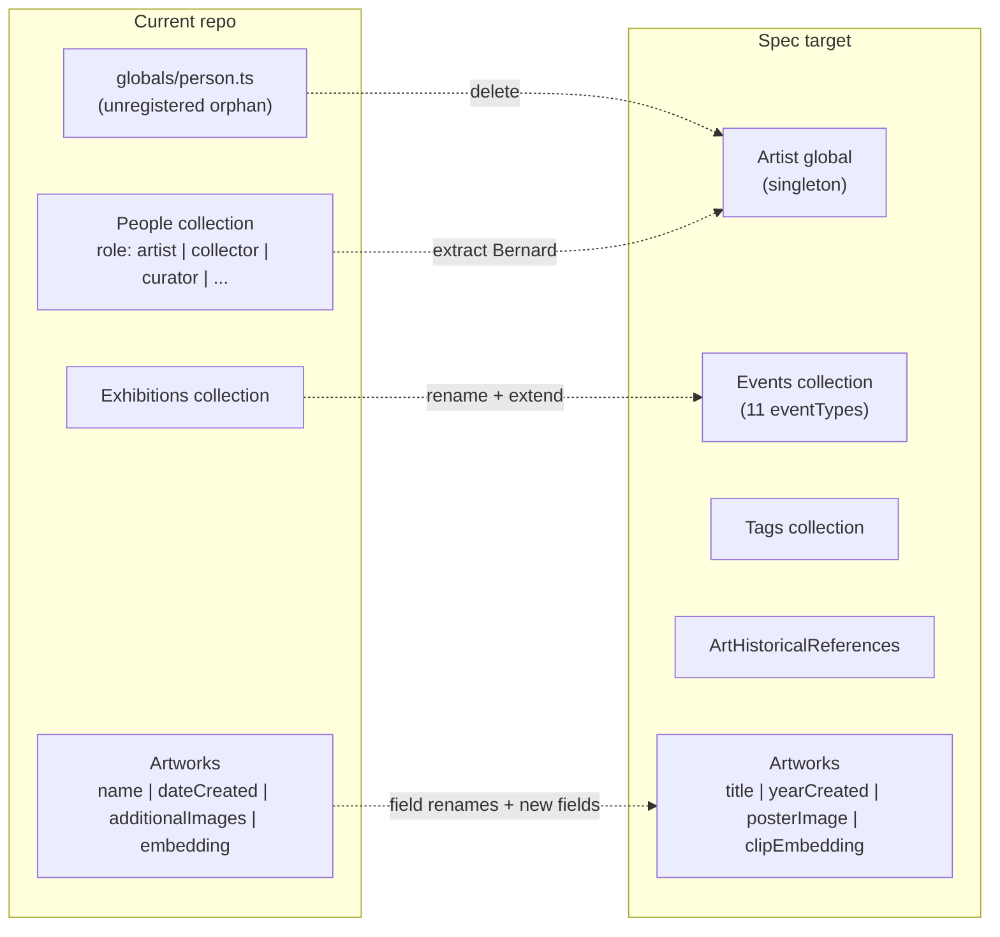

# Master Schema Specification
## bernardbolter.com · Artworks Collection · Events Collection · Data Relations · Payload Implementation Guide
*May 2026 · Developed in dialogue: Bernard Bolter × Claude*

This is the single authoritative reference for implementing the bernardbolter.com data model in Payload CMS. It contains the complete field specifications for both primary collections (Artworks and Events), the dependent collections they reference, the full data relationship map, and step-by-step implementation instructions for Cursor's AI coding agents. Read the entire document before writing any collection config.

---

## Layer and field type key

**Layer** — who fills this field and how:
- `artist` — entered through Art/Official dialogue; artist must confirm before record is committed
- `agent` — filled computationally by image analysis or inference; shown for artist review at confirmation
- `private` — role-restricted to artist and admin; never returned in public API responses

**Field Type** — philosophical role in the schema:
- `CORE` — foundational identity and descriptive data
- `INTENT` — artist-authored, unmediated — fills the intent gap
- `RELATIONAL` — non-hierarchical connections across works and time
- `COMPUTED` — machine-generated from other fields
- `TEMPORAL` — time-aware, holds non-linear change
- `GAP FILLER` — makes visible what current records suppress
- `SYSTEM` — infrastructure for AI reasoning and the cataloguing agent

**Status:**
- `EXISTING` — already in the Payload collection config
- `NEW` — needs implementing
- `DEFERRED` — belongs to a future node, not the Artwork record now

---

## 0. Repo Reality Check (Cursor Agent Preamble)

> **Read this section before reading anything else.** The body of this spec was drafted greenfield. The repo it ships into has substantial work in flight that will collide with the spec if implemented naively. This section is the bridge. The full reconciliation lives in §5 (Repo-Specific Addendum) — sections 1–4 below carry inline `> Repo Note:` callouts pointing back to the relevant addendum entry.

### 0.1 Stack snapshot — what is actually installed

| Concern | Reality | Spec assumption |
|---|---|---|
| Database adapter | `@payloadcms/db-postgres@3.82.1` (Neon Postgres) | "Neon Postgres" — matches |
| pgvector extension | **Not enabled yet** | Required for `clipEmbedding` (Addendum B) |
| Storage | `@payloadcms/storage-s3` → Cloudflare R2 (`R2_BUCKET_NAME`, `R2_ENDPOINT`, `NEXT_PUBLIC_IMAGE_DOMAIN`) | "S3, Cloudflare R2, or local" — matches R2 |
| Framework | Next.js 16.2.3, App Router, route groups `(frontend)` and `(payload)` | "Next.js App Router mode" — matches; group names differ |
| Package manager | **pnpm only** (`engines.pnpm: ^9 || ^10`) | "npm/pnpm available" — pnpm only here |
| Node version | `^18.20.2 || >=20.9.0` | "Node 18+" — matches |
| ID type | `defaultIDType: number` (Postgres serial integers) | (unstated) — relations carry integer IDs, not Mongo ObjectIds |
| Localization | Already configured: `en` + `de`, `fallback: true`, `defaultLocale: 'en'` | Spec uses parallel `_DE` fields — **incompatible**. See Addendum D |
| Payload version | `payload@3.82.1` (v3) | "Payload v3" — matches |

### 0.2 What already exists in the codebase

| Path | Status | Notes |
|---|---|---|
| [src/payload.config.ts](src/payload.config.ts) | EXISTS | Registers Users, Media, Artworks, People, Series, Exhibitions. **No `globals: []` array yet.** |
| [src/collections/Users.ts](src/collections/Users.ts) | EXISTS | Auth collection — keep as-is |
| [src/collections/Media.ts](src/collections/Media.ts) | EXISTS, minimal | Only `alt` field |
| [src/collections/Artworks.ts](src/collections/Artworks.ts) | EXISTS, ~700 lines, 12 tabs | Includes legacy WP fields and 3 series-extension tabs. Major rewrite — see Addendum A.1 |
| [src/collections/People.ts](src/collections/People.ts) | EXISTS, multi-role | Spec replaces the artist-role records with an Artist global; non-artist roles are kept. See Addendum A.3 |
| [src/collections/Series.ts](src/collections/Series.ts) | EXISTS | Mostly aligns with spec — see Addendum C |
| [src/collections/Exhibitions.ts](src/collections/Exhibitions.ts) | EXISTS | Spec renames/expands to Events — see Addendum A.2 |
| [src/globals/person.ts](src/globals/person.ts) | EXISTS, **unregistered** | Not in `payload.config.ts globals: []`. Delete; spec's Artist singleton replaces it |
| [src/helpers/convertUnits.ts](src/helpers/convertUnits.ts) | EXISTS | Already has `parseInputImperialToInches` + `splitImperialInches` + fraction simplification. **Reuse — do not duplicate** in the dimension hook |
| [src/helpers/seriesColor.ts](src/helpers/seriesColor.ts) | EXISTS | Canonical list of 11 series slugs — see Addendum C |
| [src/scripts/migrate-wp-artworks.ts](src/scripts/migrate-wp-artworks.ts) | EXISTS, in active use | Writes legacy field names; must be updated in lockstep with renames (Addendum A.1) |
| [src/lib/payload/artworks.ts](src/lib/payload/artworks.ts) | EXISTS | Already uses `unstable_cache` + locale-aware queries — extend this pattern |
| [src/lib/jsonld/person.ts](src/lib/jsonld/person.ts) | EXISTS, stub | Use this folder for the spec's JSON-LD generators |
| [src/components/admin/MapField.tsx](src/components/admin/MapField.tsx) | EXISTS | Reference implementation for custom admin fields with the `#NamedExport` import-map pattern |
| `src/hooks/`, `src/access/`, `src/utilities/`, `src/collections/Tags.ts`, `src/collections/ArtHistoricalReferences.ts`, `src/collections/Artist.ts`, `src/collections/Events.ts` | DOES NOT EXIST | Spec creates these. Note: spec says `src/utilities/` but this repo uses `src/helpers/` |

### 0.3 The collection rename map (high level)



### 0.4 Field rename map (Artworks)

| Current name | Current type | Spec name | Spec type | Migration note |
|---|---|---|---|---|
| `name` | text, localized | `title` | text, localized | Rename column. Update [src/scripts/migrate-wp-artworks.ts](src/scripts/migrate-wp-artworks.ts) to write `title`. |
| `dateCreated` | date | `yearCreated` (+ optional `yearCompleted`) | number | **Type change.** Backfill: `yearCreated = EXTRACT(YEAR FROM date_created)::integer`. |
| `creator` | rel → People | (removed for Bernard's records; replaced by Artist global lookup in JSON-LD) | — | See Addendum A.3 |
| `artform` | select | (removed; covered by spec's `medium` select) | — | Map values manually into `medium` enum |
| `artMedium` | text | `medium` | select + text override | Free-text → controlled vocabulary; agents must NOT auto-coerce |
| `artworkSurface` | text | `support` | select | Map common values: canvas → `canvas`, paper → `paper`, etc. |
| `dimensions.{width,height,depth,unitCode}` | group | `widthWhole/widthFraction/widthMm` etc. + `dimensionUnit` | flat fields | Backfill via the existing fraction parser in [src/helpers/convertUnits.ts](src/helpers/convertUnits.ts) |
| `description` | richText, localized | `descriptionShort` (text) + `descriptionLong` (richText) | both `localized: true` | Split: first ≤400 chars → `descriptionShort`; full body → `descriptionLong` |
| `aiDescription` | textarea | (no direct equivalent) | — | Repurpose as initial draft input for `descriptionShort` / `encounterNote` |
| `aiVibe` | textarea | `encounterNote` (closest) | longText | Migrate verbatim; agent re-confirms with artist |
| `embedding` | json | `clipEmbedding` | vector(1536) | **Drop** json column; add pgvector column per Addendum B |
| `keywords[]` (array of `{keyword: text}`) | array | `conceptualKeywords` | text[] | Flatten to string array |
| `additionalImages[]` (single array, role-tagged) | array | `alternateViewImages` + `detailImages` + `installationShots` | three arrays | Split by `imageRole`: `installation` → `installationShots`; `detail` → `detailImages`; everything else → `alternateViewImages` |
| `printEditions[]` | array | `editions[]` | array | Rename. Extend object shape per spec §1.8 |
| `offers` | group | covered by `editions` + `availabilityStatus` | (removed group) | Migrate `offers.price` to a single edition entry OR to `askingPrice` for unique works |
| `provenanceNotes` | richText | `ownershipHistory[]` + `provenanceConfidenceLayer` | structured | Manual triage; do NOT auto-parse |
| `wp_id`, `wpImageUrl`, `oldWpUrl` | various | (none) | — | **Keep** until WP cutover complete. See Addendum A.4 |
| `seriesSlug` (computed text via beforeChange hook) | text | (no spec field, but the pattern is exactly what spec §1.11 needs) | — | **Preserve** — gates series-extension tab visibility |

### 0.5 Files to delete

| File | Reason | When |
|---|---|---|
| [src/globals/person.ts](src/globals/person.ts) | Unregistered orphan; spec's Artist singleton replaces it with a different field shape | Step 1 (before creating Artist global) |
| Legacy fields `wp_id`, `wpImageUrl`, `oldWpUrl` on Artworks | WP migration scaffolding | After WP cutover only — Addendum A.4 / Step 17 |

### 0.6 Files to keep and reuse (do NOT duplicate)

| File | Contains | Use it for |
|---|---|---|
| [src/helpers/convertUnits.ts](src/helpers/convertUnits.ts) | `parseInputImperialToInches`, `splitImperialInches`, `getFraction`, `convertSizeForDisplay` | Dimension `beforeChange` hook (spec §1.2 / Step 7) — **import, do not re-implement** |
| [src/helpers/seriesColor.ts](src/helpers/seriesColor.ts) | Canonical map of 11 series slugs → hex colors | Series tab visibility checks; series page rendering |
| [src/lib/payload/artworks.ts](src/lib/payload/artworks.ts) | `unstable_cache` + locale-aware Payload query pattern | Template for all new Payload data-loading helpers |
| [src/components/admin/MapField.tsx](src/components/admin/MapField.tsx) | Reference custom admin field with `#MapField` named-export pattern | Template for any custom admin component (clipEmbedding inspector, AR target preview, etc.) |

### 0.7 Localization — single source of truth

> **Decision:** This repo uses Payload's built-in localization (`localized: true` on each translatable field, `defaultLocale: 'en'`, `fallback: true`). The spec's parallel `_DE` field pattern (`descriptionShortDE`, `bioDE`, `historicalContextDE`, `descriptionDE`, `statementDE`, etc.) is **rejected** for this repo — agents must NOT introduce these fields. Mark the corresponding base field `localized: true` and let editors switch locales in the admin. Full rationale in Addendum D.

### 0.8 Required reading before writing any code

1. This entire document, all sections including the Addendum (§5).
2. The repo-level [AGENTS.md](AGENTS.md) — especially the "Critical Security Patterns" section. Postgres has transactions enabled by default; `req` propagation in nested operations is mandatory.
3. The current [src/payload.config.ts](src/payload.config.ts) and the existing collection files for the section you're touching.

---

## 0. Collection Overview & Data Relationships

The bernardbolter.com data model consists of two primary collections and four dependent collections.

| Collection | Type | Purpose |
|---|---|---|
| **Artworks** | Primary | Core content unit. Every artwork in the practice lives here. Drives timeline, grid, individual artwork pages. |
| **Events** | Primary | All professional events — exhibitions, art fairs, prizes, residencies, publications, commissions, talks, screenings. Drives the CV page and exhibition history on artwork pages. |
| Tags | Dependent | Classification vocabulary for both Artworks and Events. Typed by category. Carries optional authority URIs (Getty AAT, Iconclass, LCSH). |
| Series | Dependent | Practice series (A Colorful History, Mediums of Perception, etc.). Each artwork belongs to exactly one series. |
| ArtHistoricalReferences | Dependent | Structured records for artworks and artists the practice is in dialogue with. |
| Artist | Singleton | The single artist record. Holds the ULAN and Wikidata URIs used in every artwork and event's JSON-LD creator output. |

### 0a. Relationship map

All relations are bidirectional in Payload — populating one side automatically updates the other.

| Relation | Description |
|---|---|
| `Artworks ↔ Events` | Many-to-many. Authority side: `Events.artworks`. Adding a work to an event auto-populates `Artworks.events`. |
| `Artworks → Series` | Many-to-one. Every artwork belongs to exactly one series. Authority: `Artworks.series`. |
| `Artworks → Tags` | Many-to-many across five tag arrays (movement, style, subject, genre, period). Authority: Artworks. |
| `Artworks → ArtHistoricalReferences` | Many-to-many. Authority: `Artworks.artHistoricalReferences`. |
| `Artworks → Artist` | Many-to-one. Artist record referenced in JSON-LD output. Read-only from Artwork. |
| `Events → Tags` | Many-to-many for event classification. Authority: Events. |
| `Events → Artist` | Many-to-one. Referenced in JSON-LD performer output. |
| `Tags → (AAT / Iconclass / LCSH)` | One-to-external. Authority URIs stored as text fields on the Tag record — no Payload relation. |
| `Artworks.ownershipHistory ↔ Artworks.salesRecord` | One-to-one within the same record via shared `transactionId` UUID. Enforced by application logic, not a Payload relation. |
| `Events.artworks → Artworks.loanHistory.eventId` | Optional one-to-one. A loan record can link to its corresponding Event. Not all loans have events. |

---

## 1. Artworks Collection

The Artwork record is the core content unit. Every painting, photograph, video, digital work, and installation in the practice lives here. It drives all public-facing views and is the primary input for the Art/Official cataloguing agent.

### 1.1 Identity

| Field | Type | Layer | Field Type | Status | Definition |
|---|---|---|---|---|---|
| `title` | text | artist | CORE | EXISTING | Required. The artwork title as confirmed by the artist. Do not auto-generate or infer. |
| `altTitle` | text | artist | CORE | NEW | Optional alternate title — for works known differently in another language or market, or retitled works. Displayed as 'also known as'. |
| `slug` | text | agent | COMPUTED | EXISTING | Auto-generated from title + yearCreated + catalogue sequence number. Unique. Never changes after first publication. |
| `yearCreated` | number | artist | CORE | EXISTING | Year the work was begun. Four-digit integer. Required. |
| `yearCompleted` | number | artist | CORE | EXISTING | Optional. Year finished if different from yearCreated. For multi-year works. |
| `status` | select | artist | SYSTEM | EXISTING | Values: `draft` \| `published`. Default: draft. Never published without explicit artist confirmation. |

> **Repo Note (§1.1):** The `EXISTING` status of these rows is misleading for this repo. The current Artworks collection uses `name` (not `title`) and `dateCreated` of type `date` (not `yearCreated` of type `number`). Renaming columns requires a Payload migration **before** any collection-config edit, plus a lockstep update to [src/scripts/migrate-wp-artworks.ts](src/scripts/migrate-wp-artworks.ts). See Addendum A.1. The current `status` enum also includes `archived` which the spec drops — preserve `archived` until WP cutover is done. The current `slug` is required (not auto-generated by hook) — keep manual slug entry for now; the spec's auto-generation hook is a follow-on enhancement.

> The `measurementType` field gates which dimension subsections are relevant in the admin UI. A work can have both physical and digital dimensions simultaneously.

#### Medium and support

| Field | Type | Layer | Field Type | Status | Definition |
|---|---|---|---|---|---|
| `medium` | select + text override | artist | CORE | EXISTING | Structured select: `acrylic photo transfer on canvas` \| `acrylic on canvas` \| `mixed media on canvas` \| `photo collage` \| `video` \| `digital` \| `other`. Override text for edge cases. |
| `measurementType` | select (multi) | artist | CORE | EXISTING | Values: `physical` \| `digital` \| `time-based`. Multiple allowed. Gates which dimension fields are shown in admin. |
| `support` | select | artist | CORE | EXISTING | Values: `canvas` \| `paper` \| `board` \| `screen` \| `file` \| `other`. |
| `framing` | select | artist | CORE | EXISTING | Values: `framed` \| `unframed` \| `artist framed`. Omit for digital-only. |
| `weight` | number | artist | CORE | EXISTING | Weight in kilograms. Optional. Physical works only. |

#### Physical dimensions

> Width, height, and depth stored as whole number + fractional string + unit. Normalised mm values computed server-side on every save via Payload `beforeChange` hook — never at render time or in the client.

| Field | Type | Layer | Field Type | Status | Definition |
|---|---|---|---|---|---|
| `dimensionUnit` | select | artist | CORE | EXISTING | Values: `cm` \| `in`. Applies to all physical dimension fields on this record. |
| `widthWhole` | number | artist | CORE | EXISTING | Whole-number part of width. Integer. |
| `widthFraction` | text | artist | CORE | EXISTING | Optional fractional part as string: `'3/16'`, `'1/2'`. Omit if whole number. |
| `heightWhole` | number | artist | CORE | EXISTING | Whole-number part of height. |
| `heightFraction` | text | artist | CORE | EXISTING | Optional fractional part of height. |
| `depthWhole` | number | artist | CORE | EXISTING | Whole-number part of depth. Omit for flat works. |
| `depthFraction` | text | artist | CORE | EXISTING | Optional fractional part of depth. |
| `widthMm` | number | agent | COMPUTED | EXISTING | Computed by `beforeChange` hook: (widthWhole + fraction decimal) × 10 if cm, × 25.4 if in. Never entered manually. |
| `heightMm` | number | agent | COMPUTED | EXISTING | Computed. Height normalised to mm. |
| `depthMm` | number | agent | COMPUTED | EXISTING | Computed. Depth normalised to mm. Null for flat works. |
| `dimensionsDisplay` | text | agent | COMPUTED | EXISTING | Computed display string: `'120 × 90 cm'`, `'23 3/16 × 18 1/2 in'`. Generated by hook. |

> **Repo Note (§1.2 dimensions):** None of the `whole + fraction + Mm` fields actually exist yet — the current Artworks collection has a flat `dimensions` group with `width`, `height`, `depth`, `unitCode` only. **Reuse** [src/helpers/convertUnits.ts](src/helpers/convertUnits.ts) — its `parseInputImperialToInches('11 5/8')` and `splitImperialInches` functions already implement everything the `beforeChange` hook needs. Import them in `src/hooks/artworkBeforeChange.ts`; do not re-implement. The `dimensionUnit` select values in the spec (`cm`, `in`) differ from the current `unitCode` values (`CMT`, `MMT`, `MTR`, `INH` — UN/CEFACT codes used directly in JSON-LD `QuantitativeValue.unitCode`). Keep the current UN/CEFACT codes internally and translate to `cm`/`in` at the admin display layer; the JSON-LD generator needs the UN/CEFACT codes anyway (see spec §1.10c).

| Field | Type | Layer | Field Type | Status | Definition |
|---|---|---|---|---|---|
| `widthPx` | number | artist | CORE | EXISTING | Width in pixels. Digital and screen works. |
| `heightPx` | number | artist | CORE | EXISTING | Height in pixels. |
| `resolutionDpi` | number | artist | CORE | EXISTING | DPI. Typical: 72 (screen), 300 (print). |
| `fileFormat` | text | artist | CORE | EXISTING | Native file format: TIFF, PSD, MP4, MOV, PDF. Not the archive image format — the format of the work itself. |
| `fileSize` | number | artist | CORE | EXISTING | File size in megabytes. Optional archival reference. |
| `colorSpace` | select | artist | CORE | EXISTING | Values: `sRGB` \| `Adobe RGB` \| `P3` \| `CMYK` \| `other`. |

#### Time-based dimensions

| Field | Type | Layer | Field Type | Status | Definition |
|---|---|---|---|---|---|
| `duration` | text | artist | CORE | EXISTING | Formatted string: `'HH:MM:SS'` for video/audio, or prose for open-duration works (`'4 hours'`, `'indefinite'`). |
| `durationSeconds` | number | agent | COMPUTED | EXISTING | Computed from duration for video/audio. Integer seconds. Null for open-duration. |
| `looped` | boolean | artist | CORE | EXISTING | Whether the time-based work loops in exhibition. |
| `soundDesign` | select | artist | CORE | EXISTING | Values: `sound` \| `silent` \| `ambient` \| `variable`. |

#### Condition and state

| Field | Type | Layer | Field Type | Status | Definition |
|---|---|---|---|---|---|
| `condition` | select | artist | TEMPORAL | EXISTING | Values: `excellent` \| `good` \| `fair` \| `poor`. |
| `conditionNotes` | text | artist | TEMPORAL | EXISTING | Free text. Optional. |
| `workState` | select | artist | TEMPORAL | EXISTING | Values: `original` \| `reworked` \| `restored` \| `damaged` \| `lost`. |
| `workStateNotes` | text | private | TEMPORAL | EXISTING | Prose notes on workState. Private. |
| `workStateDate` | date | artist | TEMPORAL | EXISTING | Date the current workState was recorded. |
| `materialAndProcessMeaning` | longText | artist | INTENT | NEW | Why these materials. What process decisions carry semantic weight. Drawn out obliquely in Art/Official dialogue. |
| `stateVersions` | array of objects | artist | TEMPORAL | NEW | Timestamped physical change records. Each: `{ date, description, type: restoration\|rework\|damage\|relining\|other }`. |

### 1.3 Size and Orientation

> These three fields drive the physical-scale display logic on the public site. `aspectRatio` is computed from `widthMm ÷ heightMm` — unit-independent. `sizeTier` is entered by the artist but the agent should suggest a value based on normalised mm dimensions.

| Field | Type | Layer | Field Type | Status | Definition |
|---|---|---|---|---|---|
| `sizeTier` | select | artist | CORE | EXISTING | Values: `sm` \| `md` \| `lg` \| `xl`. Agent suggests: <300mm=sm, 300–800mm=md, 800–2000mm=lg, >2000mm=xl (longest dimension). Artist confirms or overrides. |
| `orientation` | select | artist | CORE | EXISTING | Values: `landscape` \| `portrait` \| `square`. Determines which dimension is constrained in layout. |
| `aspectRatio` | number | agent | COMPUTED | EXISTING | `widthMm ÷ heightMm`. Stored float. Computed by `beforeChange` hook. For video-only works, computed from `posterImage` pixel dimensions instead. |

> **Repo Note (§1.3):** `sizeTier` and `aspectRatio` do not exist on the current Artworks collection but the layout-side logic does — see [src/hooks/useGridItemDimesnions.ts](src/hooks/useGridItemDimesnions.ts) and [src/helpers/getGridItemContainerSize.ts](src/helpers/getGridItemContainerSize.ts). The frontend currently derives orientation from raw `dimensions.width/height`; once `aspectRatio` and `sizeTier` are stored fields, refactor those hooks to read the stored values rather than recomputing on render.

### 1.4 Classification

#### Artwork-level fields

| Field | Type | Layer | Field Type | Status | Definition |
|---|---|---|---|---|---|
| `series` | relation → Series | artist | CORE | EXISTING | Every artwork belongs to exactly one series. Required. Not a text field. |
| `city` | text (controlled) | artist | CORE | EXISTING | City where the work was made. Controlled vocabulary. Typical: New York \| Amsterdam \| San Francisco \| Berlin. |
| `country` | text (controlled) | artist | CORE | EXISTING | Country. Controlled vocabulary. |
| `cityTgnUri` | text (URI) | agent | SYSTEM | NEW | Getty TGN URI for the city. Agent suggests. Used in JSON-LD `locationCreated` object. |
| `movementTags` | relation[] → Tags | artist | RELATIONAL | EXISTING | Art historical movement tags. Agent suggests; artist confirms. |
| `styleTags` | relation[] → Tags | artist | RELATIONAL | EXISTING | Formal style tags. Agent suggests; artist confirms. |
| `subjectTags` | relation[] → Tags | artist | RELATIONAL | EXISTING | Iconographic subject tags. Agent suggests; artist confirms. |
| `genreTags` | relation[] → Tags | artist | RELATIONAL | NEW | Genre tags (portrait, landscape, abstraction, installation). Agent suggests; artist confirms. |
| `periodTags` | relation[] → Tags | artist | RELATIONAL | NEW | Art-historical period tags (Contemporary, 21st century, Post-internet). Agent suggests; artist confirms. |
| `conceptualKeywords` | text[] | agent | INTENT | EXISTING | Abstract conceptual terms: memory \| erasure \| mediation \| accumulation. Generated from full session context. Artist confirms or edits. Primary driver of cross-corpus similarity queries. |
| `events` | relation[] → Events | artist | RELATIONAL | NEW | Events in which this artwork has appeared. Reverse side of `Events.artworks` — bidirectional. Populating `Events.artworks` auto-populates this field. Resolves the missing exhibitions relation. |
| `artHistoricalReferences` | relation[] → ArtHistoricalReferences | agent | RELATIONAL | EXISTING | Structured art historical connections. Agent suggests; artist confirms. Prose explanation in `artHistoricalContext`. |
| `artHistoricalContext` | longText | artist | RELATIONAL | EXISTING | Prose note on art historical connections. Reasoned by agent; confirmed or rewritten by artist. |
| `seriesContext` | longText | artist | RELATIONAL | NEW | Artist's account of where this work sits in the practice arc. Drawn out through Art/Official dialogue. |
| `consciousRejections` | longText | artist | INTENT | NEW | What was being pushed against. Never asked directly — drawn out in dialogue Layer 4. |
| `formalContributionAssessment` | longText | artist | INTENT | NEW | What this work does that hasn't been done before. Agent synthesises draft from dialogue; artist confirms. |

> **Repo Note (§1.4 — `events` & relations):** The `events` row's `EXISTING` status refers only to the conceptual relation. The current code has `Artworks.exhibitions` (relation to the `exhibitions` collection, Tab 7). After Addendum A.2 renames `exhibitions` → `events`, implement the **reverse** side as a Payload v3 `join` field, NOT a manual `relationship`. Concrete shape:
> ```ts
> { name: 'events', type: 'join', collection: 'events', on: 'artworks', admin: { readOnly: true } }
> ```
> Authority lives on `Events.artworks` only. Same pattern for `Series` reverse lookups. Full pattern in Addendum E. Also: the spec lists five separate tag arrays (`movementTags`, `styleTags`, `subjectTags`, `genreTags`, `periodTags`) — implement each as a `relationship` with `filterOptions: { type: { equals: 'movement' } }` etc. so admin pickers only show appropriate tags.

#### Tags collection — authority URI fields

> These fields live on the Tags collection, shared across both Artworks and Events. Every tag can optionally carry authority URIs. Not required — the URI is an enrichment layer, not a prerequisite.

| Field | Type | Layer | Field Type | Status | Definition |
|---|---|---|---|---|---|
| `label` | text | artist | CORE | EXISTING | Display label: Abstract Expressionism, Photography, Memory, Landscape. |
| `type` | select | artist | CORE | EXISTING | Values: `movement` \| `style` \| `subject` \| `genre` \| `period`. Determines which tag arrays a tag appears in. |
| `aatUri` | text (URI) | agent | SYSTEM | NEW | Getty AAT URI. Example: `http://vocab.getty.edu/aat/300108208`. Agent suggests at tag creation; artist confirms. |
| `iconclassNotation` | text | agent | SYSTEM | NEW | Iconclass notation for subject tags with iconographic identity. Example: `25F39(EAGLE)`. Agent suggests where clear match exists. |
| `lcshUri` | text (URI) | agent | SYSTEM | NEW | Library of Congress Subject Heading URI. Secondary to AAT. Optional. |
| `description` | text | artist | CORE | EXISTING | Optional note on how this tag is used in this archive specifically. |

### 1.5 Media Fields

#### Primary media type

| Field | Type | Layer | Field Type | Status | Definition |
|---|---|---|---|---|---|
| `primaryMediaType` | select | artist | CORE | EXISTING | Values: `image` \| `video` \| `image-and-video`. Determines primary presentation on the public site. |

#### Image fields

> `primaryImage` is the canonical image. `alternateViewImages` are different vantage points on the same object. `detailImages` are surface crops. These are meaningfully different and receive different UI treatment on the public page.

| Field | Type | Layer | Field Type | Status | Definition |
|---|---|---|---|---|---|
| `primaryImage` | upload | artist | CORE | EXISTING | High-res canonical image. Required for image-based works. Aspect ratio stored at upload. |
| `primaryImageAltText` | text | agent | CORE | NEW | Alt text. Agent drafts from visual analysis; artist confirms. Required for accessibility compliance. |
| `posterImage` | upload | artist | CORE | EXISTING | Featured image in all display contexts: thumbnails, grid, timeline, social, video poster. Required when `primaryMediaType` is `video`. Aspect ratio stored at upload. |
| `posterImageAltText` | text | agent | CORE | NEW | Alt text for the poster image. |
| `alternateViewImages` | upload[] with metadata | artist | CORE | EXISTING | Different vantage points — verso, installation from north, raking light. Each entry has `caption` + `altText` + `aspectRatio`. |
| `detailImages` | upload[] with metadata | artist | CORE | EXISTING | Surface detail crops. Each entry has `caption` + `altText` + `aspectRatio`. |
| `installationShots` | upload[] with metadata | artist | CORE | EXISTING | Work installed in gallery/exhibition context. Each entry has `venue`, `date` (optional), `altText`, `aspectRatio`. |
| `arTargetImage` | upload | artist | CORE | EXISTING | AR target for Mediums of Perception mind.js layer. Series-specific — only relevant for that series. |

> **Repo Note (§1.5 images):** The current Artworks collection has a single `additionalImages[]` array (Tab 4 — Media) with an `imageRole` select (`detail | installation | process | reverse | other`). The spec splits this into three semantically distinct arrays: `alternateViewImages`, `detailImages`, `installationShots`. Migration: write a Payload migration (or seed script) that splits `additionalImages` by `imageRole`: `installation` → `installationShots`; `detail` → `detailImages`; `process | reverse | other` → `alternateViewImages`. Keep the old field name as a deprecated read-only column for one release cycle. Also: the spec's `posterImage` lives at the artwork root, but the current schema only has `posterImage` per video entry inside `videos[]`. Add a top-level `posterImage` and migrate the first video's poster into it where present.

#### Video fields

> `videoFile` and `videoUrl` are mutually exclusive. If both are present, `videoFile` takes precedence. `documentationVideoUrl` and `documentationVideoFile` are two separate fields for video that documents a physical work rather than being the work itself.

| Field | Type | Layer | Field Type | Status | Definition |
|---|---|---|---|---|---|
| `videoFile` | upload (video) | artist | CORE | EXISTING | Direct video upload: MP4, MOV, WebM. Mutually exclusive with `videoUrl`. |
| `videoUrl` | text (URL) | artist | CORE | EXISTING | External video URL: YouTube, Vimeo, or any embeddable host. Mutually exclusive with `videoFile`. |
| `videoCaption` | text | artist | CORE | EXISTING | Optional caption below the video player. |
| `documentationVideoUrl` | text (URL) | artist | CORE | EXISTING | URL to video documentation of a physical work — walkthrough, performance recording, or process film. Not the work itself. |
| `documentationVideoFile` | upload (video) | artist | CORE | EXISTING | Upload for video documentation of a physical work. Alternative to `documentationVideoUrl`. |

> **Repo Note (§1.5 videos):** None of the four flat video fields (`videoFile`, `videoUrl`, `documentationVideoUrl`, `documentationVideoFile`) exist as separate top-level fields. The current schema has `videos[]` (Tab 4 — Media), an array where each entry has a `videoType` select with values `upload | youtube | vimeo | url` and a conditional `videoFile` (upload) or `videoUrl` (text). The current pattern is more flexible (multiple videos per work) and matches existing WP migration data. **Recommendation:** keep the existing `videos[]` array shape, add a `videoRole` enum with `primary | documentation | makingOf | ar | interview | other` (the existing field already has these), and surface `videoRole === 'primary'` as the spec's `videoFile/videoUrl` and `videoRole === 'documentation'` as the spec's `documentationVideoUrl/File` at the JSON-LD layer.

### 1.6 Description and Human-Layer Text

> Layered discovery sequence: `descriptionShort` (thumbnail) → `descriptionLong` (full view) → `makingNote` + `directInspiration` (on scroll) → `encounterNote` (on zoom). Each layer must add something the previous did not.

| Field | Type | Layer | Field Type | Status | Definition |
|---|---|---|---|---|---|
| `descriptionShort` | text (400 char) | artist | CORE | EXISTING | 1–3 sentences. Neutral, third-person. Populates schema.org description, meta tag, snippets, hover cards. Agent drafts; artist refines. |
| `descriptionShortDE` | text (400 char) | artist | CORE | NEW | German translation of `descriptionShort`. Bernard's primary European market. |
| `descriptionLong` | richText | artist | CORE | EXISTING | Extended description, catalogue entry register. Shown when full image is viewed. |
| `descriptionLongDE` | richText | artist | CORE | NEW | German translation of `descriptionLong`. |
| `intent` | longText | artist | INTENT | EXISTING | Artist's own words on what the work means and does. First-person. Never AI-generated. Most important INTENT field in the schema. |
| `intentVsOutcome` | longText | artist | INTENT | NEW | What the work actually did vs. what was intended. Encodes productive failure. Drawn out after `intent` is established — never the opening question. |
| `makingNote` | longText | artist | INTENT | EXISTING | Experiential account of making. First-person, informal. Distinct from `intent` (meaning) and `processNotes` (technique). |
| `directInspiration` | text | artist | INTENT | EXISTING | Immediate specific seed: a photograph seen, an architectural detail, a memory. Distinct from `artHistoricalContext` (broader lineage). |
| `encounterNote` | longText | artist | INTENT | EXISTING | What it is like to stand in front of the physical work — scale, surface, light, presence. Agent drafts from image analysis; artist refines. |
| `workContext` | text | artist | TEMPORAL | EXISTING | Where this work sits in the practice flow — relationship to preceding/following works. Raw contextual evidence for future significance recognition. |
| `processNotes` | text | agent | COMPUTED | EXISTING | Factual technique record. Departures from standard series approach. Populated through dialogue + agent inference from visual analysis. |
| `sourceMaterials` | text | artist | INTENT | EXISTING | Plain-language description of photographic or archival source material incorporated. Blank if none. |

> **Repo Note (§1.6 — descriptions and localization):** The current Artworks collection has a single `description` (richText, localized) field, plus `aiDescription` (textarea, localized) and `aiVibe` (textarea). The spec splits this into eight text fields plus parallel `_DE` variants. **Reject the `_DE` parallel fields entirely** (Addendum D) — every `localized: true` field already supports German via Payload's locale toggle. So `descriptionShort` + `descriptionShortDE` becomes a single `descriptionShort` with `localized: true`. Same for `descriptionLong`, `bio`, `statement`, `historicalContext`, etc. Migration: split the existing `description` richText into a 400-char plain-text excerpt → `descriptionShort` and the full body → `descriptionLong`. Repurpose `aiDescription` as the agent's draft input; repurpose `aiVibe` as the seed for `encounterNote`. The spec's `intent`, `intentVsOutcome`, `consciousRejections`, `formalContributionAssessment` are NEW — never AI-generated (see §4.5).

### 1.7 AI Analysis Fields

> Filled silently during the Art/Official session from image analysis. Reviewed at confirmation step. Visually distinct as agent-suggested in the admin. Can be corrected at any time.

| Field | Type | Layer | Field Type | Status | Definition |
|---|---|---|---|---|---|
| `dominantColors` | text[] | agent | COMPUTED | EXISTING | Hex array: dominant colours extracted by visual analysis. |
| `paintedFieldColors` | text[] | agent | COMPUTED | EXISTING | Hex array: painted acrylic field areas specifically, distinct from photo transfer areas. Only prompted when medium includes painted elements. |
| `compositionalNotes` | text | agent | COMPUTED | EXISTING | Structured compositional description: painted field positions, dominant direction, visual weight. |
| `clipEmbedding` | vector (pgvector) | agent | COMPUTED | EXISTING | High-dimensional CLIP embedding stored via pgvector on Neon. Powers nearest-neighbour similarity queries. Not displayed in UI. |
| `analysisModelVersion` | text | agent | SYSTEM | NEW | Version of the analysis pipeline: e.g. `'claude-sonnet-4-20250514 / CLIP-ViT-L-14'`. Enables targeted re-analysis when model upgrades. |
| `recognitionTimeline` | array of objects | artist | TEMPORAL | NEW | **Layer: artist** (reclassified from agent). When first seen publicly, when lost from view, when rediscovered. Agent may suggest entries by querying the `events` relation. Artist confirms all. Each: `{ date, event, context, effect }`. |

> **Repo Note (§1.7 — clipEmbedding & pgvector):** The current Artworks collection has `embedding` as `type: 'json'` — a placeholder. Payload has **no native pgvector field type**. Implementing `clipEmbedding` requires (a) a Payload migration that runs `CREATE EXTENSION IF NOT EXISTS vector;` and `ALTER TABLE artworks ADD COLUMN clip_embedding vector(1536);` plus an HNSW index, (b) a custom field declaration with a `db.dbType` hint so Payload's schema generator stays out of the way, and (c) raw SQL via `payload.db.drizzle` for nearest-neighbour queries. Full recipe in Addendum B. Also: `recognitionTimeline` and other narrative arrays should be `type: 'json'` (not `type: 'array'`) on Postgres to avoid join-table proliferation — see Addendum F.

### 1.8 Commercial Fields

> All commercial fields are private and role-restricted to artist and admin. None are returned in public API responses. The `editions` array is public — format, size, price per print, and remaining stock are displayed on the public artwork page for available works.

#### Availability and pricing

| Field | Type | Layer | Field Type | Status | Definition |
|---|---|---|---|---|---|
| `availabilityStatus` | select | artist | CORE | EXISTING | Values: `available` \| `sold` \| `not for sale` \| `on loan` \| `reserved` \| `on consignment`. |
| `consignmentDetails` | text | artist | CORE | NEW | Gallery name and date when status is `on consignment`. Private. |
| `listingCurrency` | select | artist | CORE | EXISTING | Values: `EUR` \| `USD` \| `GBP` \| `CHF` \| `other`. Applies to all price fields on this record. Default: EUR. |
| `askingPrice` | number | private | CORE | EXISTING | Current asking price in `listingCurrency`. Null for sold/not-for-sale/on-loan. Private. |
| `originalAskingPrice` | number | private | CORE | EXISTING | First listed price. Preserved even after asking price changes. Private. |
| `priceNotes` | text | private | CORE | EXISTING | Notes on pricing — commission splits, market-specific pricing, history. Private. |
| `insuranceValue` | number | private | CORE | EXISTING | Insured value in `listingCurrency`. Reflects replacement cost. Private. |
| `insuranceValueDate` | date | private | CORE | EXISTING | Date current insurance valuation was established. Private. |
| `galleryReference` | text | private | CORE | NEW | Gallery's own inventory number. Bernard needs to cross-reference both systems. Private. |

#### Sales record

> Transaction log — separate from provenance. Each sale event creates a corresponding `ownershipHistory` entry linked via `transactionId` UUID.

| Field | Type | Layer | Field Type | Status | Definition |
|---|---|---|---|---|---|
| `salesRecord` | array of objects | private | TEMPORAL | EXISTING | Transaction log. Each: `{ transactionId (UUID), saleDate, salePrice, saleCurrency, exchangeRateToEur, buyerPrivate, buyerCity, channel (direct\|gallery\|auction\|fair\|online\|other), galleryName, auctionHouse, invoiceReference, commissionRate, netToArtist (computed), vatApplicable (boolean), vatRate, editionNumber, notes }`. Private. |
| `totalRevenue` | computed number | private | COMPUTED | EXISTING | Sum of all `salesRecord.netToArtist` values normalised to EUR using stored `exchangeRateToEur` per transaction. Management convenience only — not a financial accounting record. Private. |

#### Editions

| Field | Type | Layer | Field Type | Status | Definition |
|---|---|---|---|---|---|
| `editionType` | select | artist | CORE | EXISTING | Values: `unique` \| `limited-edition` \| `open-edition` \| `artist-proof-only`. Describes the original work, not the prints. |
| `editions` | array of objects | artist | CORE | EXISTING | Edition formats. Each: `{ formatLabel, widthCm, heightCm, substrate, printTechnique (giclée\|screenprint\|lithograph\|etching\|other), totalEditionSize, artistProofs, remaining, pricePerPrint, currency, certificate (boolean), signature (signed\|unsigned\|signed-on-request), notes }`. Public. |
| `editionNotes` | text | artist | CORE | EXISTING | Public notes on the edition programme — printing house, paper, special considerations. |

> **Repo Note (§1.8 — commercial & private logs on Postgres):** The current Artworks collection has Tab 8 (Commerce) with `isForSale`, `offers` (group), and `printEditions[]`. The spec is much more elaborate. Two structural decisions for this Postgres install:
> 1. **Use `type: 'json'` for `salesRecord`, `ownershipHistory`, `loanHistory`, `provenanceConfidenceLayer`, `stateVersions`** (Addendum F). They are private, write-mostly, and Payload PG would otherwise create a join table per array. Use `type: 'array'` only for `editions` (queryable, public).
> 2. **Field-level access control on every private field** is mandatory. Create `src/access/isArtistOrAdmin.ts` and apply it. After implementation, hit `GET /api/artworks/[id]` unauthenticated — none of `askingPrice`, `salesRecord`, `ownershipHistory`, `loanHistory`, `priceNotes`, `insuranceValue`, `provenanceConfidenceLayer` may appear in the response. See AGENTS.md "Field-Level Access".

### 1.9 Provenance and Location

> All fields private and role-restricted. `ownershipHistory` entries linked to `salesRecord` entries via shared `transactionId` UUID — not by string match. `loanHistory` entries carry optional `eventId` linking to the Events collection.

| Field | Type | Layer | Field Type | Status | Definition |
|---|---|---|---|---|---|
| `currentLocation` | select + text | private | TEMPORAL | EXISTING | Values: `artist's studio` \| `private collection` \| `institution` \| `on loan`. `locationDetail` text holds specific address. Private. |
| `ownershipHistory` | array of objects | private | TEMPORAL | EXISTING | Each: `{ transactionId (links to salesRecord), ownerPrivate, displayName, city, dateAcquired, dateRelinquished, claimStatus (unclaimed\|claimed-pending\|claimed-confirmed), collectorVisible (boolean), notes }`. `displayName` defaults to `'Private collection'`. Sale price never publicly displayed. |
| `loanHistory` | array of objects | private | TEMPORAL | EXISTING | Each: `{ institution, dateOut, dateReturned, eventId (relation → Events, optional), notes }`. |
| `provenanceAndExhibitionTimeline` | computed display | agent | TEMPORAL | NEW | Timeline assembled from `ownershipHistory` + `loanHistory` + `events` relation. Structured to hold uncertainty and contested claims. Computed presentation — not a stored field. |
| `provenanceConfidenceLayer` | array of objects | private | GAP FILLER | NEW | Evidence basis for provenance claims. Each: `{ claim, evidenceBasis, confidenceLevel (documented-fact\|credible-inference\|institutional-assertion\|speculation) }`. Makes uncertainty visible. Private. |

### 1.10 Schema.org / JSON-LD

> All JSON-LD generated programmatically at render time. Never hardcoded. Schema.org type: `VisualArtwork` (inherits from `CreativeWork`).

> **Repo Note (§1.10):** Place JSON-LD generators in [src/lib/jsonld/](src/lib/jsonld/) — the folder already exists with [src/lib/jsonld/person.ts](src/lib/jsonld/person.ts) as a stub. Create siblings: `src/lib/jsonld/artwork.ts`, `src/lib/jsonld/event.ts`, `src/lib/jsonld/series.ts`. Each exports a pure function that takes the Payload doc + the Artist global + the active locale and returns the JSON-LD object. Inject into pages via `<script type="application/ld+json">{JSON.stringify(jsonld)}</script>` in the route's `page.tsx`. Use the **stored** `widthMm`/`heightMm` for QuantitativeValues — do NOT re-parse the display string. The spec's `unitCode` values (`CMT`, `INH`, `E37`) match the existing `dimensions.unitCode` enum exactly — do not translate at the JSON-LD layer.

#### 10a. Identity and attribution

| Field | Type | Layer | Field Type | Status | Definition |
|---|---|---|---|---|---|
| `jsonld_name` | → title | agent | COMPUTED | EXISTING | `schema.org name`. |
| `jsonld_creator` | typed Person object | agent | COMPUTED | NEW | `{ '@type': 'Person', name: 'Bernard Bolter', identifier: [{ '@type': 'PropertyValue', propertyID: 'ULAN', value: 'http://vocab.getty.edu/ulan/…' }, { '@type': 'PropertyValue', propertyID: 'Wikidata', value: 'https://www.wikidata.org/entity/…' }] }`. Not a plain name string. |
| `artistUlanUri` | text (URI) | artist | SYSTEM | NEW | Getty ULAN URI for Bernard. Stored on Artist record. Referenced in every artwork's JSON-LD creator. |
| `artistWikidataUri` | text (URI) | artist | SYSTEM | NEW | Wikidata entity URI for Bernard. Stored on Artist record. |
| `jsonld_identifier` | computed PropertyValue | agent | COMPUTED | NEW | Catalogue number: `{ '@type': 'PropertyValue', propertyID: 'CatalogueNumber', value: 'BB-2021-012' }`. |
| `sameAs` | text[] (URIs) | artist | SYSTEM | NEW | URIs for this artwork in external databases — Wikidata, institution, catalogue. Manual entry when known. |

#### 10b. Dates

| Field | Type | Layer | Field Type | Status | Definition |
|---|---|---|---|---|---|
| `jsonld_dateCreated` | → yearCreated | agent | COMPUTED | NEW | ISO 8601 year: `'2021'` or `'2019/2021'` for multi-year. No false precision. |
| `jsonld_dateModified` | → workStateDate | agent | COMPUTED | NEW | Only output when `workState` ≠ `original`. |
| `jsonld_temporalCoverage` | → periodTags | agent | COMPUTED | NEW | Period label string. Where tag has AAT URI, included as value identifier. |

#### 10c. Physical description

| Field | Type | Layer | Field Type | Status | Definition |
|---|---|---|---|---|---|
| `jsonld_width` | QuantitativeValue | agent | COMPUTED | NEW | `{ '@type': 'QuantitativeValue', value: 23.1875, unitCode: 'INH', unitText: 'in' }` or `CMT` for cm, `E37` for pixels. |
| `jsonld_height` | QuantitativeValue | agent | COMPUTED | NEW | Same structure as width. |
| `jsonld_depth` | QuantitativeValue | agent | COMPUTED | NEW | Only when `depthWhole` is present. |
| `jsonld_artMedium` | → medium | agent | COMPUTED | EXISTING | If medium tag has AAT URI: `DefinedTerm` object with `inDefinedTermSet` and `termCode`. |
| `jsonld_artworkSurface` | → support | agent | COMPUTED | EXISTING | Plain string. |
| `jsonld_artform` | → artform field | agent | COMPUTED | EXISTING | Plain string. |
| `jsonld_material` | → medium + support | agent | COMPUTED | EXISTING | Array. `DefinedTerm` objects where AAT URIs exist. |
| `jsonld_duration` | → durationSeconds | agent | COMPUTED | NEW | ISO 8601 duration: `'PT4M32S'`. Video and time-based works only. |

#### 10d. Subject and classification

| Field | Type | Layer | Field Type | Status | Definition |
|---|---|---|---|---|---|
| `jsonld_depicts` | → subjectTags | agent | COMPUTED | EXISTING | Array. `DefinedTerm` with Iconclass notation where available. |
| `jsonld_about` | → conceptualKeywords | agent | COMPUTED | NEW | Array of plain strings. Distinct from `depicts` — conceptual subject, not visual subject. |
| `jsonld_genre` | → genreTags | agent | COMPUTED | NEW | `DefinedTerm` objects where AAT URIs exist. |
| `jsonld_keywords` | → all tags union | agent | COMPUTED | NEW | Flat string array of all tag labels + conceptualKeywords. Convenience index for search. |

#### 10e. Location and context

| Field | Type | Layer | Field Type | Status | Definition |
|---|---|---|---|---|---|
| `jsonld_locationCreated` | typed Place object | agent | COMPUTED | NEW | `{ '@type': 'Place', name: 'Berlin', address: { '@type': 'PostalAddress', addressLocality: 'Berlin', addressCountry: 'DE' }, sameAs: 'http://vocab.getty.edu/tgn/…' }`. Not a plain string. |
| `jsonld_isPartOf` | → series | agent | COMPUTED | NEW | `{ '@type': 'Collection', name: 'Mediums of Perception', url: 'https://bernardbolter.com/series/…' }`. |
| `jsonld_url` | → slug | agent | COMPUTED | NEW | Canonical artwork page URL. |

#### 10f. Image and media

| Field | Type | Layer | Field Type | Status | Definition |
|---|---|---|---|---|---|
| `jsonld_image` | typed ImageObject | agent | COMPUTED | NEW | `{ '@type': 'ImageObject', url: '…', width: { QuantitativeValue }, height: { QuantitativeValue } }`. Richer than plain URL. |
| `jsonld_thumbnailUrl` | → posterImage | agent | COMPUTED | NEW | Plain URL. Compatibility fallback. |
| `jsonld_encodingFormat` | MIME type | agent | COMPUTED | NEW | `'image/tiff'`, `'video/mp4'`. From `fileFormat` field. |
| `jsonld_contentUrl` | → videoFile/videoUrl | agent | COMPUTED | NEW | Video works only. `schema.org contentUrl`. |

#### 10g. Rights

| Field | Type | Layer | Field Type | Status | Definition |
|---|---|---|---|---|---|
| `copyrightHolder` | → Artist record | agent | COMPUTED | NEW | Same Person object as creator. Defaults to Bernard. |
| `copyrightYear` | → yearCreated | agent | COMPUTED | NEW | Integer year. |
| `license` | select + URI | artist | CORE | NEW | Values: `all-rights-reserved` \| `cc-by` \| `cc-by-nc` \| `cc-by-nc-nd` \| `cc-by-sa`. Output as URI: `'https://rightsstatements.org/vocab/InC/1.0/'` for all-rights-reserved. |
| `creditText` | text | artist | CORE | NEW | Attribution credit line: `'Bernard Bolter, Title, 2021. Medium, dimensions. Courtesy the artist.'` Agent drafts; artist confirms. |

#### 10h. Editions in JSON-LD

| Field | Type | Layer | Field Type | Status | Definition |
|---|---|---|---|---|---|
| `jsonld_offers` | → editions array | agent | COMPUTED | NEW | For available edition works: array of `Offer` objects. Each: `{ '@type': 'Offer', price: pricePerPrint, priceCurrency: currency, availability: 'InStock' or 'OutOfStock', itemOffered: { '@type': 'VisualArtwork', name: title } }`. |

#### Full JSON-LD reference output

```json
{
  "@context": "https://schema.org",
  "@type": "VisualArtwork",
  "name": "Artwork Title",
  "identifier": { "@type": "PropertyValue", "propertyID": "CatalogueNumber", "value": "BB-2021-012" },
  "url": "https://bernardbolter.com/artworks/slug-here",
  "sameAs": ["https://www.wikidata.org/entity/QXXXXX"],
  "creator": {
    "@type": "Person",
    "name": "Bernard Bolter",
    "identifier": [
      { "@type": "PropertyValue", "propertyID": "ULAN", "value": "http://vocab.getty.edu/ulan/500XXXXXX" },
      { "@type": "PropertyValue", "propertyID": "Wikidata", "value": "https://www.wikidata.org/entity/QXXXXXX" }
    ]
  },
  "dateCreated": "2021",
  "artMedium": "Acrylic photo transfer on canvas",
  "artworkSurface": "Canvas",
  "artform": "Painting",
  "material": ["Acrylic", "Photographic transfer", "Canvas"],
  "width": { "@type": "QuantitativeValue", "value": 90, "unitCode": "CMT", "unitText": "cm" },
  "height": { "@type": "QuantitativeValue", "value": 120, "unitCode": "CMT", "unitText": "cm" },
  "locationCreated": {
    "@type": "Place",
    "name": "Berlin",
    "address": { "@type": "PostalAddress", "addressLocality": "Berlin", "addressCountry": "DE" },
    "sameAs": "http://vocab.getty.edu/tgn/7003712"
  },
  "isPartOf": { "@type": "Collection", "name": "Mediums of Perception", "url": "https://bernardbolter.com/series/mediums-of-perception" },
  "depicts": [{ "@type": "DefinedTerm", "name": "Architectural facade", "inDefinedTermSet": "https://iconclass.org/", "termCode": "48C" }],
  "about": ["memory", "mediation", "the photographic index"],
  "genre": "Mixed media",
  "keywords": ["Abstract Expressionism", "Photography", "Memory", "Contemporary"],
  "description": "One to three sentence short description.",
  "image": { "@type": "ImageObject", "url": "https://bernardbolter.com/media/image.jpg" },
  "thumbnailUrl": "https://bernardbolter.com/media/poster.jpg",
  "copyrightHolder": { "@type": "Person", "name": "Bernard Bolter" },
  "copyrightYear": 2021,
  "license": "https://rightsstatements.org/vocab/InC/1.0/",
  "creditText": "Bernard Bolter, Mediums of Perception No. 12, 2021. Courtesy the artist.",
  "temporalCoverage": "Contemporary"
}
```

### 1.11 Series Extension Tabs

> Series-specific fields in separate Payload tabs, conditionally visible based on which series the artwork belongs to. Adding a new series means adding a new tab config only — base schema never modified.

> **Repo Note (§1.11 — series tabs):** This pattern is **already implemented** in [src/collections/Artworks.ts](src/collections/Artworks.ts) — the `seriesSlug` field is auto-populated from the related `series.slug` via a `beforeChange` hook, then each tab uses `admin.condition: (data) => data?.seriesSlug === '<slug>'`. **Preserve this exact pattern** — it is the right pattern for Payload's admin UI (relation-based `condition` predicates do not work reliably). Existing tabs in the repo: `A Colorful History`, `Digital City Series`, `Megacities`. The spec mentions `Mediums of Perception` (currently absent from [src/helpers/seriesColor.ts](src/helpers/seriesColor.ts)) — confirm with Bernard whether this is a new series or a rename of an existing one before adding the tab. Full series catalogue reconciliation in Addendum C.

#### Mediums of Perception tab

| Field | Type | Layer | Field Type | Status | Definition |
|---|---|---|---|---|---|
| `sourcePhotographDetails` | text | artist | INTENT | EXISTING | Detailed description of source photograph — technology, origin, historical context. |
| `imageCaptureType` | select | artist | CORE | EXISTING | Values: `daguerreotype` \| `ambrotype` \| `lithograph` \| `aerial` \| `satellite` \| `digital`. |
| `historicalContextEN` | richText | artist | CORE | EXISTING | Historical context copy in English. |
| `historicalContextDE` | richText | artist | CORE | EXISTING | Historical context copy in German. |
| `triptychPosition` | select | artist | RELATIONAL | EXISTING | Values: `panel 1` \| `panel 2` \| `panel 3` \| `standalone`. |
| `triptychGroup` | relation → TriptychGroups | artist | RELATIONAL | EXISTING | Groups three panels of a triptych. |
| `arVideoUrl` | text | artist | CORE | EXISTING | AR video layer URL for mind.js. |
| `arRapScript` | text | artist | CORE | EXISTING | Rap script text for AR audio layer. |
| `lat` | number | artist | CORE | EXISTING | Map pin latitude. |
| `lng` | number | artist | CORE | EXISTING | Map pin longitude. |

#### A Colorful History tab

| Field | Type | Layer | Field Type | Status | Definition |
|---|---|---|---|---|---|
| `overlayColors` | text[] | agent | COMPUTED | EXISTING | Hex array for the coloured rectangle hover interaction. Agent suggests from painted field positions; artist confirms. |
| `overlayRects` | array of objects | agent | COMPUTED | EXISTING | `{ color, x, y, w, h }` — all values as percentage of image dimensions. Resolution-independent. Agent suggests; artist confirms. |

### 1.12 Deferred — Future Nodes

> These fields belong to future nodes not yet built. Documented here so the Artwork record is architected to connect to them when the time comes. The `clipEmbedding` and `conceptualKeywords` fields are the primary connection points.

| Field | Source | Field Type | Status | Description |
|---|---|---|---|---|
| `swipeResponse` | viewer record | CORE | DEFERRED | Four-directional mechanic: right (like), left (dislike), up (uncertain → dialogue), down (enthusiastic → dialogue). |
| `uncertaintyDialogue` | viewer record | INTENT | DEFERRED | Viewer articulates why they are unsure. Most valuable signal: the inability to name is often where the genuinely new thing is. |
| `enthusiasmDialogue` | viewer record | INTENT | DEFERRED | Viewer articulates why they are moved. |
| `intentResponseDelta` | computed | GAP FILLER | DEFERRED | Where viewer response consistently diverges from artist intent. Built from `intent` fields + viewer dialogues. |
| `formalContributionConvergence` | computed | GAP FILLER | DEFERRED | Where artist `formalContributionAssessment` and viewer `uncertaintyDialogue` independently point at the same quality. The closest thing to disinterested critical assessment the system can produce. |
| `visualSimilarity` | computed | COMPUTED | DEFERRED | CLIP-based similarity across corpus. Powered by `clipEmbedding` (already implemented). |
| `excludedResonances` | computed | GAP FILLER | DEFERRED | Works visually resonant with canonical works but excluded from the canon. Makes the exclusion gap visible as a pattern. |
| `temporalWeb` | computed | TEMPORAL | DEFERRED | Cross-time connections. A work from 1420 and one from 2024 can be peers. Built from `artHistoricalReferences` + embeddings. |

---

## 2. Events Collection

The Events collection handles every type of professional event in an artist's career — not just exhibitions. It is the structured data source for the CV page, exhibition history on artwork pages, and the Art/Official agent's knowledge pool.

**Why 'Events' and not 'Exhibitions':** A working artist's CV includes exhibitions, art fairs, prizes, residencies, publications, public commissions, talks, screenings, and performances. All need structured records. All may be relevant to an artwork's history. 'Events' is the right umbrella — each event carries an `eventType` field that determines the schema.org output, the CV section, and which optional fields are shown in the admin.

> **Repo Note (§2):** This repo currently has [src/collections/Exhibitions.ts](src/collections/Exhibitions.ts), narrower than the spec's Events. Migration sequence (full recipe in Addendum A.2):
> 1. Generate Payload migration: `pnpm payload migrate:create rename_exhibitions_to_events`
> 2. SQL: `ALTER TABLE exhibitions RENAME TO events;` and rename related FK columns in `artworks_rels`
> 3. Rename file: `src/collections/Exhibitions.ts` → `src/collections/Events.ts`
> 4. Change collection slug from `'exhibitions'` to `'events'`
> 5. Add `eventType` enum (default existing rows to `'group-exhibition'` via the migration)
> 6. Update [src/payload.config.ts](src/payload.config.ts) and every `relationTo: 'exhibitions'` consumer
> 7. Run `pnpm payload generate:types && pnpm payload generate:importmap && pnpm tsc --noEmit`
>
> The current Exhibitions collection has an `organizer` relation to `people` (with `filterOptions: { role: { contains: 'organizer' } }`) — **keep** the People collection for non-artist roles even after extracting Bernard to the Artist global (Addendum A.3).

### 2.1 schema.org type mapping

| eventType | schema.org @type | Notes |
|---|---|---|
| `solo-exhibition` | `ExhibitionEvent` | Bernard as sole or primary artist. |
| `group-exhibition` | `ExhibitionEvent` | Works in a curated group show. |
| `art-fair` | `SaleEvent` | Booth or presentation. SaleEvent is closest schema.org type. |
| `residency` | `Event` | Period residency. `startDate` + `endDate`. No artworks relation typically. |
| `award` | `Event` | Prize, award, nomination. No venue typically. |
| `publication` | `PublicationEvent` | Press, catalogue essay, book inclusion. Adds `url` field. |
| `public-commission` | `Event` | Site-specific or permanent commission. |
| `talk-panel` | `Event` | Artist talk, panel, lecture, symposium. |
| `screening` | `ScreeningEvent` | Film festival, video art programme. |
| `performance` | `Event` | Live performance or durational work. |
| `other` | `Event` | `eventTypeCustom` text field describes the type. |

### 2.2 Identity and type

| Field | Type | Layer | Field Type | Status | Definition |
|---|---|---|---|---|---|
| `title` | text | artist | CORE | NEW | Full event title as it appears on a CV. Required. |
| `slug` | text | agent | COMPUTED | NEW | Auto-generated from title + yearStart. Unique. URL for event's permalink. |
| `eventType` | select | artist | CORE | NEW | Values: `solo-exhibition` \| `group-exhibition` \| `art-fair` \| `residency` \| `award` \| `publication` \| `public-commission` \| `talk-panel` \| `screening` \| `performance` \| `other`. Determines schema.org `@type`, CV grouping, and which optional field sections are shown. |
| `eventTypeCustom` | text | artist | CORE | NEW | Free-text event type label when `eventType` is `other`. |
| `status` | select | artist | SYSTEM | NEW | Values: `draft` \| `published`. Default: draft. |
| `featured` | boolean | artist | CORE | NEW | Whether this event is highlighted on the exhibitions page. |

### 2.3 Dates

| Field | Type | Layer | Field Type | Status | Definition |
|---|---|---|---|---|---|
| `startDate` | date | artist | CORE | NEW | Opening, start, or publication date. Required. |
| `endDate` | date | artist | CORE | NEW | Closing or end date. Null when `isOngoing` is true. |
| `isOngoing` | boolean | artist | CORE | NEW | Work is permanent or event still active. When true, CV displays 'ongoing'. |
| `openingDate` | date | artist | CORE | NEW | Vernissage date if different from `startDate`. Optional. |
| `yearStart` | number | agent | COMPUTED | NEW | Four-digit year from `startDate`. Computed. Used for CV grouping and fast year-based queries. |

### 2.4 Venue and location

| Field | Type | Layer | Field Type | Status | Definition |
|---|---|---|---|---|---|
| `venueName` | text | artist | CORE | NEW | Gallery, museum, institution, or fair venue name. |
| `venueCity` | text (controlled) | artist | CORE | NEW | City. Controlled vocabulary. |
| `venueCountry` | text (controlled) | artist | CORE | NEW | Country. |
| `venueTgnUri` | text (URI) | agent | SYSTEM | NEW | Getty TGN URI for venue city. Agent suggests. Used in JSON-LD location. |
| `venueUrl` | text (URL) | artist | CORE | NEW | Optional URL for venue website or exhibition page. |
| `venueWikidataUri` | text (URI) | agent | SYSTEM | NEW | Wikidata URI for venue institution. Agent suggests. Links event to known institutional record. |
| `isOnline` | boolean | artist | CORE | NEW | Online-only or online component. When true, `onlineEventUrl` required. |
| `onlineEventUrl` | text (URL) | artist | CORE | NEW | Online exhibition or event URL. |
| `additionalVenues` | array of objects | artist | TEMPORAL | NEW | Touring exhibition legs. Each: `{ venueName, venueCity, venueCountry, startDate, endDate, venueUrl }`. |

### 2.5 Event context

| Field | Type | Layer | Field Type | Status | Definition |
|---|---|---|---|---|---|
| `organiser` | text | artist | CORE | NEW | Institution or body that organised the event — may differ from venue. |
| `curator` | text | artist | CORE | NEW | Curator name. Optional. |
| `role` | select | artist | CORE | NEW | Values: `solo` \| `group` \| `duo` \| `invited-artist` \| `artist-in-residence` \| `awardee` \| `speaker` \| `panellist` \| `screened-artist` \| `commissioned-artist`. |
| `coExhibitors` | text[] | artist | RELATIONAL | NEW | Other artist names in group/duo shows. Plain text array. |
| `catalogue` | boolean | artist | CORE | NEW | Whether a catalogue was produced. |
| `catalogueUrl` | text (URL) | artist | CORE | NEW | Optional URL to catalogue. |
| `pressUrl` | text (URL) | artist | CORE | NEW | Optional URL to press release or review. |
| `recordingUrl` | text (URL) | artist | CORE | NEW | Optional URL to recording. Relevant for talks, panels, performances. |

### 2.6 Artworks in this event

> Authority side of the bidirectional relation. Adding artworks here auto-populates `Artworks.events` on each linked work.

| Field | Type | Layer | Field Type | Status | Definition |
|---|---|---|---|---|---|
| `artworks` | relation[] → Artworks | artist | RELATIONAL | NEW | Artworks included in or produced for this event. Authority side of the bidirectional relation with `Artworks.events`. |
| `artworkPresentationNote` | text | artist | CORE | NEW | How works were presented: `'shown as a triptych'`, `'large-scale projection'`. Context the relation alone cannot capture. |

> **Repo Note (§2.6 — bidirectional artworks ↔ events):** This is the **authority** side of the relation. Implement as a normal `relationship` with `hasMany: true`. The reverse `Artworks.events` (spec §1.4) is a Payload v3 `join` field — Payload manages the join table automatically, no SQL or manual sync code required. Pattern documented in Addendum E. Do NOT try to use `payload.update` in an `afterChange` hook to mirror the relation by hand — that pattern fails on Postgres transactions and creates infinite-loop risk (AGENTS.md "Prevent Infinite Hook Loops").

### 2.7 Description and public text

| Field | Type | Layer | Field Type | Status | Definition |
|---|---|---|---|---|---|
| `descriptionShort` | text | artist | CORE | NEW | 1–2 sentences. The CV line — appears in CV list next to title/venue/date. Neutral, factual. May be blank for simple entries. |
| `descriptionLong` | richText | artist | CORE | NEW | Extended description for events with their own page. Major solo exhibitions, significant commissions. |
| `artistNote` | longText | artist | INTENT | NEW | Artist's personal account of this event. First-person, informal. Feeds Art/Official knowledge pool. |
| `pressQuote` | text | artist | CORE | NEW | Significant press quote with attribution. May surface on event page or social sharing. |

### 2.8 Type-specific fields

> Admin UI gates these on `eventType`. Only relevant fields shown per type.

**Publications** (`eventType: publication`)

| Field | Type | Layer | Status | Definition |
|---|---|---|---|---|
| `publicationTitle` | text | artist | NEW | Publication title — book, magazine, journal, catalogue. Distinct from event title (which may be the article title). |
| `publicationAuthor` | text | artist | NEW | Author if not Bernard — catalogue essayist, journalist. |
| `publicationIssn` | text | artist | NEW | ISSN for periodicals. Optional. |
| `publicationIsbn` | text | artist | NEW | ISBN for books. Optional. |
| `publicationPages` | text | artist | NEW | Pages: `'pp. 34–36'`. |

**Awards** (`eventType: award`)

| Field | Type | Layer | Status | Definition |
|---|---|---|---|---|
| `awardGrantingOrganisation` | text | artist | NEW | The body granting the award. |
| `awardAmount` | number | private | NEW | Prize value in `awardAmountCurrency`. Private. |
| `awardAmountCurrency` | select | private | NEW | Values: `EUR` \| `USD` \| `GBP` \| `CHF` \| `other`. Private. |
| `awardOutcome` | select | artist | NEW | Values: `winner` \| `shortlisted` \| `nominated` \| `honourable-mention`. |

**Residencies** (`eventType: residency`)

| Field | Type | Layer | Status | Definition |
|---|---|---|---|---|
| `residencyOrganisation` | text | artist | NEW | Institution or programme organising the residency. |
| `residencyType` | select | artist | NEW | Values: `studio` \| `live-work` \| `research` \| `production` \| `international`. |
| `residencyWorksProduced` | text | artist | NEW | Short note on what was produced. Not a formal artworks relation. |

**Public commissions** (`eventType: public-commission`)

| Field | Type | Layer | Status | Definition |
|---|---|---|---|---|
| `commissionClient` | text | artist | NEW | Commissioning body — city, institution, developer. |
| `commissionSite` | text | artist | NEW | Site or building for permanent/site-specific commission. |
| `commissionBudget` | number | private | NEW | Commission value in EUR. Private. |

### 2.9 CV configuration

| Field | Type | Layer | Field Type | Status | Definition |
|---|---|---|---|---|---|
| `cvSection` | select | artist | SYSTEM | NEW | Values: `solo-exhibitions` \| `group-exhibitions` \| `art-fairs` \| `residencies` \| `awards-prizes` \| `publications` \| `public-commissions` \| `talks-panels` \| `screenings` \| `performances` \| `other`. Default computed from `eventType`. Override here if standard grouping is wrong. |
| `cvDisplayTitle` | text | artist | CORE | NEW | Display title on the CV line, if different from `title` field. |
| `cvPriority` | number | artist | SYSTEM | NEW | 1–10. Higher = more prominent within CV section. Default 5. |
| `excludeFromCv` | boolean | artist | SYSTEM | NEW | Exclude from public CV page — for private commissions or events Bernard no longer wishes to show. |

### 2.10 Schema.org / JSON-LD

| Field | Type | Layer | Field Type | Status | Definition |
|---|---|---|---|---|---|
| `jsonld_name` | → title | agent | COMPUTED | NEW | `schema.org name`. |
| `jsonld_startDate` | → startDate | agent | COMPUTED | NEW | ISO 8601 date. |
| `jsonld_endDate` | → endDate | agent | COMPUTED | NEW | ISO 8601. Omitted when `isOngoing`. |
| `jsonld_location` | typed Place object | agent | COMPUTED | NEW | `{ '@type': 'Place', name, address: { PostalAddress }, sameAs: TGN URI }`. `VirtualLocation` when `isOnline`. |
| `jsonld_organizer` | typed Organization | agent | COMPUTED | NEW | `{ '@type': 'Organization', name: organiser, url: venueUrl }`. |
| `jsonld_performer` | → Artist record | agent | COMPUTED | NEW | Same typed Person object as Artworks JSON-LD creator. With ULAN and Wikidata URIs. |
| `jsonld_workFeatured` | → artworks | agent | COMPUTED | NEW | Array of VisualArtwork references: `[{ '@type': 'VisualArtwork', name, url }]`. |
| `jsonld_url` | → slug | agent | COMPUTED | NEW | Canonical event page URL. |
| `jsonld_sameAs` | text[] (URIs) | artist | SYSTEM | NEW | URIs for this event in external databases. Manual entry. |

### 2.11 CV page generation

The CV page queries all Events where `status=published` and `excludeFromCv=false`. Results are sorted by `yearStart` descending within each `cvSection` group. Higher `cvPriority` values surface events more prominently within their year group.

**Standard CV section display order:** `solo-exhibitions` → `group-exhibitions` → `art-fairs` → `awards-prizes` → `residencies` → `public-commissions` → `publications` → `talks-panels` → `screenings` → `performances` → `other`

**CV line formats:**

```
Exhibitions:   YEAR   TITLE   Venue Name, City
Publications:  YEAR   'Article Title' in Publication Name, pp. XX–XX
Awards:        YEAR   Award Name, Organisation (outcome if not winner)
Residencies:   YEAR   Programme Name, Organisation, City
```

**Agent briefing format** — compressed summary for Art/Official system prompt:

```
EXHIBITION HISTORY:
Solo: [Title], [Venue] [City] [Year]. [Title], [Venue] [City] [Year].
Group: [Title], [Venue] [City] [Year].
Fairs: [Name] [Year].
Prizes: [Name], [Org], [Year, outcome].
Residencies: [Name], [Org], [City] [Year].
```

The agent receives the 10 most recent events per section. Older events summarised as a count.

---

## 3. Dependent Collections

These collections must be implemented before or alongside the primary collections — the primary collections hold relations to them.

### 3.1 Series

| Field | Type | Layer | Status | Definition |
|---|---|---|---|---|
| `name` | text | artist | NEW | Full series name: A Colorful History, Mediums of Perception. Required. |
| `slug` | text | agent | NEW | URL-safe slug. Used to key series extension tab visibility in Artworks. |
| `description` | richText | artist | NEW | Series description for the public series page. |
| `descriptionDE` | richText | artist | NEW | German translation. |
| `yearStart` | number | artist | NEW | Year the series began. |
| `yearEnd` | number | artist | NEW | Year concluded. Null if ongoing. |
| `city` | text | artist | NEW | Primary city associated with the series. |
| `country` | text | artist | NEW | Primary country. |
| `coverImage` | upload | artist | NEW | Series cover image for the series overview page. |
| `status` | select | artist | NEW | Values: `draft` \| `published`. |
| `jsonld_output` | computed Collection | agent | NEW | `{ '@type': 'Collection', name, url, description, startDate, endDate }`. Referenced from `Artworks.jsonld_isPartOf`. |

### 3.2 Tags

| Field | Type | Layer | Status | Definition |
|---|---|---|---|---|
| `label` | text | artist | EXISTING | Display label. |
| `type` | select | artist | EXISTING | Values: `movement` \| `style` \| `subject` \| `genre` \| `period`. |
| `aatUri` | text (URI) | agent | NEW | Getty AAT URI. Agent suggests at tag creation; artist confirms. |
| `iconclassNotation` | text | agent | NEW | Iconclass notation for iconographic subject tags. Optional. |
| `lcshUri` | text (URI) | agent | NEW | Library of Congress URI. Secondary to AAT. Optional. |
| `description` | text | artist | EXISTING | How this tag is used in this archive specifically. |

### 3.3 ArtHistoricalReferences

| Field | Type | Layer | Status | Definition |
|---|---|---|---|---|
| `artworkTitle` | text | artist | NEW | Title of the referenced artwork. Required. |
| `artistName` | text | artist | NEW | Name of the artist who made the referenced work. Required. |
| `yearCreated` | number | artist | NEW | Year the referenced work was made. |
| `medium` | text | artist | NEW | Medium of the referenced work. |
| `institution` | text | artist | NEW | Institution where the work is held, if known. |
| `imageUrl` | text (URL) | artist | NEW | URL to an image. For reference only — not displayed publicly. |
| `referenceUrl` | text (URL) | artist | NEW | URL to a museum page, Wikidata entry, or authoritative record. |
| `wikidataUri` | text (URI) | agent | NEW | Wikidata URI for the referenced artwork. Agent suggests. |
| `notes` | text | artist | NEW | Why this work is referenced — what the specific connection is to Bernard's practice. |

### 3.4 Artist (singleton)

One record. Holds the URIs that appear in every artwork and event's JSON-LD output. Set up once.

> **Repo Note (§3.4):** In Payload v3 a "singleton" is a **global**, not a collection. Place at `src/globals/Artist.ts` (capitalized) and register in `payload.config.ts globals: [Artist]`. **Before creating it, delete the orphan** [src/globals/person.ts](src/globals/person.ts) — it has a different (and conflicting) field shape and is not registered anywhere. The repo also has [src/collections/People.ts](src/collections/People.ts), which keeps non-artist roles (collectors, curators, fabricators, organizers) used by `Artworks.artworkHolder` and `Exhibitions.organizer`. Do NOT delete the People collection. Migration recipe (extract Bernard's record from People into the new Artist global) is in Addendum A.3.

| Field | Type | Layer | Status | Definition |
|---|---|---|---|---|
| `name` | text | artist | NEW | Bernard Bolter. |
| `ulanUri` | text (URI) | artist | NEW | Getty ULAN URI. Search `vocab.getty.edu/ulan`. Required for rich JSON-LD output. |
| `wikidataUri` | text (URI) | artist | NEW | Wikidata entity URI. Search `wikidata.org`. Create an entry if one doesn't exist. |
| `bio` | richText | artist | NEW | Artist biography. Feeds the public bio page and Art/Official knowledge pool. |
| `bioDE` | richText | artist | NEW | German translation. |
| `statement` | richText | artist | NEW | Artist statement. Feeds public statement page and agent knowledge pool. |
| `statementDE` | richText | artist | NEW | German translation. |

---

## 4. Payload CMS Implementation Guide

This section is written as instructions for Cursor's AI coding agents. Each step is scoped to be completable as a single focused task. Read all steps before beginning. The agent working each step should read the relevant schema section first, implement, then verify against the checklist.

### 4.1 Prerequisites

Before any collection config is written, confirm all of the following:

- [ ] Payload CMS 3.x installed and running (Next.js App Router mode)
- [ ] Neon Postgres database connected to Payload
- [ ] pgvector extension enabled on Neon: `CREATE EXTENSION IF NOT EXISTS vector;`
- [ ] Anthropic API key in server environment as `ANTHROPIC_API_KEY` — never in the client
- [ ] Payload admin authentication working — can log in at `/admin`
- [ ] Media upload storage configured (S3, Cloudflare R2, or local for development)
- [ ] Node 18+ and npm/pnpm available
- [ ] This entire document has been read

> **Repo Note (§4.1):** Substitutions for this repo:
> - "Payload CMS 3.x" → already installed at `payload@3.82.1`
> - "Neon Postgres database connected" → already wired via `DATABASE_URL` and `@payloadcms/db-postgres@3.82.1`
> - "pgvector extension enabled" → **NOT done yet**; runs as part of Step 9a (Addendum B.1)
> - "Anthropic API key" → not used by anything in this repo yet; only required when the Art/Official agent is wired (deferred beyond Step 16)
> - "Media upload storage configured" → R2 already configured via `s3Storage` plugin; `NEXT_PUBLIC_IMAGE_DOMAIN` is the public CDN host
> - "Node 18+ and npm/pnpm available" → **pnpm only**, never npm/yarn; engines pin Node `^18.20.2 || >=20.9.0`
> - "This entire document has been read" → AND [AGENTS.md](AGENTS.md) AND §0 of this doc AND §5 (Addendum)

### 4.2 Implementation order

Dependencies must exist before collections that reference them. Do not implement Artworks before Tags and Series — the collection config will fail to compile.

> **Repo Note (§4.2):** This order is correct in spirit but **must be prefixed by Steps 0a and 0b** (database migrations to rename existing fields/tables before any collection-config edit), and **suffixed by Step 17** (drop legacy WP fields after cutover). The full corrected ordering is in Addendum H. Do not start at Step 1 of the original ordering; start at Step 0a.

| Phase | Collection / Task | Why this order |
|---|---|---|
| 1 | **Artist (singleton)** | No dependencies. Required by JSON-LD in every other collection. |
| 1 | **Tags** | No dependencies. Required by Artworks and Events classification fields. |
| 1 | **Series** | No dependencies. Required by `Artworks.series` relation. |
| 1 | **ArtHistoricalReferences** | No dependencies. Required by `Artworks.artHistoricalReferences`. |
| 2 | **Events (without artworks relation)** | Depends on Tags and Artist. Build first without the `artworks` relation — add it after Artworks exists. |
| 3 | **Artworks** | Depends on Tags, Series, ArtHistoricalReferences, Events, Artist. |
| 4 | **Add Events.artworks relation** | Now that Artworks exists, add the bidirectional relation. Payload will error if you reference a collection that doesn't exist yet. |
| 5 | **beforeChange hooks** | Add dimension normalisation and computed field hooks to Artworks. Can be added to a running collection without rebuilding it. |
| 6 | **Access control functions** | Add field-level access control to private fields on Artworks and Events. |
| 7 | **JSON-LD generation** | Add JSON-LD generation logic as utility functions called in Next.js page components. |
| 8 | **Admin UI customisation** | Conditional field visibility (measurementType gating), Art/Official custom view stub, computed field display. |

### 4.3 Step-by-step instructions

Each step is one Cursor session. Implement only the scope listed. Verify against the checklist before moving on. Commit after each step.

---

**Step 1 — Create Artist singleton**

Read: Section 3.4

Create `src/collections/Artist.ts`. Fields: `name` (text, required), `ulanUri` (text), `wikidataUri` (text), `bio` (richText), `bioDE` (richText), `statement` (richText), `statementDE` (richText). Use Payload's singleton pattern — exactly one record, no list view.

✓ Artist record visible in admin. Can create exactly one record. Cannot create a second.

---

**Step 2 — Create Tags collection**

Read: Section 3.2

Create `src/collections/Tags.ts`. Fields: `label` (text, required), `type` (select with five values, required), `aatUri` (text), `iconclassNotation` (text), `lcshUri` (text), `description` (text). No relations yet.

✓ Tags collection visible in admin. Can create tags. `type` select shows all five values.

---

**Step 3 — Create Series collection**

Read: Section 3.1

Create `src/collections/Series.ts`. Fields: `name` (text, required), `slug` (auto-generated, unique), `description` (richText), `descriptionDE` (richText), `yearStart` (number), `yearEnd` (number, optional), `city` (text), `country` (text), `coverImage` (upload), `status` (select: draft|published).

✓ Series collection visible in admin. Slug auto-generates from name.

---

**Step 4 — Create ArtHistoricalReferences collection**

Read: Section 3.3

Create `src/collections/ArtHistoricalReferences.ts`. All fields from Section 3.3. All optional except `artworkTitle` and `artistName`.

✓ ArtHistoricalReferences visible in admin. Can create records.

---

**Step 5 — Create Events collection (without artworks relation)**

Read: Section 2

Create `src/collections/Events.ts` with all fields from Section 2 **except** the `artworks` relation. Add a `// TODO: add artworks relation after Artworks collection exists` comment where it goes. Include all field sections: identity, type, dates, venue, context, description, type-specific conditional groups, CV config, and JSON-LD field stubs.

✓ Events collection in admin. `eventType` select has all 11 values. `cvSection` select visible. `artworks` field absent (added in Step 10).

---

**Step 6 — Create Artworks collection — identity and physical fields**

Read: Sections 1.1 and 1.2

Create `src/collections/Artworks.ts`. Implement identity fields (1.1) and physical/digital fields (1.2) only. Do not add relations yet — they depend on other collections. Include all dimension fields (whole + fraction + unit), digital dimension fields, and time-based dimension fields.

✓ Artworks collection in admin. Can create a record with title and dimensions. Slug auto-generates. `measurementType` select shows three values.

---

**Step 7 — Add beforeChange hooks for computed fields**

Read: Sections 1.2 (dimension notes) and 1.3

Create `src/hooks/artworkBeforeChange.ts`. The hook must run server-side on every save and compute:

1. `widthMm`, `heightMm`, `depthMm` — from whole + fraction + unit using `fractionToDecimal` utility
2. `dimensionsDisplay` — human-readable string
3. `aspectRatio` — from `widthMm ÷ heightMm`
4. `durationSeconds` — from `duration` string for video works
5. `yearStart` integer for slug generation

Create `src/utilities/fractionToDecimal.ts` that parses `'3/16'` → `0.1875`.

✓ Create an artwork with `widthWhole: 23`, `widthFraction: '3/16'`, `dimensionUnit: 'in'`. Save. Verify `widthMm` ≈ 588.9. Verify `aspectRatio` is computed. Verify `dimensionsDisplay` shows `'23 3/16 in'`.

---

**Step 8 — Add classification and tag fields to Artworks**

Read: Section 1.4

Add to the Artworks collection:
- `series` (relation → Series, required)
- `city`, `country` (text), `cityTgnUri` (text)
- `movementTags`, `styleTags`, `subjectTags`, `genreTags`, `periodTags` (relation[] → Tags, each filtered by type)
- `conceptualKeywords` (array of text)
- `events` (relation[] → Events, `hasMany: true`, bidirectional)
- `artHistoricalReferences` (relation[] → ArtHistoricalReferences)
- `artHistoricalContext`, `seriesContext`, `consciousRejections`, `formalContributionAssessment` (longText)

✓ Can assign series to an artwork. Can assign tags. Adding artwork to an Event also populates `Artworks.events` (verify bidirectional). All tag selects show correct options.

---

**Step 9 — Add media, description, and AI analysis fields to Artworks**

Read: Sections 1.5, 1.6, 1.7

Add `primaryMediaType` and all image upload fields (with caption + altText metadata per array entry). Add video fields: `videoFile`, `videoUrl`, `videoCaption`, `documentationVideoUrl`, `documentationVideoFile` (two separate fields, not one). Add all description fields (1.6) including German translations. Add AI analysis fields (1.7) including `recognitionTimeline` as artist-layer array.

For `clipEmbedding`: add as a custom Payload field that maps to a `vector(1536)` column in Neon. This requires a Payload custom field with `custom.dbType = 'vector(1536)'` or equivalent pgvector integration.

✓ Can upload images to all upload fields. Both `documentationVideoUrl` and `documentationVideoFile` exist as separate fields. All text fields accept content.

---

**Step 10 — Add bidirectional artworks relation to Events**

Now that Artworks exists, add `artworks` (relation[] → Artworks, `hasMany: true`) to the Events collection. Configure as bidirectional with `Artworks.events`.

✓ Add Artwork A to Event X in Events admin. Navigate to Artwork A. Verify Event X appears in the `events` field without manually adding it there.

---

**Step 11 — Add commercial and provenance fields to Artworks**

Read: Sections 1.8 and 1.9

Add all commercial fields from Section 1.8: `availabilityStatus` (include `on consignment`), `listingCurrency`, `askingPrice`, `originalAskingPrice`, `priceNotes`, `insuranceValue`, `insuranceValueDate`, `galleryReference`, `salesRecord` (array with full object shape including `transactionId` and `exchangeRateToEur`), `totalRevenue` (computed). Add `editions` array. Add provenance fields: `currentLocation`, `ownershipHistory` (array with `transactionId`), `loanHistory` (array with optional `eventId` relation), `provenanceConfidenceLayer`.

Set field-level access control on all private fields: `artistOrAdmin` role only. Create `src/utilities/accessControl.ts` with `isArtistOrAdmin` and `isPublished` helper functions.

✓ `GET /api/artworks/[slug]` as unauthenticated request. Verify `askingPrice`, `salesRecord`, `ownershipHistory`, `loanHistory` are absent from response. Log in as admin. Verify these fields are visible in the admin.

---

**Step 12 — Add size/orientation, schema.org fields, and series extension tabs**

Read: Sections 1.3, 1.10, 1.11

Add `sizeTier` (select: sm|md|lg|xl), `orientation` (select). `aspectRatio` already computed in Step 7. Add `sameAs` (text array), `license` (select), `creditText` (text). Add schema.org computed fields as admin-only tabs — these feed the JSON-LD hook. Add Mediums of Perception tab (conditionally shown when `series.slug === 'mediums-of-perception'`). Add A Colorful History tab (for that series).

✓ A Colorful History artwork shows overlay fields tab. Mediums of Perception artwork shows MoP tab. Other series artworks show neither. `sizeTier` select has `sm`/`md`/`lg`/`xl`.

---

**Step 13 — Implement JSON-LD generation**

Read: Sections 1.10 and 2.10

Create `src/utilities/generateArtworkJsonLd.ts` and `src/utilities/generateEventJsonLd.ts`. Each takes the full Payload document and the Artist singleton, and returns a complete JSON-LD object.

Key requirements:
- `creator` must be a typed `Person` object with `identifier` array carrying ULAN and Wikidata URIs — not a name string
- `width`, `height`, `depth` must be `QuantitativeValue` objects with `unitCode` (`CMT`, `INH`, or `E37`)
- `locationCreated` must be a typed `Place` object with TGN `sameAs` URI
- Dimension values in JSON-LD must come from the stored `widthMm`/`heightMm` values, not re-parsed from the display string
- Editions produce `Offer` objects in the JSON-LD `offers` array

Inject the result as `<script type="application/ld+json">` in the Next.js artwork and event page components.

✓ Use Google's Rich Results Test on a published artwork page. Verify no structured data errors. Verify `creator` has `identifier` array with ULAN and Wikidata entries. Verify `width` is a `QuantitativeValue` object, not a string.

---

**Step 14 — Configure pgvector for CLIP embeddings**

Run `CREATE EXTENSION IF NOT EXISTS vector;` in the Neon console if not already done.

Create `src/utilities/generateClipEmbedding.ts` that calls the CLIP embedding endpoint with an artwork image URL and returns a 1536-dimension vector. Hook this into the Artworks `afterChange` hook — run after image upload, asynchronously, not blocking the save.

Create a basic nearest-neighbour query utility:

```sql
SELECT id, 1 - (clip_embedding <=> $1::vector) AS similarity
FROM artworks
ORDER BY similarity DESC
LIMIT 5;
```

✓ `clipEmbedding` column exists in Neon as `vector(1536)`. Can run the nearest-neighbour query against a test embedding without error.

---

**Step 15 — Implement CV page data query**

Read: Section 2.11

Create `src/app/(public)/cv/page.tsx`. Query all Events where `status=published` and `excludeFromCv=false` using Payload's local API. Group results by `cvSection`. Sort by `yearStart` DESC within each group. Apply `cvPriority` within year groups. Render each group as a CV section with the appropriate heading. Render each event as a CV line using the format in Section 2.11.

Use `generateStaticParams` or `revalidate` for static generation.

✓ CV page renders all published events grouped by type. Solo exhibitions appear first. Each line shows year, title, venue, city. Publication lines use article format. Award lines show outcome in parentheses when not `winner`.

---

**Step 16 — Add Art/Official custom view (stub)**

Register a custom Payload admin view at `/admin/art-official`. For now, render a placeholder: `'Art/Official cataloguing agent — coming soon.'` This step reserves the route and confirms the custom view registration pattern works. Full Art/Official implementation is in `art-official-handoff.md`.

✓ Navigate to `/admin/art-official`. See the placeholder. No 404 error.

---

### 4.4 Cursor prompt template

Use this structure when assigning each step to a Cursor agent:

> **Repo Note (§4.4):** The template below is generic. **Use the refreshed template in Addendum G instead** — it bakes in pnpm, the AGENTS.md security patterns, the `generate:types`/`generate:importmap`/`tsc`/`lint` verification gates, and the repo path conventions (`src/app/(payload)/admin/`, `src/app/(frontend)/`, `src/helpers/`, `src/lib/jsonld/`). The template below remains for reference only.

```
CURSOR AGENT PROMPT — STEP [N]: [Task name]

Read first:
- Section [X.Y] of master-schema-spec.md — [relevant section title]
- Section 4.2 implementation order — do not create dependencies out of order
- Section 4.3 Step [N] for the specific checklist

Task:
Implement [specific scope]. Create or modify only the files listed below.
Do not touch other collections or utility files unless explicitly listed.

Files to create or modify:
- src/collections/[CollectionName].ts

Constraints:
- Use Payload v3 collection config syntax (not v2)
- All select field values must match exactly the values specified in the schema
- Private fields must have access: { read: artistOrAdmin } access control functions
- Do not store API keys in collection config — use process.env
- Relation fields must use the collection slug string, not a hardcoded import

Done when:
[Copy the ✓ verify line from Step [N] in Section 4.3]
```

### 4.5 What NOT to do

These constraints apply to every Cursor agent working on this implementation. They are not optional.

- ✗ Do not use free text fields where a structured type is available. Medium, series, city, support, condition, tags — all must be select or relation fields.
- ✗ Do not implement Artworks before Tags, Series, and Events collections exist. The collection config will fail to compile.
- ✗ Do not add `Events.artworks` relation before Artworks collection exists — add it in Step 10.
- ✗ Do not compute `widthMm`/`heightMm`/`aspectRatio` at render time. These must be stored values computed by the `beforeChange` hook on every save.
- ✗ Do not hardcode JSON-LD. All JSON-LD is generated programmatically from stored fields.
- ✗ Do not output `creator` as a plain name string in JSON-LD. It must be a typed Person object with ULAN and Wikidata identifier URIs.
- ✗ Do not output `width`/`height`/`depth` as plain strings in JSON-LD. They must be `QuantitativeValue` objects with `unitCode`.
- ✗ Do not output `locationCreated` as a plain string. It must be a typed `Place` object with `address` and `sameAs` (TGN URI).
- ✗ Do not store the Anthropic API key in the browser or in collection config. All Anthropic API calls happen server-side via Next.js API routes.
- ✗ Do not commit any artwork record without explicit artist confirmation. Do not auto-publish.
- ✗ Do not generate `intent`, `intentVsOutcome`, `makingNote`, `directInspiration`, `encounterNote`, `consciousRejections`, or `formalContributionAssessment` from AI inference. These require genuine artist input.
- ✗ Do not make private fields readable by the public API. `askingPrice`, `salesRecord`, `ownershipHistory`, `loanHistory`, `priceNotes`, `provenanceConfidenceLayer` must always be role-restricted.
- ✗ Do not normalise image display. `sizeTier` and `orientation` must both apply simultaneously — never override with uniform grid sizing or `object-cover` cropping.
- ✗ Do not use Payload v2 collection config syntax. All collections must use v3 (Next.js App Router) config patterns.

### 4.6 Expected file structure

```
src/
  collections/
    Artist.ts                     ← singleton
    Tags.ts                       ← dependent
    Series.ts                     ← dependent
    ArtHistoricalReferences.ts    ← dependent
    Events.ts                     ← primary
    Artworks.ts                   ← primary
  hooks/
    artworkBeforeChange.ts        ← dimension normalisation + computed fields
    artworkAfterChange.ts         ← CLIP embedding generation (async)
  utilities/
    generateArtworkJsonLd.ts
    generateEventJsonLd.ts
    generateClipEmbedding.ts
    accessControl.ts              ← artistOrAdmin + isPublished helpers
    fractionToDecimal.ts          ← parses '3/16' → 0.1875
  app/
    (admin)/
      art-official/               ← custom Payload admin view (stub in Step 16)
    (public)/
      artworks/[slug]/page.tsx
      events/[slug]/page.tsx
      cv/page.tsx
  payload.config.ts               ← registers all collections and custom views
```

> **Repo Note (§4.6):** The structure above does not match this repo's conventions. **Use the structure in Addendum J** instead. Key differences:
> - `src/utilities/` does NOT exist — use `src/helpers/` (already in use) for pure utilities and `src/lib/` for module-organised library code (`src/lib/payload/`, `src/lib/jsonld/`)
> - `src/app/(admin)/` does NOT exist — admin custom views live under `src/app/(payload)/admin/`
> - `src/app/(public)/` does NOT exist — public pages live under `src/app/(frontend)/`
> - `Artist` is a global, not a collection: place at `src/globals/Artist.ts` and add to `payload.config.ts globals: []`
> - `fractionToDecimal.ts` is **already** [src/helpers/convertUnits.ts](src/helpers/convertUnits.ts) — do NOT duplicate
> - `accessControl.ts` is best split into `src/access/isArtistOrAdmin.ts` and `src/access/isPublished.ts` (one access fn per file matches AGENTS.md guidance)
> - The People collection stays for non-artist roles (collectors, curators, organizers)

---

## 5. Repo-Specific Addendum (Implementation Reality)

> §4 is the spec author's idealised step list. This section reconciles it with what is actually in the repo. Every step in §4 has at least one corresponding entry here. If any agent asks "but what about X in the existing code?" — the answer is below.

### 5.A Migration recipes

#### A.1 Artwork field renames (Step 0a — runs BEFORE Step 6)

The current Artworks collection has fields that conflict with the spec by name and by type. **Do not rewrite the collection config first** — that produces a broken admin UI and orphan columns. Instead:

1. Generate a Payload migration:

```bash
pnpm payload migrate:create rename_artwork_fields
```

2. Migration body — rename columns in place, preserving data. The exact column names below assume Payload's default snake_case convention; verify against `pnpm payload generate:db-schema` first.

```ts
import { MigrateUpArgs, MigrateDownArgs, sql } from '@payloadcms/db-postgres'

export async function up({ db }: MigrateUpArgs): Promise<void> {
  // 1. name → title  (preserve localized columns: artworks_locales.name → artworks_locales.title)
  await db.execute(sql`ALTER TABLE artworks RENAME COLUMN name TO title;`)
  await db.execute(sql`ALTER TABLE artworks_locales RENAME COLUMN name TO title;`)

  // 2. dateCreated (date) → yearCreated (integer) + keep yearCompleted nullable
  await db.execute(sql`ALTER TABLE artworks ADD COLUMN year_created integer;`)
  await db.execute(sql`ALTER TABLE artworks ADD COLUMN year_completed integer;`)
  await db.execute(sql`UPDATE artworks SET year_created = EXTRACT(YEAR FROM date_created)::integer WHERE date_created IS NOT NULL;`)

  // 3. add new dimension fields; backfill from current dimensions group
  await db.execute(sql`ALTER TABLE artworks ADD COLUMN width_whole integer;`)
  await db.execute(sql`ALTER TABLE artworks ADD COLUMN width_fraction text;`)
  await db.execute(sql`ALTER TABLE artworks ADD COLUMN height_whole integer;`)
  await db.execute(sql`ALTER TABLE artworks ADD COLUMN height_fraction text;`)
  await db.execute(sql`ALTER TABLE artworks ADD COLUMN depth_whole integer;`)
  await db.execute(sql`ALTER TABLE artworks ADD COLUMN depth_fraction text;`)
  await db.execute(sql`ALTER TABLE artworks ADD COLUMN width_mm numeric;`)
  await db.execute(sql`ALTER TABLE artworks ADD COLUMN height_mm numeric;`)
  await db.execute(sql`ALTER TABLE artworks ADD COLUMN depth_mm numeric;`)
  await db.execute(sql`ALTER TABLE artworks ADD COLUMN dimensions_display text;`)
  await db.execute(sql`ALTER TABLE artworks ADD COLUMN aspect_ratio numeric;`)
  await db.execute(sql`ALTER TABLE artworks ADD COLUMN size_tier text;`)
  // Backfill widthMm/heightMm: dimensions_unit_code in {CMT,MMT,MTR,INH}
  await db.execute(sql`
    UPDATE artworks SET
      width_whole = floor(dimensions_width)::integer,
      height_whole = floor(dimensions_height)::integer,
      depth_whole = floor(dimensions_depth)::integer,
      width_mm = CASE dimensions_unit_code
        WHEN 'CMT' THEN dimensions_width * 10
        WHEN 'MMT' THEN dimensions_width
        WHEN 'MTR' THEN dimensions_width * 1000
        WHEN 'INH' THEN dimensions_width * 25.4
        ELSE dimensions_width * 10 END,
      height_mm = CASE dimensions_unit_code
        WHEN 'CMT' THEN dimensions_height * 10
        WHEN 'MMT' THEN dimensions_height
        WHEN 'MTR' THEN dimensions_height * 1000
        WHEN 'INH' THEN dimensions_height * 25.4
        ELSE dimensions_height * 10 END
    WHERE dimensions_width IS NOT NULL;
  `)
  await db.execute(sql`UPDATE artworks SET aspect_ratio = width_mm / NULLIF(height_mm, 0) WHERE width_mm IS NOT NULL AND height_mm IS NOT NULL;`)

  // 4. description → split into descriptionShort + descriptionLong (do NOT lose source text)
  await db.execute(sql`ALTER TABLE artworks_locales ADD COLUMN description_short text;`)
  await db.execute(sql`ALTER TABLE artworks_locales ADD COLUMN description_long jsonb;`)
  await db.execute(sql`UPDATE artworks_locales SET description_long = description WHERE description IS NOT NULL;`)
  // descriptionShort backfill is a manual triage task — leave NULL until artist confirms

  // 5. embedding (json) → drop in favour of clip_embedding vector(1536) (added in Step 9a)
  // Do NOT drop yet; deletion is in Step 9a's pgvector migration so we never have an embedding-less window
}

export async function down({ db }: MigrateDownArgs): Promise<void> {
  await db.execute(sql`ALTER TABLE artworks RENAME COLUMN title TO name;`)
  await db.execute(sql`ALTER TABLE artworks_locales RENAME COLUMN title TO name;`)
  await db.execute(sql`ALTER TABLE artworks DROP COLUMN year_created;`)
  await db.execute(sql`ALTER TABLE artworks DROP COLUMN year_completed;`)
  await db.execute(sql`ALTER TABLE artworks DROP COLUMN width_whole, DROP COLUMN width_fraction, DROP COLUMN height_whole, DROP COLUMN height_fraction, DROP COLUMN depth_whole, DROP COLUMN depth_fraction, DROP COLUMN width_mm, DROP COLUMN height_mm, DROP COLUMN depth_mm, DROP COLUMN dimensions_display, DROP COLUMN aspect_ratio, DROP COLUMN size_tier;`)
  await db.execute(sql`ALTER TABLE artworks_locales DROP COLUMN description_short, DROP COLUMN description_long;`)
}
```

3. Lockstep update to [src/scripts/migrate-wp-artworks.ts](src/scripts/migrate-wp-artworks.ts):
   - Replace `name: wp.title` → `title: wp.title`
   - Replace the `dateCreated` block with `yearCreated: f.year ? parseInt(f.year, 10) : null`
   - Remove the `dimensions: { width, height, depth, unitCode }` block; replace with `widthWhole`, `widthFraction`, `heightWhole`, `heightFraction`, `dimensionUnit` derived from `f.width`, `f.height`, `f.units` using the existing `parseInputImperialToInches` / `splitImperialInches` from [src/helpers/convertUnits.ts](src/helpers/convertUnits.ts)

4. Validate before merging:

```bash
pnpm payload migrate
pnpm payload generate:types
pnpm tsc --noEmit
pnpm tsx src/scripts/migrate-wp-artworks.ts   # ideally with a --dry-run flag
```

#### A.2 Exhibitions → Events rename (Step 0a)

The repo's [src/collections/Exhibitions.ts](src/collections/Exhibitions.ts) covers a narrow subset (exhibition events only) of what the spec calls Events.

```bash
pnpm payload migrate:create rename_exhibitions_to_events
```

```ts
export async function up({ db }: MigrateUpArgs): Promise<void> {
  await db.execute(sql`ALTER TABLE exhibitions RENAME TO events;`)
  await db.execute(sql`ALTER TABLE exhibitions_locales RENAME TO events_locales;`)
  // Rename FK columns in any rels tables Payload created:
  await db.execute(sql`ALTER TABLE artworks_rels RENAME COLUMN exhibitions_id TO events_id;`)
  // Add eventType column with default; backfill all existing rows to 'group-exhibition'
  await db.execute(sql`ALTER TABLE events ADD COLUMN event_type text NOT NULL DEFAULT 'group-exhibition';`)
  await db.execute(sql`ALTER TABLE events ADD COLUMN cv_section text;`)
  await db.execute(sql`UPDATE events SET cv_section = 'group-exhibitions' WHERE cv_section IS NULL;`)
}

export async function down({ db }: MigrateDownArgs): Promise<void> {
  await db.execute(sql`ALTER TABLE events DROP COLUMN cv_section;`)
  await db.execute(sql`ALTER TABLE events DROP COLUMN event_type;`)
  await db.execute(sql`ALTER TABLE artworks_rels RENAME COLUMN events_id TO exhibitions_id;`)
  await db.execute(sql`ALTER TABLE events_locales RENAME TO exhibitions_locales;`)
  await db.execute(sql`ALTER TABLE events RENAME TO exhibitions;`)
}
```

After migration:
1. Rename file: `src/collections/Exhibitions.ts` → `src/collections/Events.ts`
2. Change collection slug from `'exhibitions'` to `'events'`
3. Expand `eventType` enum per spec §2.1 (the existing `eventStatus` field is unrelated — it carries schema.org event status URIs; keep it but do not conflate with `eventType`)
4. Add the `cvSection` field with `defaultValue` derived from `eventType`
5. Update [src/payload.config.ts](src/payload.config.ts):

```ts
import { Events } from './collections/Events'
// ...
collections: [Users, Media, Artworks, People, Series, Events],
```

6. Update every `relationTo: 'exhibitions'` consumer in [src/collections/Artworks.ts](src/collections/Artworks.ts) (currently Tab 7) to `relationTo: 'events'`.

7. Verification:

```bash
pnpm payload generate:types
pnpm payload generate:importmap
pnpm tsc --noEmit
```

#### A.3 People (artist role) → Artist global

The repo's [src/collections/People.ts](src/collections/People.ts) is multi-role (`artist | collector | curator | galleryOwner | fabricator | press | other`). The spec wants a dedicated single-record Artist global.

**Recommended path:** keep `People` for non-artist roles (the `artworkHolder` and `Exhibitions.organizer` relations still need it) AND introduce a new `Artist` global per spec §3.4.

1. Create `src/globals/Artist.ts`:

```ts
import type { GlobalConfig } from 'payload'

export const Artist: GlobalConfig = {
  slug: 'artist',
  label: 'Artist',
  admin: {
    description: 'Single-record canonical artist identity. Drives JSON-LD creator/performer URIs across the site.',
  },
  fields: [
    { name: 'name', type: 'text', required: true, defaultValue: 'Bernard Bolter' },
    { name: 'ulanUri', type: 'text', admin: { description: 'Getty ULAN URI. Search vocab.getty.edu/ulan.' } },
    { name: 'wikidataUri', type: 'text', admin: { description: 'Wikidata entity URI.' } },
    { name: 'bio', type: 'richText', localized: true },
    { name: 'statement', type: 'richText', localized: true },
  ],
}
```

2. Register in [src/payload.config.ts](src/payload.config.ts):

```ts
import { Artist } from './globals/Artist'

export default buildConfig({
  // ...
  globals: [Artist],
  // ...
})
```

3. **Delete** [src/globals/person.ts](src/globals/person.ts) — orphan, never registered, conflicts in shape.

4. Migrate Bernard's record from People into the new global. After running `pnpm payload migrate` to create the `globals_artist` table:

```bash
pnpm payload migrate:create extract_bernard_to_artist_global
```

```ts
export async function up({ db }: MigrateUpArgs): Promise<void> {
  await db.execute(sql`
    INSERT INTO globals_artist (id, name)
    SELECT 1, name FROM people WHERE 'artist' = ANY(role) ORDER BY id LIMIT 1
    ON CONFLICT (id) DO NOTHING;
  `)
  // Localized bio/statement go into globals_artist_locales — adjust columns to actual generated schema
}
```

5. JSON-LD generators (Step 13) read ULAN/Wikidata URIs from the Artist global, NOT from `People.authorityLinks`.

6. The existing `Artworks.creator` relation stays as-is (it points at People); the JSON-LD output for `creator` is built from the Artist global instead. After cutover, `creator` becomes vestigial — drop it in a future migration.

#### A.4 Backwards-compat window — WP cutover

These fields exist solely to support the WordPress migration. They are NOT part of the spec but must not be deleted prematurely:

- `Artworks.wp_id` (legacy WP database ID)
- `Artworks.wpImageUrl` (image URL pointing at the live WP install — see [src/scripts/migrate-wp-artworks.ts](src/scripts/migrate-wp-artworks.ts))
- `Artworks.oldWpUrl` (legacy WP artwork URL)

**Rule:** Update each field's admin description to `'TEMPORARY — remove after WP cutover.'` and keep `position: 'sidebar'`. Step 17 (Addendum H) handles the eventual purge. Until that step runs, `migrate-wp-artworks.ts` must continue to write these columns.

### 5.B pgvector recipe for `clipEmbedding`

Payload has no native pgvector field. The spec assumes it's straightforward; on this stack it is not. Follow these steps in order.

#### B.1 Enable the extension and add the column (Step 9a)

```bash
pnpm payload migrate:create enable_pgvector
```

```ts
import { MigrateUpArgs, MigrateDownArgs, sql } from '@payloadcms/db-postgres'

export async function up({ db }: MigrateUpArgs): Promise<void> {
  await db.execute(sql`CREATE EXTENSION IF NOT EXISTS vector;`)
  await db.execute(sql`ALTER TABLE artworks ADD COLUMN clip_embedding vector(1536);`)
  await db.execute(sql`
    CREATE INDEX IF NOT EXISTS artworks_clip_embedding_idx
    ON artworks USING hnsw (clip_embedding vector_cosine_ops);
  `)
  // Drop the legacy json embedding column once we are sure the new column is populated
  // await db.execute(sql`ALTER TABLE artworks DROP COLUMN IF EXISTS embedding;`)
}

export async function down({ db }: MigrateDownArgs): Promise<void> {
  await db.execute(sql`DROP INDEX IF EXISTS artworks_clip_embedding_idx;`)
  await db.execute(sql`ALTER TABLE artworks DROP COLUMN IF EXISTS clip_embedding;`)
}
```

> Neon supports pgvector but it must be explicitly enabled per database. If the migration fails with "extension not allowed", enable it via the Neon console before re-running.

#### B.2 Declare the field with a `db.dbType` hint (Step 9b)

Payload needs to know the field exists but should not try to manage its column type:

```ts
// inside src/collections/Artworks.ts, in the AI Analysis tab
{
  name: 'clipEmbedding',
  type: 'json',
  admin: {
    readOnly: true,
    description: 'CLIP embedding (1536 dims). Auto-generated. Do not edit.',
    position: 'sidebar',
  },
  custom: {
    dbType: 'vector(1536)',
  },
  hooks: {
    afterRead: [() => undefined], // keep out of public API responses
  },
}
```

> Payload may issue a schema warning on first boot ("column type mismatch"). This is **expected**. Do not "fix" it by changing the column type back to json — the migration in B.1 has already done the right thing.

#### B.3 Nearest-neighbour query via raw SQL (Step 14)

Payload exposes the underlying Drizzle instance:

```ts
// src/lib/payload/similarity.ts
import { getPayload } from 'payload'
import config from '@payload-config'

export async function findSimilarArtworks(
  embedding: number[],
  limit = 5,
): Promise<Array<{ id: number; similarity: number }>> {
  const payload = await getPayload({ config })
  const result = await payload.db.drizzle.execute(
    `SELECT id, 1 - (clip_embedding <=> $1::vector) AS similarity
     FROM artworks
     WHERE clip_embedding IS NOT NULL AND status = 'published'
     ORDER BY similarity DESC
     LIMIT $2`,
    [JSON.stringify(embedding), limit],
  )
  return result.rows as Array<{ id: number; similarity: number }>
}
```

#### B.4 Embedding generation in afterChange (async, non-blocking) (Step 9c)

```ts
// src/hooks/artworkAfterChange.ts
import type { CollectionAfterChangeHook } from 'payload'

export const artworkAfterChange: CollectionAfterChangeHook = async ({
  doc, req, operation, context,
}) => {
  if (context?.skipEmbedding) return doc
  if (operation !== 'create' && operation !== 'update') return doc
  if (!doc.primaryImage) return doc

  // fire-and-forget; do NOT block the save
  void generateAndStoreEmbedding(doc.id, req.payload).catch((e) =>
    req.payload.logger.error({ msg: 'CLIP embedding failed', id: doc.id, err: e }),
  )
  return doc
}
```

The implementation of `generateAndStoreEmbedding` MUST set `context: { skipEmbedding: true }` on its `payload.update` call to prevent infinite loops (AGENTS.md "Prevent Infinite Hook Loops") AND must pass `req` to maintain transaction atomicity (AGENTS.md "Transaction Safety in Hooks").

### 5.C Series catalogue reconciliation

The repo currently recognises 11 series slugs. The canonical list lives in [src/helpers/seriesColor.ts](src/helpers/seriesColor.ts):

| Slug | In `seriesColor.ts` | Has tab in Artworks today | Mentioned in spec | Action |
|---|---|---|---|---|
| `a-colorful-history` | yes | yes | yes (§1.11) | Keep tab as-is |
| `art-collision` | yes | no | no | Add tab if/when needed |
| `digital-city-series` | yes | yes | no | Keep tab |
| `megacities` | yes | yes | no | Keep tab |
| `breaking-down-art` | yes | no | no | Add tab if/when needed |
| `vanishing-landscapes` | yes | no | no | Add tab if/when needed |
| `og-oil-paintings` | yes | no | no | Add tab if/when needed |
| `installations` | yes | no | no | Add tab if/when needed |
| `photography` | yes | no | no | Add tab if/when needed |
| `videos` | yes | no | no | Add tab if/when needed |
| `sold` | yes (pseudo) | no | no | Pseudo-status, NOT a real series; do not create a Series record or tab |
| `mediums-of-perception` | **no** | no | yes (§1.11) | Decide with Bernard before adding: net-new series, or a rename of `a-colorful-history`? |

#### Pattern preserve

The existing `seriesSlug` field on Artworks (auto-populated via `beforeChange` hook from the related `series.slug`) is exactly the gating pattern the spec wants. Do **not** replace it with runtime relation lookups in tab `condition` predicates — that pattern doesn't work in Payload's admin UI (the related doc is not loaded during tab visibility evaluation).

Reference shape (already in [src/collections/Artworks.ts](src/collections/Artworks.ts)):

```ts
{
  name: 'seriesSlug',
  type: 'text',
  admin: { readOnly: true, position: 'sidebar', description: 'Auto-set from series.' },
  hooks: {
    beforeChange: [
      async ({ siblingData, req }) => {
        if (!siblingData?.series) return null
        const s = await req.payload.findByID({ collection: 'series', id: siblingData.series })
        return s?.slug ?? null
      },
    ],
  },
}
```

#### Rule for adding a new series tab

```
1. Add the Series record in admin (slug + name)
2. Add a row in src/helpers/seriesColor.ts
3. Add a series-extension tab to src/collections/Artworks.ts
   with admin.condition: (data) => data?.seriesSlug === '<slug>'
4. Run: pnpm payload generate:types && pnpm payload generate:importmap && pnpm tsc --noEmit
```

### 5.D Localization standard

Use Payload's built-in localization. Reasons:

- Already configured in [src/payload.config.ts](src/payload.config.ts) (`locales: [en, de]`, `fallback: true`, `defaultLocale: 'en'`)
- Lexical richText is locale-aware out of the box
- Public site queries already pass `locale` (see [src/lib/payload/artworks.ts](src/lib/payload/artworks.ts))
- Parallel `_DE` fields double the field count, break Payload's locale-aware caching, and require duplicate access-control declarations

#### Translation rules — drop these spec fields entirely

| Spec field | Implement as |
|---|---|
| `descriptionShort` + `descriptionShortDE` | Single `descriptionShort` with `localized: true` |
| `descriptionLong` + `descriptionLongDE` | Single `descriptionLong` with `localized: true` |
| `historicalContextEN` + `historicalContextDE` | Single `historicalContext` with `localized: true` |
| `bio` + `bioDE` | Single `bio` with `localized: true` |
| `statement` + `statementDE` | Single `statement` with `localized: true` |
| `description` + `descriptionDE` (Series) | Single `description` with `localized: true` |

#### Server query pattern

```ts
const result = await payload.find({
  collection: 'artworks',
  locale: 'de',          // 'en' | 'de'
  fallbackLocale: 'en',
  depth: 2,
})
```

Front-end pages already follow this pattern (see [src/lib/payload/artworks.ts](src/lib/payload/artworks.ts) — extend it for events, cv, series).

### 5.E Bidirectional relations on Postgres

In Payload v3 the canonical pattern for a bidirectional relation is the `join` field type on the **reverse** side. A manual `relationship` on both sides creates two unconnected join tables and breaks the spec's "populating one side automatically updates the other" guarantee.

#### Authority pattern for `Events.artworks ↔ Artworks.events`

```ts
// src/collections/Events.ts (authority side)
{
  name: 'artworks',
  type: 'relationship',
  relationTo: 'artworks',
  hasMany: true,
}

// src/collections/Artworks.ts (reverse side — read-only)
{
  name: 'events',
  type: 'join',
  collection: 'events',
  on: 'artworks',
  admin: { readOnly: true, description: 'Auto-populated from Events.artworks.' },
}
```

Postgres handles the join table automatically; **do not write SQL for it**. The reverse `events` field will populate read-only based on what's set on the `Events.artworks` side. Querying `where: { events: { equals: <id> } }` works as expected.

The same pattern applies to:
- `Artworks.series ↔ Series.artworks` — Series gets a `join` field if you want the reverse listing on the series page
- `Tags ↔ Artworks` — Tags can carry a `join` field for reverse-lookup if needed for the public tag page

### 5.F Postgres array-of-objects warning

Payload Postgres promotes `type: 'array'` fields with object children into **separate join tables** (one row per array entry, FK back to the parent). Unlike Mongo where they're embedded subdocuments. This matters for sequential logs that grow unboundedly per artwork.

| Field | Recommended type | Reason |
|---|---|---|
| `Artworks.editions` | `array` | Public, queryable, edited often, modest size |
| `Events.additionalVenues` | `array` | Queryable for tour history |
| `Events.coExhibitors` | `array` of text | Single-typed primitives |
| `Artworks.salesRecord` | **`json`** | Private, write-mostly, never queried by structure |
| `Artworks.ownershipHistory` | **`json`** | Private, sequential log, no per-row queries |
| `Artworks.loanHistory` | **`json`** | Same |
| `Artworks.provenanceConfidenceLayer` | **`json`** | Private, narrative |
| `Artworks.stateVersions` | **`json`** | Private, sequential timeline |
| `Artworks.recognitionTimeline` | **`json`** | Sequential log, low query value |
| `Artworks.dominantColors` / `paintedFieldColors` | `array` of text | Short, queryable for color search later |
| `Artworks.conceptualKeywords` | `array` of text | Queryable for the tag page |

**Rule of thumb:** if you would never write `where: { 'salesRecord.salePrice': { greater_than: ... } }`, use `json`. If you would query individual entries, use `array`.

### 5.G Refreshed Cursor agent prompt template

Replaces the generic template in §4.4. Use this exact structure when assigning each step:

```
CURSOR AGENT PROMPT — STEP [N]: [Task name]

Required reading (in order):
1. AGENTS.md — Critical Security Patterns section
2. docs/archive-master-schema-spec.md §0 (Repo Reality Check) and §5 (Addendum)
3. The spec section(s) for this step (see §4.3)
4. The existing source files you will modify (read in full, do not skim)

Task:
Implement [specific scope] in this repo. Make ONLY the changes required by Step N.
Do not modify other collections, helpers, or routes unless explicitly listed.

Files to create or modify:
- [exact paths from Addendum J]

Hard constraints (this repo):
- Package manager: pnpm only — never npm or yarn
- Database: Postgres via @payloadcms/db-postgres@3.82.1; transactions enabled by default
- Localization: use Payload's `localized: true` pattern; never introduce `_DE` parallel fields (Addendum D)
- Helpers: reuse src/helpers/* before writing new utilities; in particular convertUnits.ts already does fraction parsing
- Custom admin components: live in src/components/admin/ with the `#NamedExport` import-map pattern (see MapField.tsx)
- Custom admin views: register under src/app/(payload)/admin/
- Public pages: live under src/app/(frontend)/
- JSON-LD generators: live under src/lib/jsonld/
- Payload Local API: when passing `user`, ALWAYS set overrideAccess: false (AGENTS.md)
- Hooks: ALWAYS pass `req` to nested operations to preserve transactions (AGENTS.md)
- Bidirectional relations: use the `join` field type on the reverse side (Addendum E)
- Private array logs: prefer `type: 'json'` over `type: 'array'` on Postgres (Addendum F)
- Series-extension tabs: gate on the existing `seriesSlug` field (Addendum C)

Verification (run in order, all must pass before commit):
1. pnpm payload generate:types
2. pnpm payload generate:importmap
3. pnpm tsc --noEmit
4. pnpm lint
5. pnpm dev   then load http://localhost:3000/admin
   verify no 500s, verify the new field/collection appears

Done when:
[Copy the ✓ verify line from Step N in §4.3, AND the Addendum I gates above all pass]
```

### 5.H Step ordering corrections to §4.2

The implementation order in §4.2 is correct in spirit but **must be prefixed and edited** to be safe in this repo:

| # | Step | Action |
|---|---|---|
| **0a** (NEW) | Run database migrations | Apply all migrations from §5.A.1 (artwork field renames) and §5.A.2 (Exhibitions → Events). Backfill data. Verify `pnpm payload migrate` succeeds and `pnpm tsc --noEmit` passes. |
| **0b** (NEW) | Update WP migration script | Update [src/scripts/migrate-wp-artworks.ts](src/scripts/migrate-wp-artworks.ts) to write to renamed columns. Re-run; verify it still completes against the live WP source. |
| 1 | Artist global | First **delete** [src/globals/person.ts](src/globals/person.ts), then create `src/globals/Artist.ts` per spec §3.4. Register in `payload.config.ts globals: []`. Run §5.A.3 migration to extract Bernard from People. |
| 2 | Tags collection | No conflict — proceed as in spec. |
| 3 | Series collection | Existing collection covers most of this. Add new fields with `localized: true` instead of `_DE` parallels (Addendum D). |
| 4 | ArtHistoricalReferences | No conflict — proceed as in spec. |
| 5 | Events collection | Already renamed in 0a. Now expand to spec §2 (eventType, cvSection, type-specific groups, JSON-LD stubs). |
| 6 | Artworks identity + physical | Edit existing collection. Use the renamed columns from 0a. Reuse [src/helpers/convertUnits.ts](src/helpers/convertUnits.ts). |
| 7 | beforeChange hooks | Import `parseInputImperialToInches` and `splitImperialInches` from [src/helpers/convertUnits.ts](src/helpers/convertUnits.ts). Do not duplicate. |
| 8 | Classification + tags | Use `join` field for reverse `events` relation (Addendum E). Filter tag relations by `type` per spec §1.4. |
| 9 | Media + description fields | Split `description` → `descriptionShort` + `descriptionLong` (both `localized: true`). Split `additionalImages[]` → three role-typed arrays. |
| **9a** (NEW split, follows 9) | pgvector enable | Run §5.B.1 migration. |
| **9b** (NEW split, follows 9a) | clipEmbedding field declaration | Add per §5.B.2. |
| **9c** (NEW split, follows 9b) | Embedding afterChange hook | Add per §5.B.4 (async, non-blocking, with `skipEmbedding` context flag). |
| 10 | Bidirectional artworks ↔ events | Implement via `join` field on the reverse side, NOT double `relationship` (Addendum E). |
| **10b** (NEW) | WP script lockstep | Update [src/scripts/migrate-wp-artworks.ts](src/scripts/migrate-wp-artworks.ts) to populate any newly-required fields with sensible defaults (e.g. `medium`, `support`, `primaryMediaType`). |
| 11 | Commercial + provenance | Use `type: 'json'` for `salesRecord`, `ownershipHistory`, `loanHistory`, `provenanceConfidenceLayer`, `stateVersions`, `recognitionTimeline` (Addendum F). Field-level access control on every private field. |
| 12 | Size/orientation + JSON-LD field stubs + series tabs | Preserve existing `seriesSlug` + `admin.condition` pattern (Addendum C). |
| 13 | JSON-LD generators | Place in `src/lib/jsonld/` — folder already exists with `person.ts` stub. |
| 14 | pgvector wiring | Already done in 9a/9b/9c; now add the similarity-query helper from §5.B.3 and wire to the public site. |
| 15 | CV page data query | Place under `src/app/(frontend)/cv/page.tsx`, NOT `src/app/(public)/`. |
| 16 | Art/Official stub | Place under `src/app/(payload)/admin/art-official/page.tsx`, NOT `src/app/(admin)/`. |
| **17** (NEW) | Drop legacy WP fields | After WP cutover is confirmed complete: write migration that drops `wp_id`, `wpImageUrl`, `oldWpUrl` from the `artworks` table and removes the field declarations from the collection config. **Do not run yet.** Coordinate with Bernard. |

### 5.I Verification gates per step

Every step must pass these checks before commit:

| Gate | Command | When required |
|---|---|---|
| TypeScript compile | `pnpm tsc --noEmit` | Always |
| Payload type generation | `pnpm payload generate:types` | After any collection or global config change |
| Import map regeneration | `pnpm payload generate:importmap` | After adding or renaming any custom admin component |
| Lint | `pnpm lint` | Always |
| Dev server boot | `pnpm dev` then load `http://localhost:3000/admin` | After collection or global registration changes |
| WP migration script | `pnpm tsx src/scripts/migrate-wp-artworks.ts` | After any field rename on Artworks (run against a scratch DB or with a `--dry-run` flag) |
| Postgres migration apply | `pnpm payload migrate` | After generating any migration in `src/migrations/` |
| Postgres migration rollback test | `pnpm payload migrate:down` | Once per PR — proves the `down` is reversible |
| Public API leak check | `curl -s 'http://localhost:3000/api/artworks?limit=1' \| grep -E 'askingPrice\|salesRecord\|ownershipHistory\|loanHistory\|priceNotes\|insuranceValue'` should return nothing | After any Step that touches private fields |

If any gate fails, fix in the same step. Do not move to the next step with red gates. Do **not** silence type errors with `// @ts-ignore` or `as any` — that hides real schema drift.

### 5.J Permitted file structure

The directory structure agents may produce while implementing the spec. **Do not create directories outside this list.**

```
src/
  collections/
    Tags.ts                        ← NEW — Step 2
    ArtHistoricalReferences.ts     ← NEW — Step 4
    Events.ts                      ← RENAMED from Exhibitions.ts — Step 5 (after 0a)
    Artworks.ts                    ← MODIFIED — Steps 6–12
    Series.ts                      ← MODIFIED — Step 3
    People.ts                      ← KEPT for non-artist roles (Addendum A.3)
    Media.ts                       ← UNCHANGED
    Users.ts                       ← UNCHANGED
  globals/
    Artist.ts                      ← NEW — Step 1 (registered in payload.config.ts globals)
    person.ts                      ← DELETED in Step 1
  hooks/
    artworkBeforeChange.ts         ← NEW — Step 7
    artworkAfterChange.ts          ← NEW — Step 9c
  access/
    isArtistOrAdmin.ts             ← NEW — Step 11
    isPublished.ts                 ← NEW — Step 11
  lib/
    jsonld/
      person.ts                    ← EXISTS, expand
      artwork.ts                   ← NEW — Step 13
      event.ts                     ← NEW — Step 13
      series.ts                    ← NEW — Step 13
    payload/
      artworks.ts                  ← EXISTS, extend
      events.ts                    ← NEW — Step 15
      cv.ts                        ← NEW — Step 15
      similarity.ts                ← NEW — Step 14 (Addendum B.3)
  helpers/                         ← EXISTS — extend, do not duplicate convertUnits.ts / seriesColor.ts
  components/admin/                ← EXISTS — extend with #NamedExport import-map pattern
  app/
    (frontend)/
      cv/page.tsx                  ← NEW — Step 15
      events/[slug]/page.tsx       ← NEW — Step 15
      artworks/[slug]/page.tsx     ← MODIFIED — Step 13 (JSON-LD injection)
    (payload)/
      admin/
        art-official/page.tsx      ← NEW — Step 16
  migrations/
    [timestamp]_rename_artwork_fields.ts                 ← NEW — Step 0a (Addendum A.1)
    [timestamp]_rename_exhibitions_to_events.ts          ← NEW — Step 0a (Addendum A.2)
    [timestamp]_extract_bernard_to_artist_global.ts      ← NEW — Step 1  (Addendum A.3)
    [timestamp]_enable_pgvector.ts                       ← NEW — Step 9a (Addendum B.1)
  scripts/
    migrate-wp-artworks.ts         ← MODIFIED in lockstep — Steps 0b, 10b
  payload.config.ts                ← MODIFIED — Steps 1, 5
```

---

*Master Schema Specification — bernardbolter.com · May 2026 · Developed in dialogue: Bernard Bolter × Claude · Repo Reality Check & Addendum added by Cursor agent for safe execution against bernardbolter-com codebase*
