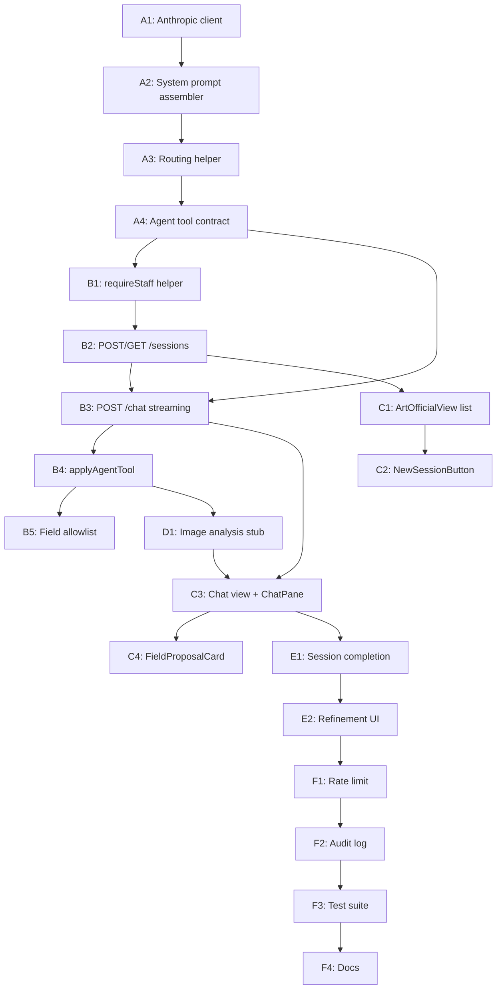

# Art/Official Admin — Implementation Plan

**bernardbolter.com · Payload admin agent build**
*May 2026 · Continues directly from `art-official-schema-build` plan (now complete).*

---

## How to use this document

The schema layer is done (Phases 0–6 of `art-official-schema-build_c7874665.plan.md`). This document is the next plan: build the actual cataloguing agent inside the Payload admin.

Each step is atomic, has a clear ✓ completion test, and assumes the previous step is committed. Hand each step to an implementation model and only move on once its completion test passes.

**Source-of-truth docs (in this order)**
- [docs/art-official-handoff.rtf](art-official-handoff.rtf) — north star, conversation philosophy, session-type matrix
- [docs/art-official-dialogue-spec.md.rtf](art-official-dialogue-spec.md.rtf) — dialogue model, weak-phase labels, formal-contribution assessment
- [docs/schema-extension-collector-ar.md](schema-extension-collector-ar.md) — collector + AR fields the agent writes
- [docs/cursor-implementation-plan-v2.md](cursor-implementation-plan-v2.md) — phase/step structure for the surrounding build
- [AGENTS.md](../AGENTS.md) — Payload security + transaction rules

## Hard constraints every step must obey

- **No `overrideAccess: true` in production routes.** Every `req.payload.*` call from an API route or hook that runs in a user request MUST pass `overrideAccess: false`. Seed scripts may override.
- **Pass `req` to nested operations.** Every `req.payload.create/update/delete` inside a hook MUST pass `req` to stay in the same transaction.
- **Anti-loop context flags.** When the agent mutates artworks/events from a hook chain, pass `context: { skipArUpdate: true, skipAgent: true }` to avoid re-entering AR or agent hooks.
- **Never expose `acquisitionPrice` or `mergeStaff.*` to anonymous API.** These are already locked at the field level — do not work around them.
- **Streaming over polling.** The chat route MUST stream the model response (Server-Sent Events or `ReadableStream`); the UI MUST consume the stream. Buffered responses cause poor UX and timeouts on Vercel.
- **TypeScript-first.** Every step ends with `pnpm tsc --noEmit` clean for the files touched. Steps that add admin components also run `pnpm payload generate:importmap`.
- **Localization stays English-only inside the agent.** Sessions are not localized. The agent reads localized fields in `en` and writes to the `en` locale unless explicitly told otherwise.

---

## Architecture at a glance

```
┌──────────────────────────────────────────────────────────────────────┐
│ Payload admin (Server Components)                                    │
│   /admin/art-official  → ArtOfficialView                             │
│     ├─ SessionList     (server) → list staff sessions                │
│     └─ ChatPane        (client) → SSE consumer + transcript          │
└──────────────────────────────────────────────────────────────────────┘
                │ POST /api/art-official/chat (SSE)
                ▼
┌──────────────────────────────────────────────────────────────────────┐
│ Route handler  (Next.js / Payload Local API)                         │
│   1. Auth check → must be staff (admin or artist role)               │
│   2. Resolve or create Session                                       │
│   3. Build system prompt (PracticeKnowledge + actor knowledge)       │
│   4. Stream from Anthropic                                           │
│   5. On tool-use chunks → call `applyAgentUpdate` (typed mutations)  │
│   6. Persist Session.messages + fieldUpdateTimeline atomically       │
└──────────────────────────────────────────────────────────────────────┘
                │
                ▼
┌──────────────────────────────────────────────────────────────────────┐
│ Side effects                                                         │
│   - Artwork PATCH (context.skipArUpdate when staging fields)         │
│   - Event upsert (entity resolution: sourceHistory append)           │
│   - Session log (messages, fieldUpdateTimeline, weakPhases)          │
└──────────────────────────────────────────────────────────────────────┘
```

---

## Phase 1 — Plumbing & system prompt

### Step A1 — Anthropic client + env

Files: `src/lib/artOfficial/anthropic.ts`, `.env.example` (additions only — never commit `.env`).

1. `pnpm add @anthropic-ai/sdk` (pin to a current major).
2. Create `src/lib/artOfficial/anthropic.ts` exporting a singleton:

   ```ts
   import Anthropic from '@anthropic-ai/sdk'
   const apiKey = process.env.ANTHROPIC_API_KEY
   if (!apiKey) throw new Error('ANTHROPIC_API_KEY missing')
   export const anthropic = new Anthropic({ apiKey })
   export const ART_OFFICIAL_MODEL = process.env.ART_OFFICIAL_MODEL ?? 'claude-sonnet-4-5'
   ```
3. Add to `.env.example`: `ANTHROPIC_API_KEY=`, `ART_OFFICIAL_MODEL=claude-sonnet-4-5` (optional override).
4. Add a `getAnthropicOrNull()` helper that returns `null` at build time (so `pnpm build` works in CI without the key).

✓ Completion test: `node -e "import('./src/lib/artOfficial/anthropic').then(m => console.log(!!m.anthropic))"` prints `true` when `ANTHROPIC_API_KEY` is set, throws otherwise. `pnpm tsc --noEmit` clean.

---

### Step A2 — System prompt assembler

Files: `src/lib/artOfficial/buildSystemPrompt.ts`, `src/lib/artOfficial/lexicalToPlain.ts`.

`buildSystemPrompt({ payload, req, sessionType, artistId?, collectorId?, galleryId? })`:

1. Always include `PracticeKnowledge` rows where `status: active`, sorted by `order ASC`. Format each as `## ${sectionLabel}\n\n${plainTextFromLexical(content)}`.
2. Switch on `sessionType`:
   - `artwork-cataloguing` | `artist-statement` | `biography` | `onboarding` → practice knowledge only.
   - `collector-cataloguing` → also include `CollectionKnowledge` (where `status: active`).
   - `gallery-cataloguing` → also include `GalleryKnowledge` (where `status: active`).
3. Append the dialogue spec footer (see `art-official-dialogue-spec.md.rtf`): conversation phases, weak-phase labels, "drawn out through dialogue — never form-filled" reminder, output JSON contract (see Step A4).
4. All `payload.find` calls MUST pass `overrideAccess: false` and `req`. Use `depth: 0` and `select` to only pull `slug`, `sectionLabel`, `content`, `order`.

`lexicalToPlain.ts`: walks the lexical JSON tree, joins `text` nodes with newlines per `paragraph`. No HTML. ~30 lines.

✓ Completion test: Unit test `tests/unit/buildSystemPrompt.spec.ts` calls the function with a stubbed `payload` returning two practice-knowledge rows; output starts with `## Biography\n\n<text>\n\n## Artist statement\n\n<text>` and ends with the dialogue spec footer.

---

### Step A3 — Routing helper

File: `src/lib/artOfficial/routing.ts`.

```ts
export type SessionType =
  | 'artwork-cataloguing'
  | 'collector-cataloguing'
  | 'gallery-cataloguing'
  | 'artist-statement'
  | 'biography'
  | 'onboarding'

export function actorRequirementForSessionType(
  t: SessionType,
): 'artist' | 'collector' | 'gallery' | 'any' {
  switch (t) {
    case 'collector-cataloguing':
      return 'collector'
    case 'gallery-cataloguing':
      return 'gallery'
    case 'artwork-cataloguing':
    case 'artist-statement':
    case 'biography':
      return 'artist'
    case 'onboarding':
      return 'any'
  }
}
```

Plus `requireArtworkContext(t)` returning `true` only for `artwork-cataloguing`.

✓ Completion test: Inline `tsc --noEmit` and exhaustiveness check (Vitest case-per-value).

---

### Step A4 — Agent tool contract (typed JSON)

File: `src/lib/artOfficial/agentTools.ts`.

Define the structured outputs the agent can emit alongside its natural-language reply. The agent uses **Anthropic tool use** so we never parse free-form JSON out of prose.

Tools to expose:

1. `propose_field_update` — agent suggests a field change but does NOT commit yet.
   - args: `{ targetCollection: 'artworks' | 'events' | 'artists' | 'collectors' | 'galleries', targetId: number, field: string, value: unknown, confidence: 'high' | 'medium' | 'low', source: 'artist-archive' | 'collector-session' | 'gallery-import' | 'enrichment-agent' | 'manual', rationale: string }`
2. `commit_field_update` — staff-confirmed → actually mutate.
   - args: same shape as above, plus `sessionId: string`.
3. `flag_weak_phase` — `{ phase: 'pre-upload' | 'identity' | 'intent' | 'art-historical' | 'classification' | 'confirmation', note: string }`
4. `record_first_impression` — single text field.
5. `record_second_description` — single text field.
6. `assess_formal_contribution` — `{ accuracy: 'accurate' | 'partial' | 'missed', notes: string }`
7. `propose_merge` — `{ candidateType, candidateId, matchConfidence, matchBasis }` → writes `mergeCandidates` on the current actor.
8. `request_image_analysis` — placeholder for Step C2.

Export Zod schemas for runtime validation **AND** the Anthropic `tools` JSON schema for the API call. Use `z.infer` so both stay in sync.

✓ Completion test: `pnpm tsc --noEmit` clean. Each tool exports a name constant and a validated `parseToolArgs(toolName, raw)` helper.

---

## Phase 2 — Sessions API

### Step B1 — Auth helper for route handlers

File: `src/lib/artOfficial/requireStaff.ts`.

```ts
import { headers as nextHeaders } from 'next/headers'
import { getPayload } from 'payload'
import config from '@payload-config'
import { isArtistOrAdmin } from '@/access/isArtistOrAdmin'

export async function requireStaff() {
  const payload = await getPayload({ config })
  const headers = await nextHeaders()
  const { user } = await payload.auth({ headers })
  if (!user || !isArtistOrAdmin(user)) {
    return { ok: false as const, payload, user: null }
  }
  return { ok: true as const, payload, user }
}
```

All `/api/art-official/**` route handlers MUST start with this helper. If `!ok`, return `Response.json({ error: 'Unauthorized' }, { status: 401 })`.

✓ Completion test: Hitting the route without a `payload-token` cookie returns 401; with a valid staff cookie returns 200.

---

### Step B2 — POST `/api/art-official/sessions` — create or resume

File: `src/app/(payload)/api/art-official/sessions/route.ts`.

`POST` body: `{ sessionType, artistId?, collectorId?, galleryId?, artworkRecord? }`.

Behaviour:

1. `requireStaff()` → bail if not.
2. Validate `sessionType` with the routing helper.
3. `payload.create({ collection: 'sessions', data: { sessionType, artistId, collectorId, galleryId, artworkRecord, status: 'in-progress', messages: [] }, req, overrideAccess: false })`.
   - `sessionId` auto-fills via the existing `beforeChange` UUID hook.
4. Return `{ id, sessionId, sessionType, status }`.

`GET /api/art-official/sessions?status=in-progress`:

1. `requireStaff()`.
2. `payload.find({ collection: 'sessions', where: { status: { equals: req.searchParams.get('status') ?? 'in-progress' } }, sort: '-updatedAt', limit: 50, req, overrideAccess: false })`.
3. Return `docs` mapped to a slim shape (id, sessionId, sessionType, updatedAt, dialogueRefinementFlag).

✓ Completion test:
```
curl -X POST -H "Cookie: payload-token=$T" -d '{"sessionType":"artwork-cataloguing","artistId":1}' http://localhost:3000/api/art-official/sessions
```
returns `{ id, sessionId: <uuid>, sessionType: 'artwork-cataloguing', status: 'in-progress' }`. A row appears at `/admin/collections/sessions`.

---

### Step B3 — POST `/api/art-official/chat` — streaming

File: `src/app/(payload)/api/art-official/chat/route.ts`.

This is the heart of the agent. Implement as a Server-Sent Events stream.

Request body: `{ sessionId: string, userMessage: string }`.

Pseudocode:

```ts
export async function POST(request: Request) {
  const { ok, payload, user } = await requireStaff()
  if (!ok) return new Response('Unauthorized', { status: 401 })

  const { sessionId, userMessage } = await request.json()
  if (!sessionId || !userMessage) {
    return new Response('sessionId + userMessage required', { status: 400 })
  }

  const sessionRes = await payload.find({
    collection: 'sessions',
    where: { sessionId: { equals: sessionId } },
    limit: 1,
    depth: 1,
    overrideAccess: false,
  })
  const session = sessionRes.docs[0]
  if (!session) return new Response('Session not found', { status: 404 })

  const systemPrompt = await buildSystemPrompt({
    payload,
    req: { user, payload } as any, // route handler has no Payload req; use overrideAccess:false explicitly
    sessionType: session.sessionType,
    artistId: typeof session.artistId === 'object' ? session.artistId?.id : session.artistId,
    collectorId: typeof session.collectorId === 'object' ? session.collectorId?.id : session.collectorId,
  })

  const priorMessages = Array.isArray(session.messages) ? session.messages : []
  const newMessages = [...priorMessages, { role: 'user', content: userMessage }]

  const encoder = new TextEncoder()
  const stream = new ReadableStream({
    async start(controller) {
      const send = (event: string, data: unknown) => {
        controller.enqueue(encoder.encode(`event: ${event}\ndata: ${JSON.stringify(data)}\n\n`))
      }

      try {
        const anthropicStream = await anthropic.messages.stream({
          model: ART_OFFICIAL_MODEL,
          max_tokens: 4096,
          system: systemPrompt,
          tools: AGENT_TOOLS,
          messages: newMessages.map(m => ({ role: m.role, content: m.content })),
        })

        let assistantText = ''
        const toolUses: Array<{ name: string; input: unknown; id: string }> = []

        for await (const chunk of anthropicStream) {
          if (chunk.type === 'content_block_delta' && chunk.delta.type === 'text_delta') {
            assistantText += chunk.delta.text
            send('token', { text: chunk.delta.text })
          }
          if (chunk.type === 'content_block_start' && chunk.content_block.type === 'tool_use') {
            toolUses.push({
              name: chunk.content_block.name,
              input: chunk.content_block.input,
              id: chunk.content_block.id,
            })
          }
        }

        // Apply tool calls atomically: this is the only place we mutate.
        for (const tool of toolUses) {
          await applyAgentTool({ payload, user, session, tool, send })
        }

        const finalAssistantMessage = {
          role: 'assistant' as const,
          content: assistantText,
          toolUses,
          timestamp: new Date().toISOString(),
        }

        await payload.update({
          collection: 'sessions',
          id: session.id,
          data: {
            messages: [...newMessages, finalAssistantMessage],
          },
          overrideAccess: false,
          user,
        })

        send('done', { sessionId: session.sessionId })
        controller.close()
      } catch (err) {
        send('error', { message: (err as Error).message })
        controller.close()
      }
    },
  })

  return new Response(stream, {
    headers: {
      'Content-Type': 'text/event-stream',
      'Cache-Control': 'no-cache, no-transform',
      Connection: 'keep-alive',
    },
  })
}
```

Notes:
- **Pass `user`** to `payload.update` plus `overrideAccess: false` so collection access runs as the staff member.
- The streaming function inside `start(controller)` must NOT await Payload writes between every token — only after the stream is fully consumed. Otherwise the Anthropic stream times out.
- Wrap `applyAgentTool` in a top-level `try` so a single bad tool call doesn't blow up the whole session.

✓ Completion test:
```
curl -N -X POST -H "Cookie: payload-token=$T" -d '{"sessionId":"<uuid>","userMessage":"hello"}' http://localhost:3000/api/art-official/chat
```
streams `event: token` chunks, ends with `event: done`. `/admin/collections/sessions/<id>` now shows a user + assistant message in `messages`.

---

### Step B4 — Tool-application layer

File: `src/lib/artOfficial/applyAgentTool.ts`.

This is the only place that writes to schema collections in response to the agent. Strict typing + Zod validation.

```ts
type Ctx = {
  payload: Payload
  user: User
  session: Session
  tool: { name: string; input: unknown; id: string }
  send: (event: string, data: unknown) => void
}

export async function applyAgentTool(ctx: Ctx) {
  const { payload, user, session, tool, send } = ctx

  switch (tool.name) {
    case 'commit_field_update': {
      const args = commitFieldUpdateSchema.parse(tool.input)
      const updated = await payload.update({
        collection: args.targetCollection,
        id: args.targetId,
        data: { [args.field]: args.value },
        overrideAccess: false,
        user,
        context: { skipArUpdate: true, skipAgent: true },
      })

      const timeline = Array.isArray(session.fieldUpdateTimeline)
        ? session.fieldUpdateTimeline
        : []
      timeline.push({
        field: `${args.targetCollection}.${args.field}`,
        value: args.value,
        confidence: args.confidence,
        source: args.source,
        timestamp: new Date().toISOString(),
      })
      await payload.update({
        collection: 'sessions',
        id: session.id,
        data: { fieldUpdateTimeline: timeline },
        overrideAccess: false,
        user,
        context: { skipAgent: true },
      })
      send('field-updated', { collection: args.targetCollection, id: args.targetId, field: args.field })
      return
    }

    case 'propose_field_update': {
      // No mutation, just emit to UI for staff confirmation.
      send('field-proposed', tool.input)
      return
    }

    case 'flag_weak_phase': {
      const args = flagWeakPhaseSchema.parse(tool.input)
      const current = Array.isArray(session.weakPhases) ? session.weakPhases : []
      if (!current.includes(args.phase)) {
        await payload.update({
          collection: 'sessions',
          id: session.id,
          data: { weakPhases: [...current, args.phase] },
          overrideAccess: false,
          user,
          context: { skipAgent: true },
        })
      }
      return
    }

    case 'record_first_impression':
    case 'record_second_description':
    case 'assess_formal_contribution': {
      // Direct map → session column; see Zod schemas.
      // ...
      return
    }

    case 'propose_merge': {
      // Append entry to mergeCandidates on the current actor (artist/collector/gallery).
      // Use proposeMerge stub from src/lib/entityResolution/proposeMerge.ts.
      return
    }

    default:
      send('error', { message: `Unknown tool: ${tool.name}` })
  }
}
```

Rules:
- Every mutation passes `overrideAccess: false`, `user`, and `context: { skipAgent: true }`.
- Field updates to `artworks` ALSO pass `context: { skipArUpdate: true }` so the AR pipeline doesn't fire mid-session (it will fire on final save in Step E1).
- `commit_field_update` only allows fields whose collection-level access grants `update` to the current user — Payload enforces this automatically because we pass `overrideAccess: false`.

✓ Completion test: Curl a chat message where the agent emits `commit_field_update` for `artworks[1].descriptionShort = 'Test'`. The artwork updates, `Session.fieldUpdateTimeline` gains one entry, and `Session.messages[-1].toolUses` records the call.

---

### Step B5 — Field-allowlist guard

File: `src/lib/artOfficial/fieldAllowlist.ts`.

Even with Payload's access control, we want a deny-list on top of `commit_field_update`:

```ts
const FORBIDDEN = new Set([
  'artworks.acquisitionPrice',
  'artworks.salesRecord',
  'artworks.recordOrigin', // immutable
  'artworks.consignmentHistory',
  'sessions.messages', // agent must not rewrite its own transcript
])

export function isFieldAllowedForAgent(collection: string, field: string): boolean {
  return !FORBIDDEN.has(`${collection}.${field}`)
}
```

`commit_field_update` must call this first and return a `send('error', ...)` if false.

✓ Completion test: Inject a tool-use payload trying to set `artworks.acquisitionPrice` — applyAgentTool emits `event: error` and never calls `payload.update`.

---

## Phase 3 — Admin UI

### Step C1 — ArtOfficialView Server Component (list)

File: `src/components/admin/ArtOfficialView.tsx` (already exists as stub — fill in).

1. Authenticate via Payload's server-side `headers()` + `payload.auth`. If not staff, redirect to `/admin`.
2. Fetch the 50 most-recent sessions, grouped:
   - "In progress" (status = `in-progress`)
   - "Needs refinement" (`dialogueRefinementFlag: true`)
   - "Recent completed" (status = `completed`, limit 20)
3. Render with `@payloadcms/ui` primitives: `Gutter`, `Card`, `Pill`.
4. Each list item links to `/admin/art-official/[sessionId]`.

```tsx
import { DefaultTemplate } from '@payloadcms/next/templates'
import { Gutter, Card } from '@payloadcms/ui'
import { headers as nextHeaders } from 'next/headers'
import { redirect } from 'next/navigation'
import { getPayload } from 'payload'
import config from '@payload-config'
import { isArtistOrAdmin } from '@/access/isArtistOrAdmin'
import { NewSessionButton } from './artOfficial/NewSessionButton'

export async function ArtOfficialView(props: DefaultTemplateProps) {
  const payload = await getPayload({ config })
  const { user } = await payload.auth({ headers: await nextHeaders() })
  if (!isArtistOrAdmin(user)) redirect('/admin')

  const sessions = await payload.find({
    collection: 'sessions',
    where: { status: { equals: 'in-progress' } },
    sort: '-updatedAt',
    limit: 50,
    overrideAccess: false,
    user,
  })

  return (
    <DefaultTemplate {...props}>
      <Gutter>
        <h1>Art/Official</h1>
        <NewSessionButton />
        <ul>
          {sessions.docs.map(s => (
            <li key={s.id}>
              <a href={`/admin/art-official/${s.sessionId}`}>
                {s.sessionType} · {new Date(s.updatedAt).toLocaleString()}
              </a>
            </li>
          ))}
        </ul>
      </Gutter>
    </DefaultTemplate>
  )
}
```

✓ Completion test: Visit `/admin/art-official` as staff — page renders with the list. Visit as anonymous — redirected to `/admin/login`.

---

### Step C2 — NewSessionButton client component

File: `src/components/admin/artOfficial/NewSessionButton.tsx`.

`'use client'` component. Renders a small form (select sessionType + relevant actor relation), POSTs to `/api/art-official/sessions`, navigates to `/admin/art-official/[newSessionId]`.

Use `useRouter` from `next/navigation` for redirect and `Button`/`Select` from `@payloadcms/ui`.

✓ Completion test: Create a session via the button; redirects to the chat view; new row visible at `/admin/collections/sessions`.

---

### Step C3 — Chat view route

Files:
- `src/app/(payload)/admin/art-official/[sessionId]/page.tsx` (Server Component)
- `src/components/admin/artOfficial/ChatPane.tsx` (`'use client'`)
- `src/components/admin/artOfficial/MessageList.tsx` (`'use client'`)

**`page.tsx`** (server):
1. `requireStaff()` via the helper; redirect if not.
2. `payload.findByID({ collection: 'sessions', id: <numeric id resolved from sessionId> })` — overrideAccess false.
3. Render `<ChatPane initialSession={session} />`.

**`ChatPane.tsx`** (client):

```tsx
'use client'
import { useState } from 'react'

export function ChatPane({ initialSession }: { initialSession: Session }) {
  const [messages, setMessages] = useState(initialSession.messages ?? [])
  const [pending, setPending] = useState('')
  const [input, setInput] = useState('')

  async function send() {
    const userMessage = input
    setInput('')
    setMessages(m => [...m, { role: 'user', content: userMessage }])
    setPending('')

    const res = await fetch('/api/art-official/chat', {
      method: 'POST',
      headers: { 'Content-Type': 'application/json' },
      body: JSON.stringify({ sessionId: initialSession.sessionId, userMessage }),
    })
    if (!res.ok || !res.body) return

    const reader = res.body.getReader()
    const decoder = new TextDecoder()
    let buf = ''
    while (true) {
      const { done, value } = await reader.read()
      if (done) break
      buf += decoder.decode(value, { stream: true })
      for (const event of buf.split('\n\n').slice(0, -1)) {
        const lines = event.split('\n')
        const type = lines[0]?.replace('event: ', '')
        const data = JSON.parse(lines[1]?.replace('data: ', '') ?? '{}')
        if (type === 'token') setPending(p => p + data.text)
        if (type === 'done') {
          setMessages(m => [...m, { role: 'assistant', content: pending }])
          setPending('')
        }
        if (type === 'field-proposed') {/* render an inline approval card */}
        if (type === 'field-updated') {/* toast + refresh related panel */}
      }
      buf = buf.split('\n\n').pop() ?? ''
    }
  }

  return (
    <div>
      <MessageList messages={messages} streaming={pending} />
      <textarea value={input} onChange={e => setInput(e.target.value)} />
      <button onClick={send}>Send</button>
    </div>
  )
}
```

✓ Completion test: Send a message in the UI; tokens stream in visibly; when `done` arrives, the message persists in `messages` (refresh — still there).

---

### Step C4 — Field-proposal approval cards

File: `src/components/admin/artOfficial/FieldProposalCard.tsx` (`'use client'`).

When `field-proposed` SSE arrives, render an inline card with:
- "AI suggests setting `artworks.descriptionShort` to:" + truncated value
- Approve / Edit / Reject buttons.

On Approve → POST `/api/art-official/chat/confirm` (Step B6 — small follow-up route that re-emits the tool use as `commit_field_update`). On Reject → send a follow-up user message `"reject: <field>"`.

This is the **only** flow where the agent persists schema changes — pure consent UX, per the dialogue spec.

✓ Completion test: Agent proposes a description short; staff clicks Approve; the artwork updates; `Session.fieldUpdateTimeline` gains a row with `confidence` and `source`.

---

## Phase 4 — Image analysis (placeholder)

### Step D1 — `/api/art-official/image-analysis` (stub)

File: `src/app/(payload)/api/art-official/image-analysis/route.ts`.

For now: accepts `{ mediaId }`, returns a hard-coded `{ dominantColors: [...], aspectRatio: 'landscape', detectedSubjects: [] }`. Wire it into the agent's `request_image_analysis` tool so the agent can call it and announce results into the conversation.

Real implementation comes later (CLIP/Claude vision). Stub now so the dialogue flow is testable.

✓ Completion test: Agent calls the tool during artwork-cataloguing; the route returns the stub object; the agent narrates "I see a landscape work with greens and blues" using stub data.

---

## Phase 5 — Final commit + AR regeneration

### Step E1 — Session completion endpoint

File: `src/app/(payload)/api/art-official/sessions/[sessionId]/complete/route.ts`.

`POST` body: `{ confirm: true }`.

Behaviour:
1. `requireStaff()`.
2. Set `Session.status = 'completed'`, `Session.completedAt = now()`.
3. If `artworkRecord` is set: trigger a "final" `payload.update` on that artwork **without** `context.skipArUpdate` — this re-fires the AR pipeline so any new dimensions/primaryImage produce a fresh USDZ/GLB.
4. Compute final `dialogueRefinementFlag` based on `weakPhases.length > 1` heuristic.
5. Return `{ status: 'completed', refinementFlagged: boolean }`.

✓ Completion test: Complete a session with artwork dims set → after a short delay, `artworks[id].arLastGenerated` updates and `arModelUrl` is populated (currently still the stub URL from Step 9 of the schema plan).

---

### Step E2 — Refinement pass UI hook

In the session list (Step C1), surface a "Needs refinement" section that surfaces `Session.dialogueRefinementFlag = true`. Clicking opens the same chat view in refinement mode (prefix the system prompt with "This is a refinement pass; you previously caught weakness in phases: <weakPhases>").

✓ Completion test: A session flagged for refinement appears in the list; opening it shows a banner "Refinement pass — weakness in: identity, classification".

---

## Phase 6 — Hardening

### Step F1 — Rate limit + abuse safety

Add a per-staff-user rate limiter on the chat route (in-memory `Map<userId, { count, resetAt }>` for v1; Redis later). Limit: 60 requests / 10 min.

### Step F2 — Audit log

Add an `Audit` collection (or reuse `Sessions.messages`) so every `commit_field_update` is queryable by `actorId` for compliance.

### Step F3 — Test suite

- `tests/int/art-official-sessions.int.spec.ts` — POST creates session, sessionId is UUID.
- `tests/int/art-official-chat.int.spec.ts` — stub Anthropic with a mock; assert SSE event order: `token+ → field-proposed? → field-updated? → done`.
- `tests/int/art-official-allowlist.int.spec.ts` — `commit_field_update` for `artworks.acquisitionPrice` is blocked.

✓ Completion test: All three int specs green when `DATABASE_URL` is set; the suite uses `describe.skipIf(!process.env.DATABASE_URL)` for CI parity.

### Step F4 — Docs touch-up

Update [README.md](../README.md) with a quick "Art/Official" section: env vars, `pnpm dev` flow, how to seed the first staff user, where to view sessions.

---

## What this plan deliberately does NOT cover

- **Real image analysis pipeline** (CLIP embeddings already exist via `src/utilities/persistArtworkClipEmbedding.ts` — wire the model decoder later).
- **Real USDZ/GLB generation.** The AR hook currently stamps placeholder URLs; the next plan should swap in `usdz-exporter` (Node) or Apple's `usdz_converter` (macOS only).
- **Background enrichment agent** (`src/lib/entityResolution/enrichmentAgent.ts` is a no-op stub).
- **Multi-tenant artist support** — single-tenant (Bernard Bolter) only.
- **Public CV PDF/HTML rendering** — only the JSON endpoint exists.

---

## Dependency graph



---

## Quick reference: file targets

```
src/
├─ app/(payload)/
│  ├─ admin/art-official/[sessionId]/page.tsx     ← C3
│  └─ api/art-official/
│     ├─ chat/route.ts                            ← B3
│     ├─ chat/confirm/route.ts                    ← C4
│     ├─ image-analysis/route.ts                  ← D1
│     ├─ sessions/route.ts                        ← B2
│     └─ sessions/[sessionId]/complete/route.ts   ← E1
├─ components/admin/
│  ├─ ArtOfficialView.tsx                         ← C1
│  └─ artOfficial/
│     ├─ ChatPane.tsx                             ← C3
│     ├─ FieldProposalCard.tsx                    ← C4
│     ├─ MessageList.tsx                          ← C3
│     └─ NewSessionButton.tsx                     ← C2
└─ lib/artOfficial/
   ├─ agentTools.ts                               ← A4
   ├─ anthropic.ts                                ← A1
   ├─ applyAgentTool.ts                           ← B4
   ├─ buildSystemPrompt.ts                        ← A2
   ├─ fieldAllowlist.ts                           ← B5
   ├─ lexicalToPlain.ts                           ← A2
   ├─ requireStaff.ts                             ← B1
   └─ routing.ts                                  ← A3

tests/int/
├─ art-official-sessions.int.spec.ts              ← F3
├─ art-official-chat.int.spec.ts                  ← F3
└─ art-official-allowlist.int.spec.ts             ← F3
```

When in doubt, prefer the simplest path that keeps the four hard constraints (no-override-access, pass-req, anti-loop context, no-leak of private fields). Everything in this plan is designed so failure modes are visible: a missing `req` shows up as a transaction split in logs; a missing `overrideAccess: false` shows up as an admin write that succeeds where it should 403.
