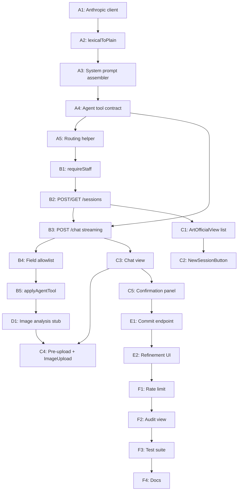

# Art/Official Admin — Implementation Plan

**bernardbolter.com · Payload admin agent build**
*Rewritten May 2026 — Artist-only scope, aligned with `artist-archive-schema-final.md`.*

---

## What this document is

The Artist Archive schema (Phases A–E of `artist-archive-build-directive.md`) is complete. The Payload collections, hooks, access control, JSON-LD utilities, and CV builder all exist and are typechecked. The database schema has been pushed clean to Neon.

**This document is the next plan: build the Art/Official cataloguing agent inside the Payload admin.**

Each step is atomic, has a clear ✓ completion test, and assumes the previous step is committed. Hand each step to an implementation auto-agent and only move on once its completion test passes.

---

## What changed since the previous version of this plan

The previous implementation plan assumed a tri-modular system (Artist / Collector / Gallery). The project has been formally scoped to **Module A — Artist Archive only**. Collector and Gallery modules are now separate future builds with their own schemas and instances.

Concrete differences from the previous plan:

| Area | Previous plan | This plan |
|---|---|---|
| Session types | `artwork-cataloguing`, `collector-cataloguing`, `gallery-cataloguing`, `artist-statement`, `biography`, `onboarding` | `artwork-cataloguing`, `artist-statement`, `biography`, `onboarding` |
| Routing helper | actor enum `artist \| collector \| gallery \| any` | actor enum `artist \| any` |
| Session prompt sources | PracticeKnowledge + CollectionKnowledge + GalleryKnowledge | PracticeKnowledge only |
| Sessions.collectorId | present | removed |
| Tool contract `targetCollection` | `artworks \| events \| artists \| collectors \| galleries` | `artworks \| events \| artists` |
| `propose_merge` tool | exposed (cross-module entity resolution) | removed (lives in Module B/C) |
| Statement/biography target | Artists collection (multi-record) | Artist **singleton** (exactly one record) |
| Tier-3 commercial fields | Mixed with cataloguing flow | Silently filtered by `careerStage` (see dialogue spec §10) |
| Live field writes during chat | `commit_field_update` mutates artworks mid-session | Staged in `Session.fieldUpdateTimeline`; commit happens once at the confirmation step |
| Renamed fields used by the agent | `description`, `bio`, `statement` | `descriptionShort` / `descriptionLong` / `bioFull` / `bioMedium` / `bioShort` / `statementFull` / etc. |
| `creator` relation | `people` | `artists` |

**Source-of-truth docs (in this order)**
- [docs/artist-archive-schema-final.md](artist-archive-schema-final.md) — canonical field names, types, access control
- [docs/art-official-dialogue-spec.md.rtf](art-official-dialogue-spec.md.rtf) — dialogue model, weak-phase labels, formal-contribution assessment, tool definitions
- [docs/art-official-handoff.rtf](art-official-handoff.rtf) — north star, conversation philosophy
- [AGENTS.md](../AGENTS.md) — Payload security + transaction rules

---

## Hard constraints every step must obey

- **No `overrideAccess: true` in production routes.** Every `req.payload.*` call from an API route or hook that runs inside a user request MUST pass `overrideAccess: false`. Seed scripts may override.
- **Pass `req` (or `user`) to nested operations.** Every `payload.create / update / delete` inside a hook MUST pass `req` to stay in the same transaction. Inside route handlers (which have no Payload `req`) pass `user` plus `overrideAccess: false`.
- **Anti-loop context flags.** When the agent mutates artworks/events from a hook chain, pass `context: { skipArUpdate: true, skipAgent: true }` to avoid re-entering AR or agent hooks.
- **Never expose private fields to anonymous API.** `askingPrice`, `salesRecord`, `insuranceValue`, `ownershipHistory`, `loanHistory`, `provenanceConfidenceLayer`, and `Artist.publicEmail` are already locked at the field level with `privateFieldAccess`. The agent must never work around this.
- **Streaming over polling.** The chat route MUST stream the model response (Server-Sent Events / `ReadableStream`). The UI MUST consume the stream. Buffered responses cause poor UX and timeouts on Vercel.
- **The agent never auto-publishes.** The agent never writes `status: 'published'`. It writes `status: 'draft'` and waits for explicit human publish.
- **The agent never live-writes artworks during a session.** All proposed/inferred values are staged in `Session.fieldUpdateTimeline`. The only mutation paths that touch `artworks` / `artists` are (a) the confirmation commit endpoint (Phase 5) and (b) the standard Payload admin UI.
- **TypeScript-first.** Every step ends with `npm run typecheck` (`tsc --noEmit`) clean for the files touched. Steps that add admin components also run `npm run generate:importmap`.
- **Localisation stays English-only inside the agent.** Sessions are not localised. The agent reads localised fields in `en` and writes to the `en` locale unless explicitly told otherwise.

---

## Architecture at a glance

```
┌──────────────────────────────────────────────────────────────────────┐
│ Payload admin (Server Components)                                    │
│   /admin/art-official  → ArtOfficialView                             │
│     ├─ SessionList     (server) → list staff sessions                │
│     └─ NewSessionButton(client) → opens new session                  │
│                                                                      │
│   /admin/art-official/[sessionId]                                    │
│     ├─ ChatPane        (client) → SSE consumer + transcript          │
│     ├─ FieldProposalCard (client) → review staged updates            │
│     └─ ConfirmationPanel (client) → final commit at session end      │
└──────────────────────────────────────────────────────────────────────┘
                │ POST /api/art-official/chat (SSE)
                ▼
┌──────────────────────────────────────────────────────────────────────┐
│ Route handler  (Next.js / Payload Local API)                         │
│   1. Auth check → must be staff (admin or artist role)               │
│   2. Resolve session (by sessionId), load Practice Knowledge         │
│   3. Read Artist.careerStage (filters field roadmap silently)        │
│   4. Stream from Anthropic with tool definitions                     │
│   5. On tool-use chunks → applyAgentTool (writes Session only)       │
│   6. Persist Session.messages + fieldUpdateTimeline atomically       │
└──────────────────────────────────────────────────────────────────────┘
                │ POST /api/art-official/sessions/[sessionId]/commit
                ▼
┌──────────────────────────────────────────────────────────────────────┐
│ Commit endpoint (Phase 5)                                            │
│   - artwork-cataloguing → payload.create({ collection: 'artworks' }) │
│   - artist-statement / biography → payload.update({ artists, id:1 }) │
│   - onboarding → no record write; finalises PracticeKnowledge edits  │
│   - On artwork commit, fires AR pipeline (no skipArUpdate)           │
└──────────────────────────────────────────────────────────────────────┘
```

---

## Phase 1 — Plumbing & system prompt

### Step A1 — Anthropic client + env

Files: `src/lib/artOfficial/anthropic.ts`, `.env.example` (additions only — never commit `.env`).

1. `npm install @anthropic-ai/sdk` (pin to current major).
2. Create `src/lib/artOfficial/anthropic.ts`:

   ```ts
   import Anthropic from '@anthropic-ai/sdk'

   const apiKey = process.env.ANTHROPIC_API_KEY

   export const ART_OFFICIAL_MODEL =
     process.env.ART_OFFICIAL_MODEL ?? 'claude-sonnet-4-20250514'

   /**
    * Returns the Anthropic client, or null during `next build` / CI when no key is set.
    * Throws at request time if a route tries to use a missing key in production.
    */
   export function getAnthropicOrNull(): Anthropic | null {
     if (!apiKey) return null
     return new Anthropic({ apiKey })
   }

   export function requireAnthropic(): Anthropic {
     if (!apiKey) {
       throw new Error('ANTHROPIC_API_KEY is missing')
     }
     return new Anthropic({ apiKey })
   }
   ```

3. Add to `.env.example`:
   ```
   ANTHROPIC_API_KEY=
   ART_OFFICIAL_MODEL=claude-sonnet-4-20250514
   ```

✓ Completion test: `npm run typecheck` clean. With `ANTHROPIC_API_KEY` set, `node -e "import('./src/lib/artOfficial/anthropic').then(m => console.log(!!m.requireAnthropic()))"` prints `true`. With the key unset, `getAnthropicOrNull()` returns `null` and `requireAnthropic()` throws.

---

### Step A2 — Lexical → plain text helper

File: `src/lib/artOfficial/lexicalToPlain.ts`.

Walks the Lexical JSON tree and joins `text` nodes with newlines per `paragraph`. ~30 lines, pure function. No HTML, no Markdown — just plain text suitable for inclusion in a system prompt.

Edge cases to handle:
- Lists → render `- ` prefix per item, blank line between.
- Headings → uppercase the text and trail with one blank line.
- Empty / null content → return empty string.

✓ Completion test: `tests/unit/lexicalToPlain.spec.ts` — a fixture with one paragraph, one bullet list, and one heading round-trips to the expected plain string.

---

### Step A3 — System prompt assembler

File: `src/lib/artOfficial/buildSystemPrompt.ts`.

Signature:

```ts
type BuildArgs = {
  payload: import('payload').Payload
  user: import('@/payload-types').User
  sessionType:
    | 'artwork-cataloguing'
    | 'artist-statement'
    | 'biography'
    | 'onboarding'
  artistId: number // required — single-tenant; resolved from Artist singleton
}

export async function buildSystemPrompt(args: BuildArgs): Promise<string>
```

Assembly order (per `art-official-dialogue-spec.md.rtf` §1.1):

1. **`IDENTITY_AND_ROLE`** — static block. Replace `{{ARTIST_NAME}}` and `{{SITE_URL}}` from `Artist` singleton (`displayName`, `website` / hard-coded `bernardbolter.com`).
2. **Practice Knowledge sections** — pull from `practice-knowledge` where `status: 'active'`, ordered by `order ASC`. For each doc, emit `## ${sectionLabel}\n\n${lexicalToPlain(content)}`. Skip docs whose `content` lexical tree is empty. Expected slugs: `biography`, `artist-statement`, `series`, `visual-vocabulary`, `art-historical-touchstones`, `preferred-vocabulary`.
3. **`DIALOGUE_RULES`** — static block lifted verbatim from §1.4 of the dialogue spec.
4. **`FIELD_ROADMAP`** — static block, but filtered by `Artist.careerStage`. Read `careerStage` from the singleton and pass it into the assembler so the roadmap can hide Tier 2/3 fields (see §9 of the dialogue spec for the exact field lists).
5. **`SESSION_TYPE_OVERRIDE`** — small per-sessionType footer:
   - `artwork-cataloguing` → "You are running a cataloguing session. Follow the full phase protocol."
   - `artist-statement` → "You are working on the artist statement. Update Artist.statementFull / statementMedium / statementShort. Do not write to Artworks."
   - `biography` → "You are working on the biography. Update Artist.bioFull / bioMedium / bioShort. Do not write to Artworks."
   - `onboarding` → "You are running an onboarding interview to populate Practice Knowledge. Updates write to `practice-knowledge`."
6. **`TOOL_DEFINITIONS`** — emitted as part of the Anthropic API call payload, not the system prompt text. Step A4 produces these.

Implementation rules:
- All `payload.find` calls MUST pass `overrideAccess: false`, `user`, `depth: 0`, and `select` to limit fields (`slug`, `sectionLabel`, `content`, `order`, `status`).
- The function is a pure async function that returns a string. No mutations.

✓ Completion test: `tests/unit/buildSystemPrompt.spec.ts` — stub `payload.find` to return two practice-knowledge rows. Output starts with `IDENTITY AND ROLE`, contains both `## ${sectionLabel}` sections, ends with `DIALOGUE RULES` and a `FIELD ROADMAP`. With `careerStage: 'studio'`, the roadmap does NOT mention `auctionEstimateHistory` or `authenticationRecord`.

---

### Step A4 — Agent tool contract (typed)

File: `src/lib/artOfficial/agentTools.ts`.

The agent uses **Anthropic tool use** so structured outputs are typed at the wire, not parsed out of free-form JSON. Export both:

- Zod schemas for runtime validation in `applyAgentTool` (Step B5).
- The Anthropic `tools` JSON Schema array for the API call.

Use `zod-to-json-schema` (or hand-write the JSON Schemas) so both stay in sync.

**Tools to expose** (lifted from `art-official-dialogue-spec.md.rtf` §4 with one addition):

1. **`update_field`** — stage a field value for later commit. **Does not write to artworks/artists directly.** Appends to `Session.fieldUpdateTimeline`.

   ```ts
   {
     targetCollection: 'artworks' | 'artists' | 'events',
     field: string,           // exact Payload field path, e.g. 'descriptionShort'
     value: unknown,          // typed per field at validation time
     confidence: 'confirmed' | 'inferred',
     source: 'conversation' | 'image-analysis' | 'knowledge-base'
   }
   ```

2. **`store_session_field`** — write to one of the session-private fields.

   ```ts
   { field: 'firstImpression' | 'secondDescription' | 'sessionNotes', value: string }
   ```

3. **`trigger_image_analysis`** — fires the (stubbed in Phase 4) analysis pass.

   ```ts
   { mediaId: number }
   ```

4. **`generate_confirmation_draft`** — emit the four agent drafts at session end.

   ```ts
   {
     agentDraftDescriptionShort: string,
     agentDraftDescriptionLong: string,
     agentDraftConceptualKeywords: string[],
     agentDraftFormalContributionAssessment: string
   }
   ```

   Writes to `Session.agentDraftDescriptionShort`, `agentDraftDescriptionLong`, `agentDraftConceptualKeywords`, and `agentDraftFormalContributionAssessment`.

5. **`flag_weak_phase`** — agent self-assessment. `{ phase, note }` where `phase` matches the `Session.weakPhases` enum: `pre-upload` | `identity` | `intent` | `art-historical` | `classification` | `confirmation`.

6. **`assess_formal_contribution`** — `{ accuracy: 'accurate' | 'partial' | 'missed', notes: string }` → writes `Session.formalContributionAccuracy` + appends notes to `Session.refinementNotes`.

Export a `parseToolArgs(toolName, raw): { ok: true, data } | { ok: false, error }` helper. Every tool name is a `const` string export so other files don't string-literal.

✓ Completion test: `npm run typecheck` clean. `tests/unit/agentTools.spec.ts` round-trips a valid payload for each tool and asserts a malformed `update_field` (bad `confidence` value) returns `{ ok: false }` rather than throwing.

---

### Step A5 — Routing & session-type helpers

File: `src/lib/artOfficial/routing.ts`.

```ts
export type SessionType =
  | 'artwork-cataloguing'
  | 'artist-statement'
  | 'biography'
  | 'onboarding'

export function requiresArtwork(t: SessionType): boolean {
  return t === 'artwork-cataloguing'
}

export function commitTarget(t: SessionType):
  | { kind: 'create-artwork' }
  | { kind: 'update-artist-singleton' }
  | { kind: 'no-record-write' } {
  switch (t) {
    case 'artwork-cataloguing':
      return { kind: 'create-artwork' }
    case 'artist-statement':
    case 'biography':
      return { kind: 'update-artist-singleton' }
    case 'onboarding':
      return { kind: 'no-record-write' }
  }
}
```

Add an exhaustive-switch guard so adding a future session type fails the type check until handled.

✓ Completion test: Vitest case-per-value, plus a deliberately failing test that proves an unhandled type fails compilation (commented assertion).

---

## Phase 2 — Sessions API

### Step B1 — `requireStaff` helper for route handlers

File: `src/lib/artOfficial/requireStaff.ts`.

```ts
import { headers as nextHeaders } from 'next/headers'
import { getPayload } from 'payload'
import config from '@payload-config'
import { isArtistOrAdmin } from '@/access/isArtistOrAdmin'

export async function requireStaff() {
  const payload = await getPayload({ config })
  const headers = await nextHeaders()
  const { user } = await payload.auth({ headers })
  if (!user || !isArtistOrAdmin(user)) {
    return { ok: false as const, payload, user: null }
  }
  return { ok: true as const, payload, user }
}
```

Every `/api/art-official/**` route handler MUST start with this helper. If `!ok`, return `Response.json({ error: 'Unauthorized' }, { status: 401 })`.

✓ Completion test: Hitting any `/api/art-official/**` route without a `payload-token` cookie returns 401. With a staff cookie returns 200 (test against the route added in B2).

---

### Step B2 — POST/GET `/api/art-official/sessions`

File: `src/app/(payload)/api/art-official/sessions/route.ts`.

**`POST`** body: `{ sessionType: SessionType, artworkRecord?: number }`.

1. `requireStaff()` → bail if not.
2. Validate `sessionType` via the Zod schema from A5.
3. Look up the Artist singleton — `payload.find({ collection: 'artists', limit: 1, depth: 0, overrideAccess: false, user })`. There is exactly one record. Bail with 412 if none exists (the schema requires one).
4. If `sessionType === 'artwork-cataloguing'`, `artworkRecord` is optional. If absent, the session catalogues a *new* artwork — `artworkRecord` will be set at commit (Phase 5).
5. `payload.create({ collection: 'sessions', data: { sessionType, artistId: artist.id, artworkRecord, status: 'in-progress', messages: [] }, overrideAccess: false, user })`. The `sessionId` UUID is set by the existing `beforeChange` hook on the Sessions collection.
6. Return `{ id, sessionId, sessionType, status }`.

**`GET`** query: `?status=in-progress` (default), `?limit=50`.

1. `requireStaff()`.
2. `payload.find({ collection: 'sessions', where: { status: { equals: <param> } }, sort: '-updatedAt', limit, overrideAccess: false, user })`.
3. Return a slim list: `{ id, sessionId, sessionType, status, artworkRecord, dialogueRefinementFlag, updatedAt }`.

✓ Completion test:
```bash
curl -X POST -H "Cookie: payload-token=$T" \
  -d '{"sessionType":"artwork-cataloguing"}' \
  http://localhost:3000/api/art-official/sessions
```
returns `{ id: <int>, sessionId: <uuid>, sessionType: 'artwork-cataloguing', status: 'in-progress' }`. A row appears at `/admin/collections/sessions`.

---

### Step B3 — POST `/api/art-official/chat` (SSE)

File: `src/app/(payload)/api/art-official/chat/route.ts`.

This is the heart of the agent.

**Request body:** `{ sessionId: string, userMessage: string, imageMediaId?: number }`.

**Response:** `text/event-stream` emitting:
- `event: token` — `{ text: string }` deltas
- `event: tool-staged` — `{ tool, input }` whenever the agent calls `update_field` / `store_session_field` / `generate_confirmation_draft` (so the UI can render proposal cards live)
- `event: error` — `{ message }`
- `event: done` — `{ sessionId }` final marker

Pseudocode:

```ts
export async function POST(request: Request) {
  const { ok, payload, user } = await requireStaff()
  if (!ok) return new Response('Unauthorized', { status: 401 })

  const { sessionId, userMessage, imageMediaId } = await request.json()
  if (!sessionId || !userMessage) {
    return new Response('sessionId + userMessage required', { status: 400 })
  }

  const sessionRes = await payload.find({
    collection: 'sessions',
    where: { sessionId: { equals: sessionId } },
    limit: 1,
    depth: 1,
    overrideAccess: false,
    user,
  })
  const session = sessionRes.docs[0]
  if (!session) return new Response('Session not found', { status: 404 })

  const artistId =
    typeof session.artistId === 'object'
      ? (session.artistId?.id as number)
      : (session.artistId as number)

  const systemPrompt = await buildSystemPrompt({
    payload,
    user,
    sessionType: session.sessionType as SessionType,
    artistId,
  })

  const priorMessages = Array.isArray(session.messages) ? session.messages : []
  const userTurn = { role: 'user' as const, content: userMessage }

  const encoder = new TextEncoder()
  const stream = new ReadableStream({
    async start(controller) {
      const send = (event: string, data: unknown) => {
        controller.enqueue(
          encoder.encode(`event: ${event}\ndata: ${JSON.stringify(data)}\n\n`),
        )
      }

      try {
        const anthropic = requireAnthropic()
        const anthropicStream = await anthropic.messages.stream({
          model: ART_OFFICIAL_MODEL,
          max_tokens: 1024,
          system: systemPrompt,
          tools: ANTHROPIC_TOOL_SCHEMAS,
          messages: [...priorMessages, userTurn].map(m => ({
            role: m.role,
            content: m.content,
          })),
        })

        let assistantText = ''
        const toolUses: Array<{ name: string; input: unknown; id: string }> = []

        for await (const chunk of anthropicStream) {
          if (
            chunk.type === 'content_block_delta' &&
            chunk.delta.type === 'text_delta'
          ) {
            assistantText += chunk.delta.text
            send('token', { text: chunk.delta.text })
          }
          if (
            chunk.type === 'content_block_start' &&
            chunk.content_block.type === 'tool_use'
          ) {
            toolUses.push({
              name: chunk.content_block.name,
              input: chunk.content_block.input,
              id: chunk.content_block.id,
            })
          }
        }

        // Apply tools after streaming completes — no awaits inside the token loop.
        for (const tool of toolUses) {
          await applyAgentTool({ payload, user, session, tool, send })
        }

        const assistantMessage = {
          role: 'assistant' as const,
          content: assistantText,
          toolUses,
          timestamp: new Date().toISOString(),
        }

        await payload.update({
          collection: 'sessions',
          id: session.id,
          data: { messages: [...priorMessages, userTurn, assistantMessage] },
          overrideAccess: false,
          user,
          context: { skipAgent: true },
        })

        send('done', { sessionId: session.sessionId })
        controller.close()
      } catch (err) {
        send('error', { message: (err as Error).message })
        controller.close()
      }
    },
  })

  return new Response(stream, {
    headers: {
      'Content-Type': 'text/event-stream',
      'Cache-Control': 'no-cache, no-transform',
      Connection: 'keep-alive',
    },
  })
}
```

Notes:
- **Pass `user` + `overrideAccess: false`** to every `payload.*` call — no `req` is available in a Next.js route handler.
- Awaiting Payload writes inside the token loop times out the Anthropic stream — buffer toolUses and write once after the loop.
- Wrap `applyAgentTool` in its own try so one bad tool call does not blow up the whole session.
- `imageMediaId` is forwarded into the next user turn's content as a Claude image content block when present (per Anthropic vision API).

✓ Completion test:
```bash
curl -N -X POST -H "Cookie: payload-token=$T" \
  -d '{"sessionId":"<uuid>","userMessage":"hello"}' \
  http://localhost:3000/api/art-official/chat
```
streams `event: token` chunks, ends with `event: done`. `/admin/collections/sessions/<id>` shows a user + assistant message in `messages`.

---

### Step B4 — Field allowlist guard

File: `src/lib/artOfficial/fieldAllowlist.ts`.

Even though Payload's access control will reject most forbidden writes, we want a defence in depth and clear agent-facing errors.

```ts
const FORBIDDEN = new Set([
  // Commerce / private — agent never writes these
  'artworks.askingPrice',
  'artworks.listingCurrency',
  'artworks.salesRecord',
  'artworks.insuranceValue',
  'artworks.insuranceValueDate',
  'artworks.galleryReference',
  'artworks.galleryText',

  // Provenance — manual only
  'artworks.ownershipHistory',
  'artworks.loanHistory',
  'artworks.exhibitionHistory',
  'artworks.provenanceConfidenceLayer',
  'artworks.recordOrigin', // locked by hook

  // Publishing — explicit human action only
  'artworks.status',
  'artworks._status',

  // Session internals — agent must not rewrite its own transcript
  'sessions.messages',
  'sessions.sessionId',
  'sessions.createdAt',
  'sessions.completedAt',

  // Artist private
  'artists.publicEmail',
  'artists.externalIdentifiers',
])

export function isFieldAllowedForAgent(
  collection: string,
  field: string,
): boolean {
  return !FORBIDDEN.has(`${collection}.${field}`)
}
```

Every tool that proposes or stages a field update MUST call this before appending to `fieldUpdateTimeline`. Violations emit `event: error` and are not persisted.

✓ Completion test: Inject a tool-use payload trying to set `artworks.askingPrice` — `applyAgentTool` emits `event: error` and the timeline does not grow.

---

### Step B5 — `applyAgentTool` — the one place that touches the Session record

File: `src/lib/artOfficial/applyAgentTool.ts`.

```ts
type Ctx = {
  payload: Payload
  user: User
  session: Session
  tool: { name: string; input: unknown; id: string }
  send: (event: string, data: unknown) => void
}

export async function applyAgentTool(ctx: Ctx) {
  const { payload, user, session, tool, send } = ctx
  const parsed = parseToolArgs(tool.name, tool.input)
  if (!parsed.ok) {
    send('error', { tool: tool.name, message: parsed.error })
    return
  }

  switch (tool.name) {
    case 'update_field': {
      const args = parsed.data
      if (!isFieldAllowedForAgent(args.targetCollection, args.field)) {
        send('error', {
          tool: tool.name,
          message: `Field ${args.targetCollection}.${args.field} is not writable by the agent.`,
        })
        return
      }
      const timeline = Array.isArray(session.fieldUpdateTimeline)
        ? session.fieldUpdateTimeline
        : []
      timeline.push({
        targetCollection: args.targetCollection,
        field: args.field,
        value: args.value,
        confidence: args.confidence,
        source: args.source,
        timestamp: new Date().toISOString(),
      })
      await payload.update({
        collection: 'sessions',
        id: session.id,
        data: { fieldUpdateTimeline: timeline },
        overrideAccess: false,
        user,
        context: { skipAgent: true },
      })
      send('tool-staged', { name: tool.name, input: args })
      return
    }

    case 'store_session_field': {
      const args = parsed.data
      await payload.update({
        collection: 'sessions',
        id: session.id,
        data: { [args.field]: args.value },
        overrideAccess: false,
        user,
        context: { skipAgent: true },
      })
      send('tool-staged', { name: tool.name, input: args })
      return
    }

    case 'generate_confirmation_draft': {
      const args = parsed.data
      await payload.update({
        collection: 'sessions',
        id: session.id,
        data: {
          agentDraftDescriptionShort: args.agentDraftDescriptionShort,
          agentDraftDescriptionLong: args.agentDraftDescriptionLong,
          agentDraftConceptualKeywords: args.agentDraftConceptualKeywords.map(
            (keyword) => ({ keyword }),
          ),
          agentDraftFormalContributionAssessment:
            args.agentDraftFormalContributionAssessment,
        },
        overrideAccess: false,
        user,
        context: { skipAgent: true },
      })
      send('tool-staged', { name: tool.name, input: args })
      return
    }

    case 'flag_weak_phase': {
      const args = parsed.data
      const current = Array.isArray(session.weakPhases) ? session.weakPhases : []
      if (!current.includes(args.phase)) {
        await payload.update({
          collection: 'sessions',
          id: session.id,
          data: { weakPhases: [...current, args.phase] },
          overrideAccess: false,
          user,
          context: { skipAgent: true },
        })
      }
      return
    }

    case 'assess_formal_contribution': {
      const args = parsed.data
      await payload.update({
        collection: 'sessions',
        id: session.id,
        data: {
          formalContributionAccuracy: args.accuracy,
          refinementNotes:
            (session.refinementNotes ?? '') +
            `\n[formalContribution] ${args.notes}`,
        },
        overrideAccess: false,
        user,
        context: { skipAgent: true },
      })
      return
    }

    case 'trigger_image_analysis': {
      // Phase 4 stub — see D1
      const args = parsed.data
      const result = await runImageAnalysisStub({ mediaId: args.mediaId })
      send('image-analysis', result)
      return
    }

    default:
      send('error', { message: `Unknown tool: ${tool.name}` })
  }
}
```

Rules:
- **No tool mutates `artworks` or `artists` directly.** Every write here goes to `sessions`. The commit endpoint in Phase 5 is the only place those collections are written.
- Every `payload.update` passes `overrideAccess: false`, `user`, and `context: { skipAgent: true }`.

✓ Completion test: Stub the Anthropic stream with a fixture that emits `update_field` for `artworks.descriptionShort = 'Test'`. After the chat round trip:
- `sessions.fieldUpdateTimeline` has one entry with `confidence`, `source`, `timestamp`.
- `artworks` table is unchanged.
- `event: tool-staged` was emitted on the wire.

---

## Phase 3 — Admin UI

### Step C1 — `ArtOfficialView` Server Component (session list)

File: `src/components/admin/ArtOfficialView.tsx` (already exists as a stub — fill in).

1. Authenticate via Payload's server-side `headers()` + `payload.auth`. If not staff, `redirect('/admin')`.
2. Fetch three slices:
   - **In progress** — `status: 'in-progress'`, sort `-updatedAt`, limit 50.
   - **Needs refinement** — `dialogueRefinementFlag: true`, limit 25.
   - **Recent completed** — `status: 'completed'`, sort `-completedAt`, limit 20.
3. Render with `@payloadcms/ui` primitives (`Gutter`, plain `<ul>` is fine — Payload's `Card` is not a public export).
4. Each list item links to `/admin/art-official/[sessionId]`.

```tsx
import { DefaultTemplate } from '@payloadcms/next/templates'
import type { DefaultTemplateProps } from '@payloadcms/next/templates'
import { Gutter } from '@payloadcms/ui'
import { headers as nextHeaders } from 'next/headers'
import { redirect } from 'next/navigation'
import { getPayload } from 'payload'
import config from '@payload-config'

import { isArtistOrAdmin } from '@/access/isArtistOrAdmin'
import { NewSessionButton } from './artOfficial/NewSessionButton'

export async function ArtOfficialView(props: DefaultTemplateProps) {
  const payload = await getPayload({ config })
  const { user } = await payload.auth({ headers: await nextHeaders() })
  if (!user || !isArtistOrAdmin(user)) redirect('/admin')

  const [inProgress, needsRefinement, completed] = await Promise.all([
    payload.find({
      collection: 'sessions',
      where: { status: { equals: 'in-progress' } },
      sort: '-updatedAt',
      limit: 50,
      overrideAccess: false,
      user,
    }),
    payload.find({
      collection: 'sessions',
      where: { dialogueRefinementFlag: { equals: true } },
      sort: '-updatedAt',
      limit: 25,
      overrideAccess: false,
      user,
    }),
    payload.find({
      collection: 'sessions',
      where: { status: { equals: 'completed' } },
      sort: '-updatedAt',
      limit: 20,
      overrideAccess: false,
      user,
    }),
  ])

  return (
    <DefaultTemplate {...props}>
      <Gutter>
        <h1>Art/Official</h1>
        <NewSessionButton />
        {/* render the three groups */}
      </Gutter>
    </DefaultTemplate>
  )
}
```

✓ Completion test: Visit `/admin/art-official` as staff — page renders all three groups. Visit anonymously — redirected to `/admin/login`. `npm run generate:importmap` produces a clean diff (or no diff if already up-to-date).

---

### Step C2 — `NewSessionButton` client component

File: `src/components/admin/artOfficial/NewSessionButton.tsx`.

`'use client'` component. Renders:
- A `Select` for `sessionType` (four options).
- For `artwork-cataloguing` only: an optional "link to existing draft artwork" relationship picker (uses Payload's `useRelationshipField` or a plain `<select>` populated from `/api/artworks?where[status][equals]=draft`).
- A "Start session" `Button` that POSTs to `/api/art-official/sessions` and on success calls `router.push('/admin/art-official/<newSessionId>')`.

Use `useRouter` from `next/navigation`. Import `Button` from `@payloadcms/ui`.

✓ Completion test: Click the button with `sessionType: 'biography'` selected; navigation lands on the new chat page; a row appears in `/admin/collections/sessions` with `sessionType: 'biography'`, `status: 'in-progress'`, and `artworkRecord` empty.

---

### Step C3 — Chat view route

Files:
- `src/app/(payload)/admin/art-official/[sessionId]/page.tsx` (Server Component)
- `src/components/admin/artOfficial/ChatPane.tsx` (`'use client'`)
- `src/components/admin/artOfficial/MessageList.tsx` (`'use client'`)
- `src/components/admin/artOfficial/SessionSidebar.tsx` (`'use client'`)

**`page.tsx` (server)**

1. `requireStaff()`-equivalent via `headers()` + `payload.auth`; redirect if not staff.
2. `payload.find({ collection: 'sessions', where: { sessionId: { equals: params.sessionId } }, limit: 1, depth: 1, overrideAccess: false, user })`.
3. Pass the resolved session to `<ChatPane initialSession={session} />`.

**`ChatPane.tsx` (client)**

```tsx
'use client'
import { useState } from 'react'
import { MessageList } from './MessageList'
import { SessionSidebar } from './SessionSidebar'

export function ChatPane({ initialSession }: { initialSession: Session }) {
  const [messages, setMessages] = useState(initialSession.messages ?? [])
  const [timeline, setTimeline] = useState(
    initialSession.fieldUpdateTimeline ?? [],
  )
  const [pending, setPending] = useState('')
  const [input, setInput] = useState('')

  async function send() {
    const userMessage = input
    if (!userMessage.trim()) return
    setInput('')
    setMessages((m) => [...m, { role: 'user', content: userMessage }])
    setPending('')

    const res = await fetch('/api/art-official/chat', {
      method: 'POST',
      headers: { 'Content-Type': 'application/json' },
      body: JSON.stringify({
        sessionId: initialSession.sessionId,
        userMessage,
      }),
    })
    if (!res.ok || !res.body) return

    const reader = res.body.getReader()
    const decoder = new TextDecoder()
    let buf = ''
    let assistantText = ''

    while (true) {
      const { done, value } = await reader.read()
      if (done) break
      buf += decoder.decode(value, { stream: true })

      const events = buf.split('\n\n')
      buf = events.pop() ?? ''

      for (const evt of events) {
        const lines = evt.split('\n')
        const type = lines[0]?.replace('event: ', '')
        const data = JSON.parse(lines[1]?.replace('data: ', '') ?? '{}')

        if (type === 'token') {
          assistantText += data.text
          setPending(assistantText)
        }
        if (type === 'tool-staged' && data.name === 'update_field') {
          setTimeline((t) => [...t, { ...data.input, timestamp: new Date().toISOString() }])
        }
        if (type === 'done') {
          setMessages((m) => [...m, { role: 'assistant', content: assistantText }])
          setPending('')
          assistantText = ''
        }
      }
    }
  }

  return (
    <div style={{ display: 'grid', gridTemplateColumns: '1fr 320px', gap: 16 }}>
      <div>
        <MessageList messages={messages} streaming={pending} />
        <textarea
          value={input}
          onChange={(e) => setInput(e.target.value)}
          rows={3}
          style={{ width: '100%' }}
        />
        <button onClick={send}>Send</button>
      </div>
      <SessionSidebar timeline={timeline} sessionType={initialSession.sessionType} />
    </div>
  )
}
```

**`MessageList.tsx`** — renders the transcript with simple role-coded bubbles. Render `streaming` as a faded assistant bubble at the bottom.

**`SessionSidebar.tsx`** — shows the staged `fieldUpdateTimeline` grouped by `targetCollection`. Each row shows field path, value (truncated), confidence pill, source pill.

✓ Completion test: Open a session, type "hello"; tokens stream in visibly. When the agent stages an `update_field`, the corresponding row appears in the sidebar immediately. Refresh — the messages and timeline persist (loaded from `Session.messages` / `fieldUpdateTimeline`).

---

### Step C4 — Pre-upload + image upload UX

Files:
- `src/components/admin/artOfficial/PreUploadPanel.tsx` (`'use client'`)
- `src/components/admin/artOfficial/ImageUpload.tsx` (`'use client'`)

For `sessionType: 'artwork-cataloguing'` only, show the pre-upload panel first (per dialogue spec §3). The four questions are asked through the normal chat turn loop — the agent itself drives them based on its system prompt. The component's only job is to **delay the upload UI** until the agent has stored `firstImpression` via `store_session_field`.

Poll the session after each turn (or read it back from the streamed events) to detect when `firstImpression` is set. Once set, render `ImageUpload`.

`ImageUpload` uploads via the standard `/api/media` Payload endpoint, then sends a follow-up agent message with the `imageMediaId` so the chat route can forward it as a Claude vision content block and the agent can call `trigger_image_analysis`.

✓ Completion test: Start an `artwork-cataloguing` session. Agent asks the first pre-upload question. Answer four questions. The upload control appears. Upload an image — `event: tool-staged` for `trigger_image_analysis` appears in the network panel; the analysis stub returns a fixture; the agent narrates the result.

---

### Step C5 — Confirmation panel

File: `src/components/admin/artOfficial/ConfirmationPanel.tsx` (`'use client'`).

Mounted at the bottom of `ChatPane` and revealed when the session has agent drafts (`agentDraftDescriptionShort` not null) OR when the user clicks a "Wrap up" button.

Two-column layout (per dialogue spec §6):

- **Left — Artist confirmed** — every timeline entry with `confidence: 'confirmed'`. Editable inline.
- **Right — Agent suggested** — every timeline entry with `confidence: 'inferred'`. Each row has Approve / Edit / Reject buttons.
- **Below — Two descriptions side by side** — `Session.firstImpression` vs `Session.secondDescription` with a soft separator.
- **Below — Agent drafts** — four cards: `descriptionShort`, `descriptionLong`, `conceptualKeywords`, `formalContributionAssessment`. Each is a textarea / tag editor pre-filled with the agent draft. The artist edits in place.

The bottom of the panel is a single **Commit** button. Clicking it POSTs to `/api/art-official/sessions/[sessionId]/commit` with the artist's final edits as the body.

For `sessionType: 'artist-statement' | 'biography'`, the panel is simpler: a single textarea for each of the three length variants (Full / Medium / Short) plus the Commit button.

For `sessionType: 'onboarding'`, the panel lists each PracticeKnowledge slug the agent has drafted updates for, with Approve / Edit per row.

✓ Completion test: For an `artwork-cataloguing` session, the Commit button is disabled until at least `title`, `yearCreated`, and one image are present. When clicked, the next step (E1) runs.

---

## Phase 4 — Image analysis (stub for now)

### Step D1 — `/api/art-official/image-analysis` (stub)

File: `src/app/(payload)/api/art-official/image-analysis/route.ts` + `src/lib/artOfficial/imageAnalysisStub.ts`.

`POST` body: `{ mediaId: number }`. Returns:

```ts
{
  dominantColors: ['#3a4a5b', '#d8c9a3', '#f1ede4'],
  aspectRatio: 'landscape' | 'portrait' | 'square',
  detectedSubjects: [] as string[],
  compositionalNotes: 'Stub analysis — replace with real pipeline.',
  paintedFieldColors: [] as string[],
  paintedFieldRects: [] as { color: string; x: number; y: number; w: number; h: number }[]
}
```

Wire it into the `trigger_image_analysis` tool path in `applyAgentTool` (the route calls the stub directly via the in-memory function in `imageAnalysisStub.ts`; the HTTP route exists for external testing). The agent uses the response as conversation fuel via subsequent `update_field` tool calls for `dominantColors`, `aspectRatio`, etc.

Real pipeline (CLIP, Claude vision, USDZ generation) is out of scope here.

✓ Completion test: Agent calls `trigger_image_analysis` during an `artwork-cataloguing` session; the stub object is logged; on the next assistant turn the agent narrates the stub colours/aspect ratio.

---

## Phase 5 — Confirmation & commit

### Step E1 — POST `/api/art-official/sessions/[sessionId]/commit`

File: `src/app/(payload)/api/art-official/sessions/[sessionId]/commit/route.ts`.

**Request body:** the artist's final edits, shape depends on session type:

```ts
// artwork-cataloguing
{
  artworkData: Partial<Artwork>,           // confirmed values incl. status (always 'draft')
  artworkId?: number,                       // if continuing a draft, update; else create
  firstImpression?: string,
  secondDescription?: string,
  refinementNotes?: string
}

// artist-statement | biography
{
  artistPatch: Partial<Artist>              // bioFull/bioMedium/bioShort or statement variants
}

// onboarding
{
  practiceKnowledgePatches: Array<{
    slug: string,
    content: LexicalJson
  }>
}
```

**Behaviour:**

1. `requireStaff()` — bail if not.
2. Resolve session by `sessionId`. 404 if missing.
3. Use `commitTarget(session.sessionType)` from A5 to branch:

   - **`create-artwork`**
     - If `artworkId` is provided → `payload.update({ collection: 'artworks', id: artworkId, data: { ...artworkData, status: 'draft' }, overrideAccess: false, user, context: { /* allow AR pipeline */ } })`.
     - Else → `payload.create({ collection: 'artworks', data: { ...artworkData, status: 'draft' }, overrideAccess: false, user })`. The `recordOrigin: 'artist-archive'` and `slug` hooks fill themselves.
     - Update session: `artworkRecord` relation, `status: 'completed'`, `completedAt: now`.
     - **Do not** pass `context.skipArUpdate` — this is where the AR pipeline is meant to fire for the first time.

   - **`update-artist-singleton`**
     - Find the singleton: `payload.find({ collection: 'artists', limit: 1, overrideAccess: false, user })`.
     - `payload.update({ collection: 'artists', id: artist.id, data: artistPatch, overrideAccess: false, user })`.
     - Update session: `status: 'completed'`, `completedAt: now`. `artworkRecord` stays null.

   - **`no-record-write` (onboarding)**
     - For each patch, `payload.update({ collection: 'practice-knowledge', id, data: { content: patch.content }, overrideAccess: false, user })`.
     - Update session: `status: 'completed'`, `completedAt: now`.

4. Compute `dialogueRefinementFlag = (session.weakPhases?.length ?? 0) > 1`. Write it onto the session.
5. Return `{ status: 'completed', artworkId?: number, refinementFlagged: boolean }`.

**Hard rule:** the commit endpoint is the **only** place that writes to `artworks` or `artists` from anywhere in the Art/Official stack.

✓ Completion test:
- Commit an `artwork-cataloguing` session with `{ title: 'Test', yearCreated: 2026, status: 'draft' }`. A new row in `artworks` appears. `Session.artworkRecord` points to it. `Session.status = 'completed'`. After ~10 seconds, `arLastGenerated` on the artwork updates (AR pipeline placeholder fires).
- Commit a `biography` session with `{ artistPatch: { bioShort: 'Updated bio' } }`. The Artist singleton row updates. No new artwork is created.
- Commit an `onboarding` session with a `practiceKnowledgePatches` array. The matching PracticeKnowledge rows update.

---

### Step E2 — Refinement-pass UI hook

In the session list (Step C1), the "Needs refinement" group already exists. Add to each item a small badge listing `weakPhases`. Clicking opens the same chat view, and the chat route detects `status: 'completed' && dialogueRefinementFlag: true` and prepends a refinement preamble to the system prompt:

> This is a refinement pass. The previous session was flagged for weakness in: <comma-list of weakPhases>. Re-open the conversation in those areas only — do not redo the full protocol. Stage `update_field` proposals for any improvements; the commit endpoint will handle the merge.

The commit endpoint in E1 already handles the merge — the `artworkData` body is patched onto the existing `artworkRecord` rather than creating a new one.

✓ Completion test: A session flagged for refinement opens with the preamble visible in the system prompt (verifiable via `console.log` in `buildSystemPrompt` during dev). Committing the refinement updates the same artwork, not a new one.

---

## Phase 6 — Hardening

### Step F1 — Rate limit + abuse safety

Add a per-staff-user rate limiter on `/api/art-official/chat` (in-memory `Map<userId, { count, resetAt }>` for v1; swap in Upstash Redis later if needed). Limit: 60 requests / 10 min. Exceeding returns 429.

### Step F2 — Audit trail

`Session.messages` and `Session.fieldUpdateTimeline` already provide a full audit log. Add a Payload custom view `/admin/art-official/audit` (server component) that lists every commit made via E1 in the last 30 days, joined to the user who made it.

### Step F3 — Test suite

Files under `tests/int/`:
- `art-official-sessions.int.spec.ts` — POST creates session, sessionId is UUID, anonymous request 401.
- `art-official-chat.int.spec.ts` — stub Anthropic SDK with a mock stream; assert SSE event order: `token+ → tool-staged? → done`; verify timeline grows.
- `art-official-allowlist.int.spec.ts` — `update_field` for `artworks.askingPrice` is rejected with `event: error`; the field on the artwork is unchanged.
- `art-official-commit.int.spec.ts` — commit creates artwork at `status: 'draft'`, links session, sets `completedAt`.
- `art-official-singleton.int.spec.ts` — commit for `biography` updates Artist singleton; no new artwork row.

Use `describe.skipIf(!process.env.DATABASE_URL)` for CI parity.

### Step F4 — Docs touch-up

Update `README.md` with a short "Art/Official" section: env vars, `npm run dev` flow, where to view sessions, how to flag for refinement.

✓ Completion test: All five int specs green locally. `npm run typecheck` clean. `npm run lint` clean for all files in `src/lib/artOfficial`, `src/app/(payload)/api/art-official`, `src/components/admin/artOfficial`.

---

## What this plan deliberately does NOT cover

- **Real image analysis pipeline** (CLIP embeddings already exist via `src/utilities/persistArtworkClipEmbedding.ts` — wire the real model decoder in a follow-up).
- **Real USDZ/GLB generation.** The AR hook currently stamps placeholder URLs; the next plan should swap in `usdz-exporter` (Node) or Apple's `usdz_converter`.
- **Background enrichment agent** (queries Artnet / auction databases for Tier 2/3 fields).
- **Multi-tenant artist support.** Single Artist singleton only.
- **Module B (Gallery) and Module C (Collector) integration.** Cross-module linking is specced separately when those modules are designed.
- **Public CV PDF/HTML rendering.** Only the JSON endpoint and the `/cv` page exist.

---

## Dependency graph



---

## Quick reference — file targets

```
src/
├─ app/(payload)/
│  ├─ admin/art-official/[sessionId]/page.tsx                    ← C3
│  └─ api/art-official/
│     ├─ chat/route.ts                                            ← B3
│     ├─ image-analysis/route.ts                                  ← D1
│     ├─ sessions/route.ts                                        ← B2
│     └─ sessions/[sessionId]/commit/route.ts                     ← E1
├─ components/admin/
│  ├─ ArtOfficialView.tsx                                         ← C1
│  └─ artOfficial/
│     ├─ ChatPane.tsx                                             ← C3
│     ├─ ConfirmationPanel.tsx                                    ← C5
│     ├─ ImageUpload.tsx                                          ← C4
│     ├─ MessageList.tsx                                          ← C3
│     ├─ NewSessionButton.tsx                                     ← C2
│     ├─ PreUploadPanel.tsx                                       ← C4
│     └─ SessionSidebar.tsx                                       ← C3
└─ lib/artOfficial/
   ├─ agentTools.ts                                               ← A4
   ├─ anthropic.ts                                                ← A1
   ├─ applyAgentTool.ts                                           ← B5
   ├─ buildSystemPrompt.ts                                        ← A3
   ├─ fieldAllowlist.ts                                           ← B4
   ├─ imageAnalysisStub.ts                                        ← D1
   ├─ lexicalToPlain.ts                                           ← A2
   ├─ requireStaff.ts                                             ← B1
   └─ routing.ts                                                  ← A5

tests/
├─ unit/
│  ├─ agentTools.spec.ts                                          ← A4
│  ├─ buildSystemPrompt.spec.ts                                   ← A3
│  └─ lexicalToPlain.spec.ts                                      ← A2
└─ int/
   ├─ art-official-allowlist.int.spec.ts                          ← F3
   ├─ art-official-chat.int.spec.ts                               ← F3
   ├─ art-official-commit.int.spec.ts                             ← F3
   ├─ art-official-sessions.int.spec.ts                           ← F3
   └─ art-official-singleton.int.spec.ts                          ← F3
```

---

## Per-step auto-agent prompt template

Hand each step to the auto agent with this scaffold:

```
You are implementing Step <NUMBER> of docs/art-official-admin-implementation-plan.md.

Context:
- This is Module A (Artist Archive). No Collector or Gallery code.
- The Artist is a Payload singleton — exactly one row, accessed by find({collection:'artists', limit:1}).
- Sessions live in src/collections/Sessions.ts with the four sessionType values.
- The four hard constraints apply (overrideAccess:false, pass user, anti-loop context, never auto-publish).

Task:
- Read art-official-dialogue-spec.md.rtf for any dialogue-layer behaviour referenced.
- Read artist-archive-schema-final.md for exact field names.
- Implement the step exactly as written. Do not invent fields not in the schema.
- Run `npm run typecheck` after your changes. Fix any new errors you introduced.
- Run the step's ✓ completion test. Stop only when it passes.

Output:
- Diff of files created/modified.
- Confirmation that the completion test passes.
- Any deviations and why.
```

When in doubt, prefer the simplest path that keeps the four hard constraints (no-override-access, pass-user, anti-loop context, no auto-publish, no live writes to artworks). Everything in this plan is designed so failure modes are visible: a missing `user` shows up as access-denied in logs; a missing `overrideAccess: false` shows up as an admin write that succeeds where it should 403; a live write during a session shows up as a row in `artworks` with a session still in `in-progress`.
