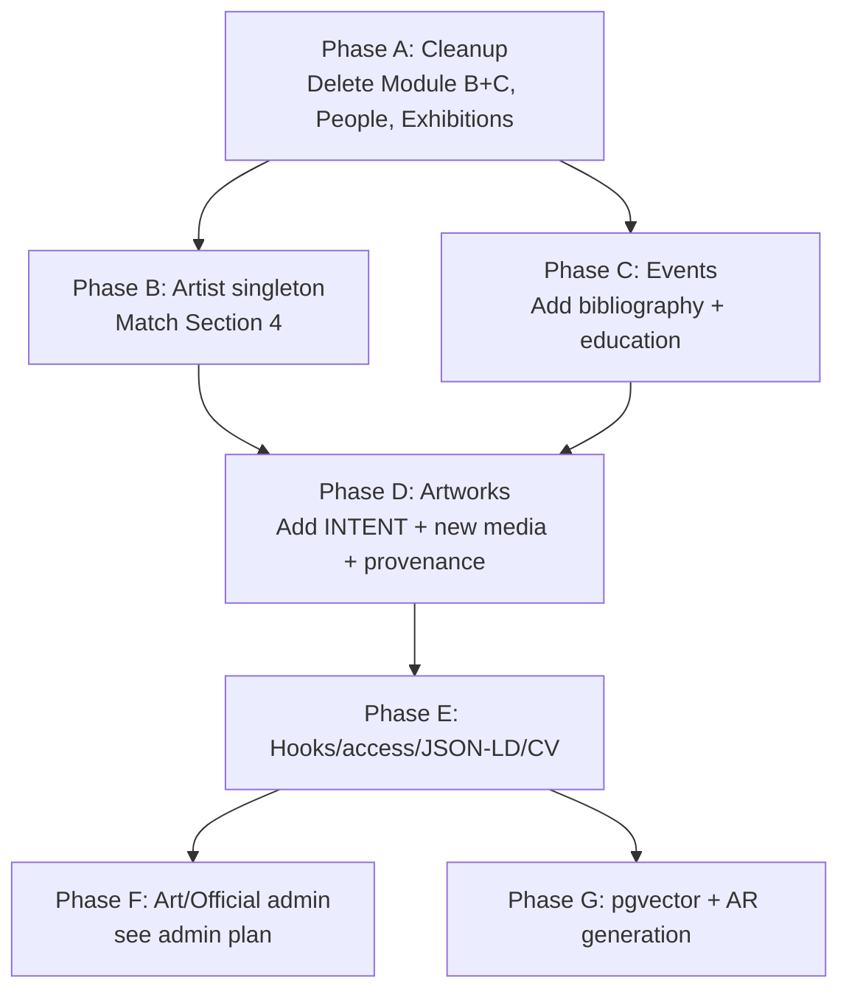

# Artist Archive — Build Directive (auto-agent handoff)

**bernardbolter.com · Module A only (Artist Archive)**
*May 2026 · Reconciles current repo state with `artist-archive-schema-final.md` and `cursor-implementation-plan-final.md`. Targets a clean Neon `payload` database with no rows.*

---

## 0. Read first

These three documents are mandatory reading before any agent writes a line of code:

1. [docs/artist-archive-schema-final.md](artist-archive-schema-final.md) — the canonical schema (Module A only).
2. [docs/cursor-implementation-plan-final.md](cursor-implementation-plan-final.md) — 17-step build sequence with completion tests.
3. [docs/project-consolidation-map.md](project-consolidation-map.md) — what each doc is and which docs are dead.
4. [AGENTS.md](../AGENTS.md) — Payload v3 / security / transaction rules.

If a constraint in this directive contradicts the final schema, **the final schema wins**. This directive only describes how to *get there from where the repo is*.

---

## 1. Where the repo is right now

This is reconciliation, not greenfield. The repo already contains a v2 build that mixed Artist Archive + Gallery + Collector modules. The final spec **separates those modules** — only Artist Archive lives in this Payload instance. The DB on Neon (`payload` database) is **empty**: no rows, no tables. There is no migration history to preserve.

### 1.1 Collections currently in `src/payload.config.ts`

| Collection | Current file | Final-spec target | Action |
|---|---|---|---|
| `users` | `src/collections/Users.ts` | keep | — |
| `media` | `src/collections/Media.ts` | keep | — |
| `artists` | `src/collections/Artists.ts` | **expand to Section 4** | rename to singleton-style; add bio/statement variants, locations, education, selectedCollections, contact, creditLine, practiceNote |
| `practice-knowledge` | `src/collections/PracticeKnowledge.ts` | keep | minor — verify all six slugs validate |
| `collection-knowledge` | `src/collections/CollectionKnowledge.ts` | **delete (Module C)** | remove file + import + payload.config.ts entry |
| `gallery-knowledge` | `src/collections/GalleryKnowledge.ts` | **delete (Module B)** | remove |
| `collectors` | `src/collections/Collectors.ts` | **delete (Module C)** | remove |
| `galleries` | `src/collections/Galleries.ts` | **delete (Module B)** | remove |
| `artworks` | `src/collections/Artworks.ts` | reduce to Sections 1.1–1.13 | strip collector tab, gallery commerce fields, `linkedCollectorId`, `consignedTo`, `consignmentHistory`, `placedBy`; add INTENT fields, `descriptionLong`, `genreTags`, `periodTags`, `cityTgnUri`, `provenanceConfidenceLayer`, `provenanceOriginKnown`, `stateVersions`, `events` reverse relation |
| `people` | `src/collections/People.ts` | **delete** | not in Module A — Bernard lives on `artists` singleton; collaborators/curators are free text on Events |
| `series` | `src/collections/Series.ts` | keep, align to §3.1 | optional minor cleanup |
| `exhibitions` | `src/collections/Exhibitions.ts` | **delete (legacy)** | superseded by Events |
| `events` | `src/collections/Events.ts` | expand per §2 | add `bibliography` + `education` event types and their type-specific fields; drop `collectors` relation; drop `mergeStaff` group (cross-module) |
| `tags` | `src/collections/Tags.ts` | keep | ✓ matches §3.2 |
| `art-historical-references` | `src/collections/ArtHistoricalReferences.ts` | keep | ✓ matches §3.3 |
| `sessions` | `src/collections/Sessions.ts` | keep | drop `collectorId` field; drop `collector-cataloguing` and `gallery-cataloguing` from `sessionType` enum |

### 1.2 Other things in the repo to preserve as-is

- Hooks: [`src/hooks/artworkBeforeChange.ts`](../src/hooks/artworkBeforeChange.ts), [`src/hooks/artworkAfterChange.ts`](../src/hooks/artworkAfterChange.ts), [`src/hooks/artworkAfterChangeAr.ts`](../src/hooks/artworkAfterChangeAr.ts), [`src/hooks/eventBeforeChange.ts`](../src/hooks/eventBeforeChange.ts) — adjust as fields rename.
- Utilities: [`src/utilities/fractionToDecimal.ts`](../src/utilities/fractionToDecimal.ts), [`src/utilities/persistArtworkClipEmbedding.ts`](../src/utilities/persistArtworkClipEmbedding.ts), [`src/lib/payload/getPool.ts`](../src/lib/payload/getPool.ts).
- Access control: [`src/access/isArtistOrAdmin.ts`](../src/access/isArtistOrAdmin.ts), [`src/access/staffAccess.ts`](../src/access/staffAccess.ts), [`src/access/isPublished.ts`](../src/access/isPublished.ts).
- CV scaffolding: [`src/lib/cv/buildCvSections.ts`](../src/lib/cv/buildCvSections.ts), [`src/app/(frontend)/api/cv/[artistSlug]/route.ts`](../src/app/(frontend)/api/cv/[artistSlug]/route.ts).
- JSON-LD scaffolding: [`src/lib/jsonld/`](../src/lib/jsonld/).
- Postgres adapter `push: process.env.PAYLOAD_DATABASE_PUSH === 'true'` in [`src/payload.config.ts`](../src/payload.config.ts).
- All five existing migration files in [`src/migrations/`](../src/migrations/) — these are **legacy WP-shape migrations** and **must not run** against the empty Neon DB. See §6.

### 1.3 Things to delete from disk

- `src/collections/CollectionKnowledge.ts`
- `src/collections/GalleryKnowledge.ts`
- `src/collections/Collectors.ts`
- `src/collections/Galleries.ts`
- `src/collections/Exhibitions.ts`
- `src/collections/People.ts`
- `src/scripts/seed-collection-knowledge.ts`
- `src/scripts/seed-gallery-knowledge.ts`
- `src/lib/entityResolution/` (entire folder — cross-module entity resolution belongs in Modules B/C)
- `src/migrations/*.ts` and `src/migrations/index.ts` — see §6 for replacement strategy

---

## 2. Hard constraints — never violate

These mirror §5.2 of `artist-archive-schema-final.md`. Repeat them at the top of every step you hand to an agent.

1. **Localisation rule** — every multilingual field uses `localized: true`. **No** `*DE`, `*EN`, `*De`, `historicalContextDE`, etc., **anywhere** in any collection. If you see one in legacy code, remove the variant; do not preserve it.
2. **No free text where a structured type exists** — medium, support, condition, series, city, tags must be `select` or `relationship`.
3. **Private fields** — every field marked `private` in the Layer column of the schema MUST have `access: { read: artistOrAdmin }`. Treat the access function as part of the field definition; don't ship the field without it.
4. **No auto-publish** — every `status` defaults to `draft`. Agents may not flip to `published` without an explicit human action.
5. **No hardcoded JSON-LD** — generated at render time from stored fields, in `src/utilities/generate*JsonLd.ts`.
6. **Payload v3 only** — App Router config, no v2 patterns, no global `globals: []` (Artist is a single-record collection, not a global).
7. **Pass `req` to nested `payload.*` calls in hooks** — same-transaction guarantee from AGENTS.md.
8. **`overrideAccess: false` in API routes** — every Local API call from a Next.js route handler that runs as a user MUST pass `overrideAccess: false` and the resolved `user`.
9. **Anti-loop context flags** — when an artwork hook updates the artwork itself or related records, pass `context: { skipArUpdate: true, skipAgent: true }` to avoid infinite hook chains.
10. **Module separation** — this Payload instance must not contain `collectors`, `galleries`, `gallery-knowledge`, `collection-knowledge`, or any reverse relation pointing at those slugs. If an agent tries to reintroduce them ("for cross-module compatibility"), reject it.
11. **No INTENT field auto-generation** — `intent`, `makingNote`, `directInspiration`, `encounterNote`, `consciousRejections`, `formalContributionAssessment`, `intentVsOutcome`, `materialAndProcessMeaning` MUST come from artist input via Art/Official, not from AI inference.
12. **Display rule** — `sizeTier` and `orientation` both apply on the public site. Never normalise images with `object-cover` or uniform grid sizing.

---

## 3. Phase plan for auto agents

Hand each phase to one auto-agent run. **Do not start phase N+1 until phase N's completion test passes against a live dev DB.** Run `pnpm payload generate:types` and `pnpm payload generate:importmap` after every phase.

### Phase A — Cleanup (one PR)

Single goal: bring the codebase down to "Module A only." No new fields added in this phase.

**Files to delete** (§1.3 above).

**Files to edit:**
- `src/payload.config.ts` — remove imports + `collections` entries for the six deleted collections (`Collectors`, `Galleries`, `CollectionKnowledge`, `GalleryKnowledge`, `Exhibitions`, `People`).
- `src/collections/Sessions.ts` — remove `collectorId` field; remove `collector-cataloguing` and `gallery-cataloguing` from `sessionType` enum.
- `src/collections/Events.ts` — remove `collectors` relation; remove the `mergeStaff` group (sourceHistory, mergeStatus, mergeLog, canonicalSource, completenessScore — these belong to cross-module entity resolution); remove the `eventBeforeChange` hook lines that touch those fields.
- `src/collections/Artworks.ts` — remove the entire **Collector tab** (acquisitionYear, acquisitionChannel, dealerSource, dealerLocation, priorOwner, acquisitionPrice, acquisitionCurrency, certificationDocs, saleHandoffReceived, artistRecognitionAtAcquisition, priorExhibitionAtAcquisition, encounterContext, whyThisWork, collectorArtistRelationship, documentationPhotoContext, linkedArtistRecord, linkedCollectorId); remove `consignedTo`, `consignmentHistory`, `placedBy` from the Commerce tab; remove the deprecated `exhibitions` legacy relation.
- `src/hooks/artworkBeforeChange.ts` — remove anything that defaults or reads `recordOrigin === 'collector-catalogued'` branches that no longer apply (the field stays — only the collector branches go).
- `src/hooks/artworkAfterChangeAr.ts` — keep, but verify it does not reference deleted fields.
- `src/lib/jsonld/*` — remove any Collector / Gallery references.
- Delete `src/migrations/` entirely (see §6 for the replacement).

**Completion test:**
- `pnpm payload generate:types` succeeds.
- `pnpm payload generate:importmap` succeeds.
- `pnpm tsc --noEmit` shows no NEW errors versus current baseline (pre-existing GA / Klaro / `helpers/index` / `seedUser` errors are still acceptable; nothing newly broken from this phase).
- App boots: `npm run dev` reaches "Ready" without throwing on missing imports.
- Admin loads at `/admin` and the sidebar contains: Users, Media, Artists, Practice Knowledge, Artworks, Series, Events, Tags, Art Historical References, Sessions — and **nothing else** from Modules B or C.

### Phase B — Align Artist singleton to Section 4

Single goal: take the existing `src/collections/Artists.ts` and make it match `artist-archive-schema-final.md` §4 exactly.

**Read first:** §4 of `artist-archive-schema-final.md`, Step 1 of `cursor-implementation-plan-final.md`.

**Edits:**
- Drop the `bio` (richText) and `statement` (richText) fields. **Replace** with:
  - `bioFull` richText, localized
  - `bioMedium` richText, localized
  - `bioShort` text, localized (plain text — not richText)
  - `statementFull` richText, localized
  - `statementMedium` richText, localized
  - `statementShort` text, localized
- Add `practiceNote` richText, localized.
- Add `creditLine` text, localized.
- Add `locations` array as defined in §4.6.
- Add `publicEmail` text with `access: { read: artistOrAdmin }` (private).
- Add `website`, `instagramUrl` text fields.
- Add `otherLinks` array of `{ label, url }`.
- Add `education` array per §4.8 (institution, degree, subject, yearStart, yearEnd, city, country, cvVisible default true).
- Add `selectedCollections` array per §4.9 (institutionName, city, country, acquisitionYear, cvVisible default true, sourceOfTruth select default `manual`, linkedArtworkId nullable relation → `artworks`).
- Keep existing `name`, `slug`, `ulanUri`, `wikidataUri`, `careerStage`, `primaryActorType`, `actorRoles`, `externalIdentifiers`.
- Drop the **Entity resolution** collapsible (`firstMentionDate`, `mergeCandidates`) — cross-module concept, not Module A.
- Enforce single-record behaviour: `admin.hidden: false`, `admin.useAsTitle: 'name'`, and add a collection-level `create` access that allows creation only when `payload.find({ collection: 'artists', limit: 1 }).totalDocs === 0`. Pattern in spec §4 / Step 1.

**Completion test:**
- Create the Artist record in admin. All 9 long-form text fields show the en/de language switcher.
- `publicEmail` is absent from anonymous `GET /api/artists`.
- A second `payload.create({ collection: 'artists', ... })` is rejected.
- `pnpm tsc --noEmit` no NEW errors.

### Phase C — Align Events to Section 2

**Read first:** §2 of the schema, Step 6 of the cursor plan.

**Edits to `src/collections/Events.ts`:**
- Add `bibliography` and `education` to the `eventType` enum.
- Add `bibliography` and `education` to the `cvSection` enum.
- Add type-specific fields:
  - **Bibliography:** `bibliographyAuthor` (required when type), `publicationTitle`, `publicationPages`, `publicationUrl`. Reuse the conditional pattern already used for publications.
  - **Education:** `institution` (required), `degree`, `subject`, `cvVisible` (boolean default true). Conditional on `eventType === 'education'`.
- Verify `awardAmount`, `awardAmountCurrency`, `commissionBudget` carry `access: { read: artistOrAdmin }`.
- Verify `descriptionShort` and `descriptionLong` are `localized: true`.
- Keep `eventBeforeChange` for `eventId` UUID + `yearStart` computation. Remove its `completenessScore` calc (cross-module).
- The `artworks` relation field stays (it's the authority side per §0a) — confirmed required.

**Completion test:** Create one Event of each of the 13 types. All type-specific field groups appear/disappear in admin. `awardAmount` absent from anonymous API. `yearStart` populates from `startDate` on save.

### Phase D — Align Artworks to Sections 1.1–1.13

**Read first:** §1 of the schema, Step 7 of the cursor plan.

**Add to `src/collections/Artworks.ts`:**
- INTENT new: `materialAndProcessMeaning` (longText/textarea, artist), `intentVsOutcome`, `consciousRejections`, `formalContributionAssessment`, `seriesContext`, `sourceMaterials`. All artist-input only.
- CORE new: `altTitle` (text, localized), `primaryImageAltText` (text, localized), `posterImageAltText` (text, localized), `descriptionLong` (richText, localized), `cityTgnUri` (text), `genreTags` (relation[] → `tags`), `periodTags` (relation[] → `tags`).
- TEMPORAL new: `stateVersions` array of `{ date, description, type: select [restoration|rework|damage|relining|other] }`.
- PROVENANCE new (private): `provenanceOriginKnown` (boolean default true), `provenanceConfidenceLayer` array per §1.9.
- RELATIONAL new: `events` relation[] → `events`, hasMany. This is the **reverse** side of `Events.artworks`. Read §0a — Payload populates the reverse automatically.

**Re-verify existing fields against §1:** if any field name in current code disagrees with the spec, **rename to match the spec**. Examples to watch for: `altText` vs `primaryImageAltText`, `description` vs `descriptionShort`/`descriptionLong`. The schema is canonical.

**Hooks:** `artworkBeforeChange` already does dimension normalisation, aspect ratio, dimensionsDisplay, AR metres. Keep that. Confirm nothing references removed Module-B/C fields after Phase A.

**Completion test:** Step 7 completion test in cursor plan. Plus: every `private` field listed in §1.8 / §1.9 returns `undefined` from anonymous `GET /api/artworks/[id]`.

### Phase E — Hooks, access control, JSON-LD, CV

Run cursor-plan Steps 8 → 10 → 14 → 17 in order.

**Step 8 — `artworkBeforeChange` hook:** already implemented. Verify against §1.2 dimension normalisation; backfill `arWidthM` / `arHeightM` only when `arEnabled` true. No code change expected unless a test fails.

**Step 9 — Access control:** consolidate. `src/utilities/accessControl.ts` should export `artistOrAdmin` and `isPublished`. Re-export from existing `src/access/isArtistOrAdmin.ts` if you want one place. Apply `isPublished` as collection-level `read` on Artworks and Events. Apply `artistOrAdmin` as field-level `access.read` on every private field per §1.8 / §1.9 / §2.8 (awards + commissions).

**Step 10 — Bidirectional relation:** the `events` field on Artworks added in Phase D plus the existing `artworks` field on Events covers this. Verify by adding an Artwork to an Event and reloading the Artwork.

**Step 14 — JSON-LD utilities:** `src/utilities/generateArtworkJsonLd.ts` + `generateEventJsonLd.ts`. Constraints in §1.10 are **mandatory**:
- `creator` is a typed `Person` with ULAN + Wikidata identifier array — never a plain string.
- `width` / `height` / `depth` are `QuantitativeValue` with `unitCode` (`CMT` / `INH` / `E37`).
- `locationCreated` is a typed `Place` with PostalAddress + TGN sameAs.
- `artMedium` with AAT URI = `DefinedTerm` object, not a string.
- `identifier` = `PropertyValue { propertyID: 'CatalogueNumber', value }`.

Inject as `<script type="application/ld+json">` in `src/app/(frontend)/artworks/[slug]/page.tsx` and `src/app/(frontend)/events/[slug]/page.tsx`.

**Step 17 — CV page:** `src/app/(frontend)/cv/page.tsx`. Query `events` where `status: published` and `excludeFromCv: false`, group by `cvSection`, sort by `yearStart` desc within each. Use `buildCvSections` from `src/lib/cv/buildCvSections.ts` (extend to handle `bibliography` and `education`). Render `selectedCollections` from the Artist singleton, not from Events. Section order is fixed in §2.10.

**Completion test:** Run Google's Rich Results Test against a published artwork page → no errors. CV page renders all section types in the §2.10 order, with education first and selected collections rendered from the Artist singleton.

### Phase F — Art/Official admin (handoff to dialogue spec)

This phase is **separately specified** in [docs/art-official-admin-implementation-plan.md](art-official-admin-implementation-plan.md) (already in the repo). Run that plan only after Phase E is complete and tested.

The dialogue spec (`art-official-dialogue-spec.md`) is the agent contract — read it in full before starting Phase F.

### Phase G — pgvector + AR pipeline

Run cursor-plan Steps 15 + 16 last. The current `artworkAfterChangeAr.ts` is a **stub** that writes placeholder URLs; replace with real USDZ + GLB generation per §1.11 of the schema. CLIP embedding generation is wired in `src/utilities/persistArtworkClipEmbedding.ts` — confirm `pgvector` extension is enabled in Neon (`CREATE EXTENSION IF NOT EXISTS vector;`).

---

## 4. Per-step prompt template

Every step you hand to an auto agent must use this template (matches §5.3 of the schema):

```
CURSOR AGENT PROMPT — [Phase letter] · [Step name]

Read first (in this order):
- docs/artist-archive-schema-final.md §[X.Y]
- docs/cursor-implementation-plan-final.md Step [N]
- docs/artist-archive-build-directive.md §[phase]   ← THIS DOC
- AGENTS.md (Payload security/transaction rules)

Task:
[concrete one-paragraph scope]

Files you MAY create or modify:
- [explicit list]

Files you MUST NOT touch:
- any file not in the list above

Constraints (non-negotiable):
- Payload v3 syntax only.
- All multilingual fields use `localized: true`. No `*DE` / `*EN` variants.
- Every private field has `access: { read: artistOrAdmin }`.
- Every nested `req.payload.*` call in a hook passes `req`.
- Every Local API call from a route handler passes `overrideAccess: false` and `user`.
- Do not reintroduce collections from Modules B or C (collectors, galleries, gallery-knowledge, collection-knowledge).
- Do not generate INTENT fields from AI inference.

Done when:
[copy completion test verbatim from cursor-implementation-plan-final.md Step N]
```

---

## 5. Database setup (Neon, empty `payload` DB)

The DB on Neon is empty. The repo's existing migration files (`src/migrations/*.ts`) are WordPress-shape rename migrations that **assume legacy tables exist** — they will fail against an empty DB and they describe a schema that no longer matches the final spec. Do not run `pnpm payload migrate` against the empty DB.

**Path forward:**

1. Delete `src/migrations/` (do not keep stale files in tree).
2. In `.env`, set `PAYLOAD_DATABASE_PUSH=true`.
3. Start `npm run dev`. Drizzle will diff the (empty) DB against the new collection configs and prompt you to **create** the new tables/enums. On every interactive prompt of the form "Is X created or renamed from Y?", choose **create**, never rename — there are no legacy tables to rename from.
4. Confirm "Accept warnings and push schema to database?" → **yes** (the warnings will be benign on an empty DB; no `127 items` data-loss warnings should appear).
5. After the push completes, set `PAYLOAD_DATABASE_PUSH=false` (or remove it) so future boots don't push silently.
6. Run **once**: `pnpm payload migrate:create --skip-empty --force-accept-warning` to capture the current state as a **baseline migration** in a fresh `src/migrations/` folder. This single file represents the full Module A schema; future production deployments run from this file forward via `pnpm payload migrate`.
7. Add the generated `migrations/index.ts` to the `postgresAdapter` config under `prodMigrations` so production deployments execute migrations on startup:

   ```ts
   import { migrations } from './migrations'
   ...
   db: postgresAdapter({
     pool: { connectionString: databaseUrl },
     push: process.env.PAYLOAD_DATABASE_PUSH === 'true',
     prodMigrations: migrations,
   }),
   ```

8. Create the first admin user via the admin UI (or `/admin/create-first-user`). Seed `practice-knowledge` via [`src/scripts/seed-practice-knowledge.ts`](../src/scripts/seed-practice-knowledge.ts).

**Rule for agents:** never check in changes that require `PAYLOAD_DATABASE_PUSH=true` to apply. Push is a developer convenience for local dev; production runs migrations only.

---

## 6. Phase order (one-glance)



Phases B and C may run in parallel after A. Everything downstream is sequential.

---

## 7. Acceptance — module-level "done"

The Artist Archive build is **complete** when **all** of the following are true:

- [ ] No file in `src/collections/` references `collectors`, `galleries`, `gallery-knowledge`, `collection-knowledge`, `people`, or `exhibitions`.
- [ ] `src/payload.config.ts` `collections: []` contains exactly: `Users`, `Media`, `Artists`, `PracticeKnowledge`, `Series`, `Tags`, `ArtHistoricalReferences`, `Events`, `Artworks`, `Sessions`.
- [ ] Every field marked `private` in `artist-archive-schema-final.md` has a Payload `access.read` function.
- [ ] No field name in any collection contains `DE`, `EN`, `_de`, `_en`, etc.; multilingual fields use `localized: true`.
- [ ] `pnpm payload generate:types` succeeds and the generated `payload-types.ts` contains the new fields.
- [ ] `pnpm payload generate:importmap` succeeds.
- [ ] `pnpm tsc --noEmit` introduces no NEW errors.
- [ ] Anonymous `GET /api/artworks` returns only `status: published` records and contains none of the private fields listed in §1.8 / §1.9.
- [ ] `GET /api/cv/[artistSlug]` returns sections in the order specified in §2.10, including `education` first and `bibliography` between publications and selected-collections.
- [ ] At least one Artwork JSON-LD output passes Google's Rich Results Test with `creator.identifier` carrying ULAN + Wikidata, and `width` / `height` as `QuantitativeValue` with `unitCode`.
- [ ] Cross-module records cannot be created in this Payload instance (the collections do not exist).

When every box is checked, mark this directive **done** and proceed to the Art/Official admin build via [`art-official-admin-implementation-plan.md`](art-official-admin-implementation-plan.md).

---

*Build Directive — Artist Archive · May 2026 · supersedes any earlier plan that included Modules B or C.*
